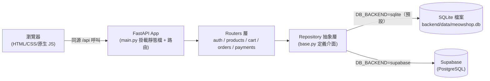

# MeowShop 喵喵商店

貓咪主題電商教學範例——用一個完整的全端專案，帶你走過「使用者註冊 → 逛商品 → 加購物車 → 下單 → 模擬付款」的完整流程。

> **本專案是教學範例，不是可以直接拿去營運的真實商店。**
> 目標讀者是「剛學會基礎程式、還沒做過完整專案」的學員，程式碼刻意寫得簡單易懂，優先考慮好理解、好教學，而不是效能或正式產品該有的完整度（例如沒有管理後台、沒有退款機制）。哪些地方是刻意簡化、為什麼這樣簡化，第 6、7 節與 [`docs/PRD.md`](docs/PRD.md) 第 8 節都有說明。

> **金流警示：本站的付款功能是自建的模擬金流（mock payment），完全沒有串接任何真實的第三方金流服務，不會有任何一筆真實金錢往來。** 不管你在結帳頁面輸入什麼卡號，都只是後端用「卡號字串」做規則判斷（見第 5 節測試卡號表），不會、也不可能真的請款。**請勿把本專案原封不動拿去對外收費使用。**

## 作者與聯絡資訊

本專案為呂紹民（Darren Lu）製作的教學範例，供學員學習全端服務開發使用。如果對本文件或專案有任何問題，或有課程教學、顧問諮詢、專案導入需求，歡迎與我聯絡。

- Email：kevin868686@gmail.com
- LinkedIn：https://www.linkedin.com/in/shaominglu
- Facebook：https://www.facebook.com/darrenlu86

## 目錄

- [功能總覽與技術架構](#功能總覽與技術架構)
- [環境需求](#環境需求)
- [快速開始（SQLite 本地）](#快速開始sqlite-本地)
- [如何切換到 Supabase](#如何切換到-supabase)
- [資料庫初始化與 Seed Data](#資料庫初始化與-seed-data)
- [API 測試指南](#api-測試指南)
- [執行測試](#執行測試)
- [對外部署指引（進階）](#對外部署指引進階)
- [專案結構與文件地圖](#專案結構與文件地圖)
- [License](#license)

## 功能總覽與技術架構

**功能範圍**：會員註冊/登入、商品瀏覽（分類篩選＋關鍵字搜尋）、購物車（加入/改數量/移除，即時檢查庫存）、下單、模擬信用卡付款（含付款失敗重試）、我的訂單查詢。販售品類涵蓋貓糧、貓零食、貓玩具、貓砂、貓用品五大類，共 10 筆種子商品。

**技術棧**：前端是純 HTML + CSS + 原生 JavaScript（沒有框架、沒有 build step，開啟瀏覽器就能看懂每一行）；後端是 Python + FastAPI；資料存取層用 Repository Pattern 包裝，本機開發預設用 SQLite（零設定），也可以切換成 Supabase（雲端 PostgreSQL）。後端同時把前端靜態檔一起 serve 出去，本機開發只需要啟動一個 process。



想看更詳細的 API 規格、ER 圖、循序圖與逐階段開發指引，請看 [`docs/PRD.md`](docs/PRD.md)（產品需求文件）；想接手擴充功能，請看 [`DEVELOPMENT.md`](DEVELOPMENT.md)。

## 環境需求

- Python **3.10 以上**（本專案實測環境為 **3.13.11**；語法用了 `str | None` 這種 3.10+ 才支援的寫法，3.9 以下會直接壞掉）
- 不需要另外安裝資料庫軟體：預設路徑用 Python 標準庫的 `sqlite3`，零額外安裝
- 不需要 Node.js／npm：前端沒有 build step

### 安裝步驟

```bash
# 1. 進入 backend 目錄（幾乎所有指令都要在這個目錄下執行）
cd backend

# 2. 建立虛擬環境
python3 -m venv .venv

# 3. 啟用虛擬環境
source .venv/bin/activate        # macOS / Linux
# .venv\Scripts\activate         # Windows（PowerShell / cmd）

# 4. 安裝套件
pip install -r requirements.txt
```

> 注意：每次重新打開終端機視窗，都要重新執行第 3 步 `source .venv/bin/activate`，不然會抓到系統內建的 Python，找不到剛裝好的套件。看終端機提示字最前面有沒有出現 `(.venv)` 就知道有沒有啟用成功。

## 快速開始（SQLite 本地）

以下每一步都附上「預期看到什麼」，方便你確認自己做對了沒有。指令延續上一節、仍在 `backend/` 目錄、虛擬環境已啟用。

**1. 初始化資料庫**

```bash
python scripts/init_db.py
```

預期輸出：

```
DB_BACKEND = sqlite
建立資料表於：/你的路徑/backend/data/meowshop.db
已匯入 10 筆種子商品資料。
SQLite 資料庫初始化完成！
```

> 注意：這支腳本有防呆設計——如果 `data/meowshop.db` 已經存在，直接重跑不會刪掉你的資料，只會印出提示叫你要不要加 `--reset`。細節見第 7 節。

**2. 啟動後端伺服器**

```bash
uvicorn app.main:app --port 8000
```

預期看到 log 出現 `Application startup complete.`，代表伺服器已經在背景準備好接受請求（開發時可以加 `--reload` 讓改程式碼自動重啟，這是 uvicorn 標準功能，本專案的整合測試沒有額外驗證 `--reload` 這個旗標本身，但不影響 app 邏輯）。

**3. 打開網站**

在瀏覽器打開 [http://localhost:8000](http://localhost:8000)，應該會看到 MeowShop 首頁（hero 區塊 + 分類入口 + 精選商品）。同一個 process 也提供了：

- [http://localhost:8000/docs](http://localhost:8000/docs) — FastAPI 自動產生的互動式 API 文件（Swagger UI），每支 API 都可以直接在網頁上試打
- [http://localhost:8000/api/health](http://localhost:8000/api/health) — 健康檢查，正常會回 `{"status":"ok","db_backend":"sqlite"}`

**測試帳號**：本專案沒有預先建立任何帳號，請自行在 [http://localhost:8000/login.html](http://localhost:8000/login.html) 的「註冊」分頁建立一個新帳號（email + 至少 8 碼密碼 + 姓名）。

**測試卡號**（結帳頁面上也會顯示）：

| 卡號 | 結果 |
|---|---|
| `4242 4242 4242 4242` | 付款成功 |
| `4000 0000 0000 0002` | 付款失敗（模擬銀行端餘額不足，訂單可以重新付款重試） |
| 其他任意 16 碼數字 | 一律視為成功（教學上示範用 4242 那組即可） |

## 如何切換到 Supabase

本專案預設用本機 SQLite，零設定就能跑；如果想改用 Supabase（雲端 PostgreSQL，適合多人協作或想體驗接近正式環境的資料庫），照下面步驟操作：

1. **建立 Supabase 專案**：到 [supabase.com](https://supabase.com) 註冊並新增一個專案（免費方案即可）。
2. **建表**：打開專案的 **SQL Editor**，貼上 [`backend/app/db/supabase_schema.sql`](backend/app/db/supabase_schema.sql) 的完整內容並執行一次。
3. **拿金鑰**：到專案的 **Settings → API**，複製 **Project URL** 與 **API Key**（本專案沒有啟用 Row Level Security，見 schema 檔內的說明；因為呼叫 Supabase 的程式碼只在後端執行，不會暴露給瀏覽器，anon key 或 service_role key 都能運作——但 service_role key 權限較高，一樣要當成機密保管，不要外流）。
4. **設定 `.env`**：在 `backend/` 目錄下把 `.env.example` 複製一份成 `.env`（`cp .env.example .env`），改成：

   ```
   DB_BACKEND=supabase
   SUPABASE_URL=你的-project-url
   SUPABASE_KEY=你的-api-key
   ```

   > 注意：金鑰只能寫在 `.env` 裡，絕對不要 commit 進 git。`.env` 已經列在 `.gitignore`（見 `backend/.gitignore` 規則），正常操作不會不小心把它加進版控；但還是養成習慣，`git status` 看一眼再 commit。

5. **匯入種子資料**：重新執行 `python scripts/init_db.py`，這次會偵測到 `DB_BACKEND=supabase`，改成把 10 筆種子商品透過 `supabase-py` 匯入你的 Supabase 專案（建表本身不會自動執行，理由見腳本內註解——DDL 屬於結構性變更，讓你自己在 SQL Editor 看過再按執行比較安全）。
6. 重新啟動 `uvicorn app.main:app --port 8000`，打開 [http://localhost:8000/api/health](http://localhost:8000/api/health) 應該會看到 `{"status":"ok","db_backend":"supabase"}`。

**誠實聲明**：SQLite 路徑（預設路徑）已經跑過完整的 E2E 實測（見第 5、6 節與 `docs/PRD.md`）。Supabase 路徑（`supabase_repo.py`）是依照 Supabase 官方文件（`supabase-py` client）撰寫並經過 code review，但**尚未在真實 Supabase 專案上跑過實測**，正確性目前只能保證「介面簽名與 SQLite 版一致、程式邏輯經人工檢查」。如果你照著上面步驟操作時遇到問題，歡迎透過本文開頭的聯絡方式回報，這對後續學員會很有幫助。

## 資料庫初始化與 Seed Data

`backend/scripts/init_db.py` 負責兩件事：建立資料表（依 `app/db/sqlite_schema.sql`）與匯入種子商品資料（`app/db/seed_products.json`，10 筆，涵蓋 5 個分類，價格與庫存與 `docs/PRD.md` 附錄完全一致；其中一筆庫存刻意設成 3（示範「僅剩 N 件」的庫存徽章），一筆庫存設成 0（示範「補貨中」）。

**防呆設計（為什麼這樣做）**：這支腳本很可能被重複執行（照教學文件一步步做，難免手滑多按一次）。如果每次都無條件砍掉重建，一旦資料庫裡已經有你自己測出來的帳號、訂單，會在沒有任何警告的情況下整個消失——這是不可逆的操作。所以預設行為是「資料庫檔案已存在就跳過、印出提示」，只有明確加上 `--reset` 旗標才會真的刪除重建：

```bash
python scripts/init_db.py --reset
```

> 注意：`--reset` 只在 `DB_BACKEND=sqlite` 時生效（會直接刪除本機的 `.db` 檔案）；`DB_BACKEND=supabase` 時腳本不會、也不能幫你清空雲端資料庫，需要清空請自己到 Supabase 後台操作。

## API 測試指南

以下示範一個完整的購物流程，逐支呼叫本專案全部 14 支 API（14 支端點清單見 `docs/PRD.md` 第 4 節）。指令假設伺服器已在 `http://localhost:8000` 啟動。回應內容以下方範例為準——實際的 `id`／`created_at` 會依你自己的執行結果而不同。

```bash
# 1. 註冊帳號 → 201
curl -s -X POST http://localhost:8000/api/auth/register \
  -H "Content-Type: application/json" \
  -d '{"email":"neko@example.com","password":"password123","name":"貓奴小明"}'
# {"id":1,"email":"neko@example.com","name":"貓奴小明","created_at":"2026-07-23 02:15:40"}

# 用同一個 email 再註冊一次 → 409（實測輸出原文）
curl -s -X POST http://localhost:8000/api/auth/register \
  -H "Content-Type: application/json" \
  -d '{"email":"neko@example.com","password":"password123","name":"貓奴小明"}'
# {"detail":"這個 email 已經註冊過了"}
```

```bash
# 2. 登入拿 access_token
curl -s -X POST http://localhost:8000/api/auth/login \
  -H "Content-Type: application/json" \
  -d '{"email":"neko@example.com","password":"password123"}'
# {"access_token":"eyJhbGciOi...(略)","token_type":"bearer","user":{"id":1,"email":"neko@example.com","name":"貓奴小明"}}

# 把 access_token 存成變數，後面所有「需要登入」的呼叫都要帶這個 Authorization header
TOKEN="貼上你剛拿到的 access_token"
```

```bash
# 3. 用 token 查自己的資料（示範 Authorization: Bearer 的用法）
curl -s http://localhost:8000/api/auth/me \
  -H "Authorization: Bearer $TOKEN"
# {"id":1,"email":"neko@example.com","name":"貓奴小明","created_at":"2026-07-23 02:15:40"}

# 不帶 token 呼叫「需要登入」的端點 → 401（實測輸出原文）
curl -s http://localhost:8000/api/cart
# {"detail":"請先登入"}
```

```bash
# 4. 商品清單（不需要登入）
curl -s http://localhost:8000/api/products
# {"items":[...10 筆商品...],"total":10}

# 依分類篩選（實測：category=toy 命中 3 筆，全部都是 toy 分類）
curl -s "http://localhost:8000/api/products?category=toy"

# 關鍵字搜尋（實測：search=貓抓 命中「雙層貓抓板波浪款」）
curl -s "http://localhost:8000/api/products?search=貓抓"
```

```bash
# 5. 商品詳情
curl -s http://localhost:8000/api/products/4
# 200，貓草薄荷魚抱枕（種子資料庫存為 3）

curl -s http://localhost:8000/api/products/9999
# {"detail":"找不到這個商品"}
```

```bash
# 6. 加入購物車（product_id=4 種子庫存只有 3 件，示範庫存檢查）
curl -s -X POST http://localhost:8000/api/cart/items \
  -H "Authorization: Bearer $TOKEN" -H "Content-Type: application/json" \
  -d '{"product_id":4,"quantity":1}'
# 200，回傳整台購物車內容

# 再加超過庫存的數量 → 409（實測輸出原文）
curl -s -X POST http://localhost:8000/api/cart/items \
  -H "Authorization: Bearer $TOKEN" -H "Content-Type: application/json" \
  -d '{"product_id":4,"quantity":10}'
# {"detail":"庫存不足，目前只剩 3 件"}
```

```bash
# 7. 改數量 / 移除（PATCH 直接覆蓋數量，不是累加）
curl -s -X PATCH http://localhost:8000/api/cart/items/4 \
  -H "Authorization: Bearer $TOKEN" -H "Content-Type: application/json" \
  -d '{"quantity":1}'

curl -s -X DELETE http://localhost:8000/api/cart/items/4 \
  -H "Authorization: Bearer $TOKEN"
```

```bash
# 8. 下單前先加一件商品（product_id=1 鮭魚無穀貓糧，NT$880，種子庫存 25）
curl -s -X POST http://localhost:8000/api/cart/items \
  -H "Authorization: Bearer $TOKEN" -H "Content-Type: application/json" \
  -d '{"product_id":1,"quantity":1}'

# 9. 建立訂單（注意：建單當下不扣庫存，付款成功才扣，理由見 docs/PRD.md 8.2 節）
curl -s -X POST http://localhost:8000/api/orders \
  -H "Authorization: Bearer $TOKEN" -H "Content-Type: application/json" \
  -d '{"recipient_name":"貓奴小明","recipient_address":"台北市信義區某路 1 號"}'
# 201，status: "pending"，購物車同時被清空
```

```bash
# 10. 用會失敗的測試卡付款（order_id 換成你上一步拿到的訂單 id）
curl -s -X POST http://localhost:8000/api/payments/mock \
  -H "Authorization: Bearer $TOKEN" -H "Content-Type: application/json" \
  -d '{"order_id":1,"card_number":"4000000000000002","card_holder":"貓奴小明"}'
# 200，但 payment.status:"failed"、order.status:"failed"，庫存不變（實測行為）

# 11. 用同一筆訂單，換成會成功的測試卡重新付款（failed 訂單可以重試）
curl -s -X POST http://localhost:8000/api/payments/mock \
  -H "Authorization: Bearer $TOKEN" -H "Content-Type: application/json" \
  -d '{"order_id":1,"card_number":"4242 4242 4242 4242","card_holder":"貓奴小明"}'
# 200，payment.status:"success"、order.status:"paid"，商品庫存正確扣減（實測驗證過：product 1 的庫存從下單前的數字，扣減對應下單數量）

# 已付款的訂單再付一次 → 409（實測輸出原文）
curl -s -X POST http://localhost:8000/api/payments/mock \
  -H "Authorization: Bearer $TOKEN" -H "Content-Type: application/json" \
  -d '{"order_id":1,"card_number":"4242424242424242","card_holder":"貓奴小明"}'
# {"detail":"這筆訂單已經付款完成"}
```

```bash
# 12. 查詢自己的訂單列表 / 單筆詳情
curl -s http://localhost:8000/api/orders -H "Authorization: Bearer $TOKEN"
curl -s http://localhost:8000/api/orders/1 -H "Authorization: Bearer $TOKEN"
```

```bash
# 13. 健康檢查（不需要登入）
curl -s http://localhost:8000/api/health
# {"status":"ok","db_backend":"sqlite"}
```

想用網頁介面試而不是敲指令，直接開 [http://localhost:8000/docs](http://localhost:8000/docs)，每支 API 都能在網頁上直接展開、填參數、按「Execute」試打，右上角有「Authorize」按鈕可以貼 token（貼 `Bearer <token>` 這個完整字串）。

## 執行測試

```bash
cd backend        # 如果還不在這個目錄
pytest tests/ -q
```

實測結果（本次整合測試）：**46 個測試全部通過**（`test_auth.py` 12 個、`test_products.py` 7 個、`test_cart.py` 12 個、`test_orders_payments.py` 15 個；`test_orders_payments.py` 含完整下單→付款成功/失敗→庫存變化的 E2E 情境）。會看到幾條 `InsecureKeyLengthWarning`／httpx deprecation 的警告訊息，那是套件本身的提醒，不影響測試結果，不用理它。

每個測試都在自己專屬的暫存 SQLite 資料庫上執行（`tests/conftest.py` 用 pytest 的 `tmp_path` + `monkeypatch` 做到的，細節見 [`DEVELOPMENT.md`](DEVELOPMENT.md)），完全不會動到你本機 `backend/data/meowshop.db` 裡的資料。

## 對外部署指引（進階）

> 這一節是給想把專案「放到網路上給別人看」的學員參考方向，不是本專案主要教學重點，實際部署平台這麼多種，這裡只講共通原則。

**後端**：任何能跑 Python container 或直接執行 `uvicorn` 的 PaaS 都可以（例如 Google Cloud Run、Render、Railway 等）。核心動作是：把 `backend/` 打包成容器（或平台原生支援直接跑 `uvicorn app.main:app --host 0.0.0.0 --port $PORT`），環境變數（`SECRET_KEY`、`DB_BACKEND`、`SUPABASE_URL`/`SUPABASE_KEY`、`CORS_ORIGINS`）改成在平台的環境變數設定介面填入，**不要**把正式的 `SECRET_KEY` 寫死進程式碼或 commit 進 git；`SECRET_KEY` 正式環境務必換成長隨機字串（`.env.example` 裡有附產生指令 `openssl rand -hex 32`）。HTTPS 由部署平台提供（Cloud Run、Render 等主流 PaaS 預設都有），不需要自己處理憑證。

**前端**：預設情況下前端會跟後端同一個 process 一起 serve（`main.py` 掛載 `StaticFiles`），部署後端的同時前端也一起上線了，最省事。如果想把前端拆出去，另外放到靜態網站平台（例如 Cloudflare Pages、GitHub Pages），要注意兩件事：

1. 後端 `.env` 的 `CORS_ORIGINS` 要改成前端實際的網址（例如 `CORS_ORIGINS=https://your-frontend.pages.dev`），不能再用預設的 `*`。
2. `frontend/js/api.js` 目前的 `API_BASE` 是寫死的相對路徑 `'/api'`（同源請求），這是因為前後端目前預設同一個來源。如果前後端分開部署，**必須手動修改這個常數**成後端的完整網址（例如 `const API_BASE = 'https://your-api.example.com/api';`）——本專案目前沒有做成環境變數/build-time 設定，這是刻意的教學簡化（沒有 build step 的專案很難做到「依部署環境自動換值」），要拆分部署請自己改這一行程式碼。

**資料庫**：正式環境建議改用 Supabase 正式專案（見上面「如何切換到 Supabase」一節），不要用本機的 SQLite 檔案——SQLite 檔案存在容器裡，容器重啟/重新部署很容易連同資料一起消失。

**金鑰管理原則**：所有機密（`SECRET_KEY`、`SUPABASE_KEY` 等）一律用平台的環境變數設定介面或 Secret Manager 類服務管理，絕對不要進 git；`.env` 檔案本來就已經被 `.gitignore` 排除，部署前再檢查一次 `git status`／`git log -p` 沒有意外把機密內容 commit 進去。

**再次提醒**：即使真的把這個專案部署到公開網址讓其他人瀏覽，付款功能仍然只是模擬——頁面上已經清楚標示「不會真實扣款」，**不可以把這個專案原封不動拿去對外收真錢**。如果要做成真的能收款的商店，必須換掉 `routers/payments.py` 整支模組，改接真實金流服務（例如 PayUNI、Stripe），並且處理好簽章驗證、webhook 回呼等本專案刻意省略的部分（見 `docs/PRD.md` 第 8.5 節）。

## 專案結構與文件地圖

```
meowshop-tutorial/
├── README.md              ← 你正在看的檔案
├── DEVELOPMENT.md          ← 接手擴充功能的開發指南
├── LICENSE                 ← MIT License
├── docs/
│   └── PRD.md              ← 完整產品需求文件（API 規格、ER 圖、循序圖、逐階段開發指引）
├── backend/                ← FastAPI 後端（見 DEVELOPMENT.md 的資料夾用途表）
│   ├── requirements.txt
│   ├── .env.example
│   ├── app/
│   ├── scripts/init_db.py
│   ├── data/                ← SQLite 檔案存放處（不進版控）
│   └── tests/
└── frontend/                ← 純 HTML/CSS/JS，前端頁面與共用元件
    ├── *.html
    ├── css/
    ├── js/
    └── images/
```

- 想了解「為什麼這樣設計」「完整 API 規格與資料庫 ER 圖」→ [`docs/PRD.md`](docs/PRD.md)
- 想接手擴充功能（新增 API、新增資料表、擴充 Repository）→ [`DEVELOPMENT.md`](DEVELOPMENT.md)

## License

本專案採用 [MIT License](LICENSE) 授權，著作權人 Darren Lu（呂紹民）。歡迎自由使用、修改、拿去教學或當作自己的練習專案，但請保留原本的授權聲明；本專案完全「照現狀（as is）」提供，不附帶任何形式的保固（詳見 LICENSE 全文）。
