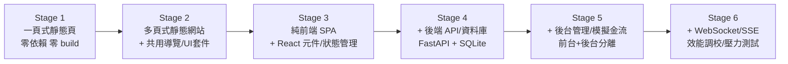

# 網站工程六階段實戰課程 — 沖沖咖啡 BrewGo

用同一個虛構咖啡電商品牌「沖沖咖啡 BrewGo」，從一頁式活動頁一路做到含即時推播與壓測報告的完整電商平台。

## 這門課在教什麼

六個階段對應六個工程成熟度：一頁式靜態網頁 → 多頁式靜態網站 → 純前端 SPA → 含後端的動態網頁 → 前台＋後台的完整應用系統 → 進階版（即時通訊／效能／壓測）。**每個階段資料夾都是獨立、完整、可跑的專案**，學員可以只做其中一個階段，也可以六個階段連著做，體驗一個真實產品從 0 到 1 的架構演進。

課程採「痛點驅動設計」：每一階段都是為了解決上一階段撐不住的問題才存在的——stage2 因為 stage1 沒有共用元件、改一個地方要改很多頁而生；stage3 因為 stage2 沒有跨頁共享狀態（購物車）而生；stage4 因為 stage3 沒有真正的後端、資料只存在使用者自己瀏覽器裡而生；stage5 因為 stage4 沒有付款流程與管理後台而生；stage6 因為 stage5 沒有即時通訊、沒有效能調校、沒有壓力測試而生。每個階段的 README 都有一節「與上一階段的差異」，逐條講清楚「新增了什麼、為什麼上一階段的做法撐不住了」。

> **本專案是教學範例，不是可以直接拿去營運的真實商店。** 程式碼刻意寫得簡單易懂，優先考慮好理解、好教學，而不是效能或正式產品該有的完整度。哪些地方是刻意簡化、為什麼這樣簡化，每個階段 README 的「教學簡化聲明」一節都有說明，[`docs/COURSE_DESIGN.md`](docs/COURSE_DESIGN.md) 第 5 節有全課程彙整版。
>
> **金流警示：stage5、stage6 的付款功能是自建的模擬金流（mock payment），完全沒有串接任何真實的第三方金流服務，不會有任何一筆真實金錢往來。** 不管在付款頁面輸入什麼卡號，都只是後端用「卡號字串」做規則判斷，不會、也不可能真的請款。**請勿把本專案原封不動拿去對外收費使用。**

## 作者與聯絡資訊

本專案為呂紹民（Darren Lu）製作的教學範例，供學員學習網站工程使用。如果對本文件或專案有任何問題，或有課程教學、顧問諮詢、專案導入需求，歡迎與我聯絡。

- Email：kevin868686@gmail.com
- LinkedIn：https://www.linkedin.com/in/shaominglu
- Facebook：https://www.facebook.com/darrenlu86

## 六階段地圖

| 階段 | 課綱代號 | 級別/點數 | 主題 | 核心技術 | 資料夾 |
|---|---|---|---|---|---|
| Stage 1 | WEB-13 | A / 2 | 一頁式靜態網頁 | HTML 語意化、CSS 響應式、JS 基礎互動 | [`stage1-onepage/`](stage1-onepage/README.md) |
| Stage 2 | WEB-14 | B / 3 | 多頁式靜態網站 | 網站地圖、JS fetch include 共用元件、自建 UI 套件、表單驗證 | [`stage2-multipage/`](stage2-multipage/README.md) |
| Stage 3 | WEB-15 | B / 4 | 互動式動態網頁·純前端 | React + Vite、Context + useReducer、react-router-dom、第三方 API 串接 | [`stage3-spa/`](stage3-spa/README.md) |
| Stage 4 | WEB-16 | C / 4 | 互動式動態網頁·後端 | FastAPI + SQLite、JWT 認證、RESTful API、並發安全 | [`stage4-fullstack/`](stage4-fullstack/README.md) |
| Stage 5 | WEB-17 | C / 5 | 完整應用系統·前台＋後台 | 訂單狀態機、模擬金流、角色權限（RBAC）、後台聚合查詢 | [`stage5-platform/`](stage5-platform/README.md) |
| Stage 6 | WEB-18 | C / 5 | 進階版·即時通訊/效能/壓測 | WebSocket、SSE、索引優化、N+1 修復、TTL 快取、locust 壓測 | [`stage6-advanced/`](stage6-advanced/README.md) |

## 架構演進



## 環境需求

- **Python 3.10 以上**（stage1/2 選用、stage4/5/6 後端必需；本課程實測環境 **Python 3.13.11**）
- **Node.js 20 以上**（stage3/4/5/6 前端必需；本課程實測環境 **v24.11.1**，npm **11.6.2**）
- stage1、stage2 **零依賴**：一個現代瀏覽器就能看完整內容，本地伺服器只是可選的預覽方式
- 不需要另外安裝任何資料庫軟體（統一用 SQLite，Python 標準庫內建）

### 六階段埠號地圖

| 階段 | 服務 | 埠號 | 啟動指令 |
|---|---|---|---|
| Stage 1 | 本地靜態伺服器（可選，`file://` 亦可） | `8081` | `python3 -m http.server 8081` |
| Stage 2 | 本地靜態伺服器（必需，見該階段說明） | `8082` | `python3 -m http.server 8082` |
| Stage 3 | Vite 開發伺服器／正式版 preview | `5173` / `4173` | `npm run dev`／`npm run preview -- --port 4173` |
| Stage 4 | 後端 FastAPI（前端開發伺服器另用 `5173`） | `8004` | `uvicorn app.main:app --port 8004` |
| Stage 5 | 後端 FastAPI（前台開發 `5173`、後台開發 `5175`） | `8005` | `uvicorn app.main:app --port 8005` |
| Stage 6 | 後端 FastAPI（前台開發 `5173`、後台開發 `5176`） | `8006` | `uvicorn app.main:app --port 8006` |

## 每階段快速啟動

以下指令逐字對照各階段 README 的「快速開始」一節，可直接複製執行；完整步驟、預期輸出與逐段教學導覽請點連結進各階段 README。

**Stage 1**
```bash
cd stage1-onepage
python3 -m http.server 8081
# 打開 http://localhost:8081
```
詳見 [`stage1-onepage/README.md`](stage1-onepage/README.md)

**Stage 2**
```bash
cd stage2-multipage
python3 -m http.server 8082
# 打開 http://localhost:8082/index.html
```
詳見 [`stage2-multipage/README.md`](stage2-multipage/README.md)

**Stage 3**
```bash
cd stage3-spa
npm install
npm test -- --run
npm run dev
```
詳見 [`stage3-spa/README.md`](stage3-spa/README.md)

**Stage 4**
```bash
cd stage4-fullstack/backend
python3 -m venv .venv && source .venv/bin/activate && pip install -r requirements.txt
python scripts/init_db.py && uvicorn app.main:app --port 8004
# 另開一個終端機：cd stage4-fullstack/frontend && npm install && npm run dev
```
詳見 [`stage4-fullstack/README.md`](stage4-fullstack/README.md)

**Stage 5**
```bash
cd stage5-platform/backend
python3 -m venv .venv && source .venv/bin/activate && pip install -r requirements.txt
python scripts/init_db.py && uvicorn app.main:app --port 8005
# 另開終端機：cd stage5-platform/frontend && npm install && npm run dev（前台）
# 再另開終端機：cd stage5-platform/admin && npm install && npm run dev（後台，注意路徑 /admin/）
```
詳見 [`stage5-platform/README.md`](stage5-platform/README.md)

**Stage 6**
```bash
cd stage6-advanced/backend
python3 -m venv .venv && source .venv/bin/activate && pip install -r requirements.txt
python scripts/init_db.py && uvicorn app.main:app --port 8006
# 另開終端機：cd stage6-advanced/frontend && npm install && npm run dev（前台）
# 再另開終端機：cd stage6-advanced/admin && npm install && npm run dev（後台，注意路徑 /admin/）
```
詳見 [`stage6-advanced/README.md`](stage6-advanced/README.md)

## 學習路徑建議

- **(a) 零基礎，循序 1→6**：適合完全沒寫過網站的學員，每一階段都建立在前一階段的概念上，跳著做容易卡在「為什麼要這樣設計」。
- **(b) 已會前端基礎，從 stage3 進場**：如果 HTML/CSS/JS 語意化、響應式排版、DOM 操作已經熟練，可以直接從 stage3（React SPA）開始，stage1、stage2 的程式碼與文件留作參考範例。
- **(c) 想補後端能力，從 stage4 進場（前面當複習）**：如果前端已經有經驗、想補後端與資料庫，可以先花較短時間瀏覽 stage1-3 的架構文件當複習，再把主力時間放在 stage4-6。

## 產出要求對照總表

每階段課綱要求的三項產出，對應到本 repo 內的實際檔案：

| 階段 | 課綱要求 | 對應本 repo 位置 |
|---|---|---|
| Stage 1（WEB-13） | 含關鍵程式片段的程式碼結構說明 | [`stage1-onepage/docs/CODE_GUIDE.md`](stage1-onepage/docs/CODE_GUIDE.md) |
| Stage 1（WEB-13） | 可存取的線上部署連結 | [`stage1-onepage/docs/DEPLOY.md`](stage1-onepage/docs/DEPLOY.md)（本地驗證＋平台教學＋學員交付檢查表） |
| Stage 1（WEB-13） | 含桌機/平板/手機呈現的設計說明文件 | [`stage1-onepage/docs/DESIGN.md`](stage1-onepage/docs/DESIGN.md) |
| Stage 2（WEB-14） | 含 Sitemap 與導覽結構的網站架構說明 | [`stage2-multipage/docs/SITEMAP.md`](stage2-multipage/docs/SITEMAP.md) |
| Stage 2（WEB-14） | 共用元件的架構說明 | [`stage2-multipage/docs/ARCHITECTURE.md`](stage2-multipage/docs/ARCHITECTURE.md) |
| Stage 2（WEB-14） | 可存取所有頁面的部署連結 | [`stage2-multipage/docs/DEPLOY.md`](stage2-multipage/docs/DEPLOY.md) |
| Stage 2（WEB-14） | 含設計面與技術面的設計與技術文件 | [`stage2-multipage/docs/DESIGN_TECH.md`](stage2-multipage/docs/DESIGN_TECH.md) |
| Stage 3（WEB-15） | 含框架/分層/狀態管理的前端專案架構說明 | [`stage3-spa/docs/ARCHITECTURE.md`](stage3-spa/docs/ARCHITECTURE.md) |
| Stage 3（WEB-15） | 可實際操作互動功能的部署連結 | [`stage3-spa/docs/DEPLOY.md`](stage3-spa/docs/DEPLOY.md) |
| Stage 3（WEB-15） | 含 API 串接流程與錯誤處理的技術文件 | [`stage3-spa/docs/API_INTEGRATION.md`](stage3-spa/docs/API_INTEGRATION.md) |
| Stage 4（WEB-16） | 前後端專案架構說明 | [`stage4-fullstack/docs/ARCHITECTURE.md`](stage4-fullstack/docs/ARCHITECTURE.md) |
| Stage 4（WEB-16） | 可實際操作完整功能的前後端部署連結 | [`stage4-fullstack/docs/DEPLOY.md`](stage4-fullstack/docs/DEPLOY.md) |
| Stage 4（WEB-16） | 含 ER Diagram 與 API 端點清單的資料庫 Schema 與 API 文件 | [`stage4-fullstack/docs/DATABASE.md`](stage4-fullstack/docs/DATABASE.md)、[`stage4-fullstack/docs/API.md`](stage4-fullstack/docs/API.md) |
| Stage 5（WEB-17） | 前後台專案架構說明 | [`stage5-platform/docs/ARCHITECTURE.md`](stage5-platform/docs/ARCHITECTURE.md) |
| Stage 5（WEB-17） | 含測試帳號的雲端部署連結（前台/後台） | [`stage5-platform/docs/DEPLOY.md`](stage5-platform/docs/DEPLOY.md) |
| Stage 5（WEB-17） | 含系統架構圖與 API 文件與資料庫設計的技術文件 | [`stage5-platform/docs/API.md`](stage5-platform/docs/API.md)、[`stage5-platform/docs/DATABASE.md`](stage5-platform/docs/DATABASE.md)、[`stage5-platform/docs/SYSTEM_DESIGN.md`](stage5-platform/docs/SYSTEM_DESIGN.md) |
| Stage 6（WEB-18） | 含技術選型與關鍵程式片段的完整系統架構說明 | [`stage6-advanced/docs/ARCHITECTURE.md`](stage6-advanced/docs/ARCHITECTURE.md)、[`stage6-advanced/docs/REALTIME.md`](stage6-advanced/docs/REALTIME.md) |
| Stage 6（WEB-18） | 含雲端架構圖與 CI/CD 的部署連結 | [`stage6-advanced/docs/CICD.md`](stage6-advanced/docs/CICD.md)、[`stage6-advanced/docs/DEPLOY.md`](stage6-advanced/docs/DEPLOY.md) |
| Stage 6（WEB-18） | 含瓶頸分析與優化對照的效能/壓力測試報告 | [`stage6-advanced/docs/PERFORMANCE_REPORT.md`](stage6-advanced/docs/PERFORMANCE_REPORT.md) |

## 部署連結政策（誠實聲明）

**本課程不代學員部署。** 每個階段的 `docs/DEPLOY.md` 都提供三塊內容：(1) 本地驗證方式（本次建置教材時已實際執行過的指令，附實測輸出）；(2) 主流平台部署步驟（文件教學指引，實際操作畫面請以平台當下介面為準，未實際部署到雲端驗證過）；(3) 學員交付檢查表，讓學員實際部署後自行填上自己的連結。完整的部署形態演進與各形態常見坑，見 [`docs/DEPLOYMENT_ROADMAP.md`](docs/DEPLOYMENT_ROADMAP.md)。

另外，**stage6 的 `ci/github-actions-ci.yml` 是教材檔案，刻意不放在 repo 根目錄的 `.github/workflows/`**：本課程全部在本地端完成，不代學員啟用任何雲端自動化（會員的 GitHub Actions 用量、雲端資源都是學員自己的帳號與費用）。學員如果想實際啟用這份 CI，請照 [`stage6-advanced/docs/CICD.md`](stage6-advanced/docs/CICD.md) 的步驟，自行把檔案複製到自己 repo 的 `.github/workflows/` 並依實際情況調整路徑過濾條件。完整理由見 [`docs/DEPLOYMENT_ROADMAP.md`](docs/DEPLOYMENT_ROADMAP.md) 第 4 節。

## 全課程本地端可跑聲明

六個階段全部可以在完全離線／本地端環境跑完整個開發與測試流程，**唯一的例外是 stage3 起「外幣參考價」功能呼叫的免金鑰匯率公開 API**——這支 API 呼叫失敗（例如離線環境）時會自動退回內建的離線參考匯率，商品瀏覽、購物車、結帳等核心功能完全不受影響。除此之外，全課程不呼叫任何需要帳號或金鑰的雲端服務。

## License

本專案採用 [MIT License](LICENSE) 授權，著作權人 Darren Lu（呂紹民）。歡迎自由使用、修改、拿去教學或當作自己的練習專案，但請保留原本的授權聲明；本專案完全「照現狀（as is）」提供，不附帶任何形式的保固（詳見 LICENSE 全文）。
