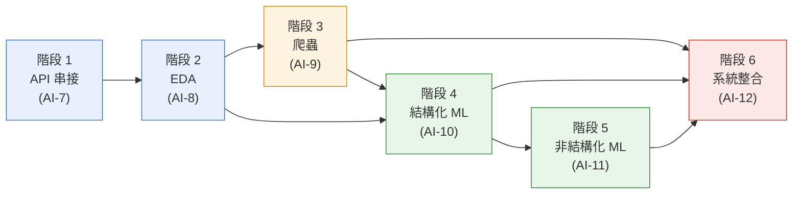

# 課程設計

這份文件講「這門課為什麼長這樣」：六個階段怎麼對應到教學單位的專案卡、
每階段要花多久、彼此的先後關係，以及怎麼打分數。如果你是要開課的講師，
先看這份；如果你是學員，先看 README.md 的快速開始，卡關再回來看這份。

## 為什麼用「台灣天氣資料」貫穿六階段

資料科學課程最常見的問題是每個單元換一個資料集，學員學完 EDA 就要重新
認識一份新資料才能學爬蟲，認知負擔疊加在教學進度之上，反而模糊了每階段
真正該學的方法論。這門課刻意用同一份資料域（台灣三城市天氣）貫穿六階段：
階段 1 用天氣預報 API 練「串接外部服務」，階段 2 用同樣的城市歷史資料練
EDA，階段 3 教你怎麼自己把資料生產出來（爬蟲），階段 4/5 用同一份資料
練結構化/非結構化建模，階段 6 把前面全部串成一個系統。學員第二次看到
「台北/台中/高雄」「temperature_2m_max」這些欄位時,不用重新理解資料
語意,可以把全部注意力放在當階段的新方法論上。

## 六階段對應表

| 階段 | 專案卡 | 級別/點數 | 主題 | 目錄 | 核心方法論 |
|---|---|---|---|---|---|
| 1 | AI-7 Data/AI 應用案例 | A / 2 點 | 天氣速報小幫手 | `stage1_api_app/` | REST API 串接、錯誤處理、mock 服務切換 |
| 2 | AI-8 資料分析 | A / 3 點 | 台灣三城市 11 年天氣 EDA | `stage2_eda/` | 資料清理、探索性視覺化、統計解讀 |
| 3 | AI-9 資料收集與資料庫 | B / 3 點 | 爬取沙盒氣象站→SQLite | `stage3_crawler/` | HTML 解析、翻頁、資料庫 upsert、爬蟲倫理 |
| 4 | AI-10 結構型資料分析 | B / 4 點 | 明日降雨預測＋隔日高溫回歸 | `stage4_ml_structured/` | 特徵工程、時間序列切分、基準線比較 |
| 5 | AI-11 非結構型資料分析 | C / 5 點 | 留言情感分類＋手寫數字辨識 | `stage5_ml_unstructured/` | 文字/影像特徵化、傳統 ML vs 神經網路 |
| 6 | AI-12 真實世界應用系統 | C / 5 點 | 天氣智慧儀表板 | `stage6_system/` | 資料流水線、模型服務化、監測與迭代 |

級別對照教學單位既有的 A/B/C 分級（A 最基礎、C 最進階），點數是該教學單位
內部的工作量權重,兩者都照專案卡原文抄錄,不是本課程自訂。

## 前置關係

六階段不是完全線性——階段 1、2 可以獨立做（都只依賴 `data/raw` 這份
committed 資料），但階段 3 之後開始互相依賴：階段 3 的爬蟲產出（SQLite）
是階段 6 資料流水線示範「怎麼把資料寫進正式系統」的前置知識；階段 4、5
訓練出的模型會被階段 6 直接載入使用。建議順序仍是 1→2→3→4→5→6,但如果你
只想學特定主題,可以參考下圖判斷能不能跳著做。

實務依賴細節：

- 階段 4 的 `features.py` 讀 `data/raw`（不需要階段 3 的資料庫），可以在
  完成階段 2 之後直接跳過階段 3 來做；但教案建議還是照順序走一次階段 3，
  因為「自己動手把資料生產出來」是後面所有階段的資料信任基礎。
- 階段 6 需要階段 3 的 SQLite schema（`predictions` 表）、階段 4 與階段 5
  的已訓練模型（`.joblib`，或用階段 6 的 `pipeline/bootstrap.py` 重新訓練）。
  沒做階段 3~5 就直接跳到階段 6 會卡在 bootstrap 那一步。

## 建議時數

以「有 Python 基礎、沒碰過 sklearn/FastAPI」的學員抓中位數,實際依個人
背景可能有 ±50% 落差：

| 階段 | 建議時數 | 備註 |
|---|---|---|
| 1 | 3~4 小時 | 多數時間花在讀懂 requests 的逾時/重試與 OpenAI 相容格式 |
| 2 | 5~6 小時 | pandas 清理與畫圖的手感建立需要時間，不要求一次到位 |
| 3 | 6~8 小時 | 全課程最容易卡關的階段：翻頁邏輯＋資料庫 upsert 兩個新概念疊加 |
| 4 | 6~8 小時 | 特徵工程與時間序列切分的心智模型建立比寫程式碼本身花更多時間 |
| 5 | 8~10 小時 | 兩個案例（文字＋影像）份量相當於兩個小專案 |
| 6 | 8~12 小時 | 整合前五階段成果，除錯時間通常比寫新程式碼時間長 |
| **總計** | **36~48 小時** | 約等於全職 1~1.5 週或業餘 4~6 週 |

## 評分規準

每階段對照 §1（見 SPEC，本文件承接其結論）「完成後產出」逐項打勾,分數
權重建議如下（單階段 100 分制,實際評分標準由開課單位決定,這裡只給參考
框架）：

| 項目 | 權重 | 說明 |
|---|---|---|
| 程式碼可運行 | 40 | 照 README「快速開始」的指令跑一次,得到文件宣稱的輸出 |
| 報告誠實性 | 25 | report.md 的數字是不是真的跑出來的（可要求學員附實測輸出截圖或終端機紀錄） |
| 方法論理解 | 20 | 「為什麼這樣設計」小節寫得出來,不是複製教案原文 |
| 測試通過 | 10 | 該階段對應的 pytest 測試全綠 |
| 延伸挑戰 | 5（加分） | 完成 README 的延伸挑戰視個人程度加分,非必要 |

「報告誠實性」刻意佔 25 分（僅次於程式碼可運行）,因為這門課的核心價值
觀是誠實面對數字,而非做出漂亮但灌水的報告——這點與 SPEC §6 的文風規範
一致，評分規準本身也要示範這個價值觀。

## 課程邊界（不在本課程範圍內）

- 不含深度學習框架（PyTorch/TensorFlow）的模型訓練,階段 5 的「神經網路」
  僅止於 sklearn 的 `MLPClassifier`（前饋神經網路),不涉及 CNN/Transformer。
- 不含雲端部署實作,階段 6 的「系統」是本機可執行的 Demo,不是正式上線
  服務（詳見 SPEC §9 已知界線）。
- 不含真實金流、真實使用者帳號系統——這門課全程不需要任何付費服務或
  需要註冊的雲端帳號。
