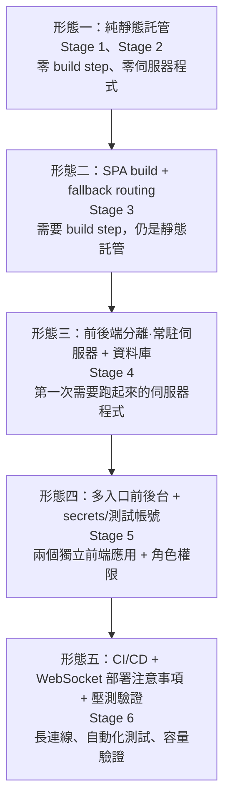

# 部署策略演進

> 回上層：[課程總覽 README](../README.md)
>
> 本課程的差異化重點：六階段不只是功能疊加，部署形態本身也跟著架構演進。這份文件把五種部署形態、各自的需求、常見坑整理在一起，方便帶課老師或想一次看完全貌的學員參考。**逐階段的實際部署步驟教學請看各階段自己的 `docs/DEPLOY.md`**，本文件不重複貼落落長的平台操作步驟，只講「為什麼形態變了、變了之後要注意什麼」。

## 1. 核心觀念：部署形態跟著架構走

一個網站專案該怎麼部署，不是憑空決定的，而是由它的技術架構決定——有沒有 build step、有沒有常駐的伺服器程式、有沒有資料庫、有幾個獨立的前端應用、有沒有長連線（WebSocket/SSE）。六個階段剛好對應五種逐漸複雜的部署形態，這也是本課程刻意保留「一路做上去」這條路徑的原因之一：學員可以親身體會「多一個功能，部署這件事會多出哪些新的要求」，而不是一開始就跳進最複雜的形態，搞不清楚哪些步驟是為了什麼而存在。

## 2. 五種部署形態總覽

### 形態一：純靜態託管（Stage 1、Stage 2）

- **需要什麼**：只需要一個能存放 HTML/CSS/JS/圖片檔案、並用 HTTP 回應這些檔案的地方。沒有 build step（Stage 1、Stage 2 都是零依賴、零 CDN），沒有伺服器程式需要「跑起來」，沒有資料庫。
- **主流平台選項**：GitHub Pages、Cloudflare Pages、Netlify、Vercel（靜態模式）——任何支援「丟一個資料夾上去就能訪問」的靜態網站託管服務都適用。
- **常見坑**：
  - **自訂 404 頁不會自動生效**：本課程用 `python3 -m http.server` 本地預覽時，打不存在的網址看到的是 Python 內建的錯誤頁，不是 Stage 2 做的 `404.html`；這個行為要部署到正式的靜態主機才會依平台規則生效（見 [`../stage2-multipage/docs/DEPLOY.md`](../stage2-multipage/docs/DEPLOY.md)）。
  - **`sitemap.xml`／canonical 網域要記得換**：教材裡用的是 RFC 2606 保留的範例網域，部署上線前必須換成實際網域。

### 形態二：SPA build + fallback routing（Stage 3）

- **需要什麼**：跟形態一一樣是靜態託管，但多了一道 **build step**（`npm run build` 產出 `dist/`），而且因為 SPA 用 client-side routing（`react-router-dom`），伺服器端必須設定「找不到實體檔案時退回 `index.html`」的 fallback rewrite 規則，否則直接輸入子路徑網址（例如 `/products`）重新整理會得到 404。
- **主流平台選項**：Cloudflare Pages（多數情況自動處理 SPA fallback）、Netlify（`dist/_redirects` 內容 `/* /index.html 200`）、Vercel（`vercel.json` 的 `rewrites`）、GitHub Pages（沒有原生 rewrite，常見做法是把 `dist/index.html` 複製成 `dist/404.html`）。
- **常見坑**：
  - **SPA 404**：這是本形態最核心的坑——忘記設定 fallback rewrite，SPA 的子路徑網址在重新整理或直接輸入時會變成平台預設的 404 頁，而不是預期的頁面內容（詳見 [`../stage3-spa/docs/DEPLOY.md`](../stage3-spa/docs/DEPLOY.md) 第三節，已用 `vite preview` 本地實測驗證這個行為）。

### 形態三：前後端分離·常駐伺服器 + 資料庫（Stage 4）

- **需要什麼**：第一次需要一個「常駐執行」的伺服器程式（`uvicorn app.main:app`），需要能跑 Python 的環境（container 或 PaaS 原生支援），需要資料庫（本課程統一用 SQLite）。前端可以跟後端合體部署（後端 `serve` 前端的 `dist/`），也可以分開部署。
- **主流平台選項**：後端——任何能跑 Python container 或直接執行 `uvicorn` 的 PaaS（Google Cloud Run、Render、Railway 等）；前端若分開部署——Cloudflare Pages、GitHub Pages、Vercel。
- **成本概念**：靜態託管（形態一、二）大多有相當慷慨的免費額度；一旦需要「常駐伺服器」，就從「幾乎零成本」跨進「需要考慮運算資源用量」的範疇——但**本課程沒有實際比較過各平台的定價方案**，實際費用會隨用量、地區、方案版本變動，且變動速度快，這裡不列出具體金額（避免資料過時或臆測），部署前請直接查閱平台當下的官方定價頁。
- **常見坑**：
  - **CORS**：前後端分開部署時，後端 `CORS_ORIGINS` 必須列入前端實際網址，不能繼續用開發環境的萬用字元預設值。
  - **SQLite 在容器裡會消失**：容器重啟或重新部署，SQLite 檔案很容易連同資料一起消失（除非額外掛載持久化磁碟）——這是 SQLite 適合教學/本機開發、不適合正式多副本環境的已知限制，正式產品通常會換成雲端代管的資料庫服務。
  - **`SECRET_KEY` 忘記換**：`.env.example` 的開發預設值只適合本機開發，正式部署務必換成長隨機字串。

### 形態四：多入口前後台 + secrets/測試帳號（Stage 5）

- **需要什麼**：在形態三的基礎上，多了一個**完全獨立的前端應用**（後台 `admin/`，自己的 `package.json`、自己的 build 產物），代表部署時要嘛多掛一組 SPA fallback 規則（後端同時 serve 前台與後台，兩組 catch-all 路由的註冊順序有講究），要嘛整個後台再開一個獨立的靜態託管專案。角色權限（`role` 欄位）代表「誰能存取後台」變成一個必須在部署環境也驗證過的安全需求，不只是本機測試過而已。
- **主流平台選項**：跟形態三相同的後端選項；前台/後台若分開部署成靜態站，可以是同一個平台開兩個專案，也可以分散到不同平台。
- **常見坑**：
  - **兩組 SPA fallback 順序不能寫反**：後台的 catch-all 路由必須先於前台的 catch-all 路由註冊，否則後台路徑會被前台的 fallback 規則搶先攔截（見 [`../stage5-platform/docs/DEPLOY.md`](../stage5-platform/docs/DEPLOY.md)）。
  - **CORS 要同時列入前台跟後台兩個網址**：分開部署時，`CORS_ORIGINS` 要用逗號分隔列入兩個網址，忘記其中一個會導致該應用打 API 全部失敗。
  - **測試帳號要在交付檢查表明確列出**：課綱要求「含測試帳號的雲端部署連結」，交付時務必附上帳號密碼（本課程種子資料的 admin／customer 測試帳號見 [`../stage5-platform/README.md`](../stage5-platform/README.md)「快速開始」一節），不能只給網址讓對方自己猜。

### 形態五：CI/CD + WebSocket 部署注意事項 + 壓測驗證（Stage 6）

- **需要什麼**：在形態四的基礎上，新增兩類需求——(1) **CI**：程式碼推送後自動跑測試＋build，本課程提供 `ci/github-actions-ci.yml` 教材（只做到 build+test，deploy 留白，理由見本文件第 4 節）；(2) **長連線基礎設施**：WebSocket 是持續保持開啟的連線，跟一般「發出去、收回應、結束」的 HTTP 請求不一樣，反向代理／負載平衡器需要額外設定才會正確轉發。
- **主流平台選項**：跟形態三、四相同的後端選項，額外注意平台是否原生支援 WebSocket 轉發（多數現代 PaaS 的負載平衡器已內建支援，但建議部署後實際測試一次連線）。
- **常見坑**：
  - **WS sticky session（連線黏著）**：如果部署平台會依流量自動開多個 instance（例如 Cloud Run 的自動擴展），使用者的 WebSocket 連線會固定在「當初接受這個連線的那個 instance」；但本課程的 `ConnectionManager`／`TTLCache` 都只存在單一 process 的記憶體裡，多 instance 情境下會出現「連在 instance A 的使用者收不到 instance B 處理的訂單事件」這種不一致。教學規模建議部署時把 instance 數量鎖定為 1，真正要支援多 instance 需要引入 Redis Pub/Sub（本課程刻意不實作，見 [`../stage6-advanced/docs/ARCHITECTURE.md`](../stage6-advanced/docs/ARCHITECTURE.md)「uvicorn workers」一節）。
  - **反向代理預設不轉發 WebSocket upgrade header**：Nginx 這類反向代理預設不會自動轉發 `Upgrade: websocket`，需要額外設定；平台代管的負載平衡器通常已內建支援，但仍建議部署後實測。
  - **壓力測試數字只在測試當下的環境有意義**：本機測出來的 RPS／延遲數字不能直接當作「正式環境能扛多少人」的保證，正式環境的容量規劃需要在目標部署環境重新實測。

## 3. 常見坑總表（跨形態彙整）

| 常見坑 | 首次出現的形態 | 完整說明 |
|---|---|---|
| SPA 404（子路徑重新整理找不到頁面） | 形態二（Stage 3） | [`../stage3-spa/docs/DEPLOY.md`](../stage3-spa/docs/DEPLOY.md) 第三節 |
| CORS（前後端分開部署跨網域） | 形態三（Stage 4） | [`../stage4-fullstack/docs/DEPLOY.md`](../stage4-fullstack/docs/DEPLOY.md) |
| WS sticky session（多 instance 下 WebSocket 連線不一致） | 形態五（Stage 6） | [`../stage6-advanced/docs/DEPLOY.md`](../stage6-advanced/docs/DEPLOY.md)「(d) WebSocket 部署注意事項」 |
| SQLite 在容器裡會消失 | 形態三（Stage 4）起，形態三～五皆適用 | 各階段 `docs/DEPLOY.md` 皆有提及，完整資料庫層設計取捨見對應階段 `docs/DATABASE.md` |

## 4. 誠實聲明

**本文件是教學指引，本課程建置過程中沒有實際執行任何雲端部署**——六個階段都沒有真的把專案部署到 GitHub Pages、Cloudflare Pages、Cloud Run 等雲端平台驗證過，上面提到的平台操作步驟是依照各平台公開文件整理而成，實際操作畫面請以你使用的平台當下介面為準。

**已實測過的，僅限本地驗證指令**：每個階段 `docs/DEPLOY.md` 第一節列出的本地驗證步驟（例如 `python3 -m http.server`、`npm run build` + `npm run preview`、`uvicorn` 啟動＋`curl` 健康檢查）都是本次建置教材時實際執行過、附上真實輸出的指令，這些是本課程唯一「已驗證」的範圍；雲端部署本身、雲端環境下的 WebSocket 連線、雲端環境下的效能數字，全部**未經實測**。

**關於 stage6 的 CI 教材檔案**：`stage6-advanced/ci/github-actions-ci.yml` 刻意只放在 stage6 資料夾內當教材，**不放進 repo 根目錄的 `.github/workflows/`**。理由是本課程全部設計為在本地端完成，不代學員啟用任何雲端自動化——一旦這份 workflow 被放進 repo 根目錄的 `.github/workflows/`，只要學員 fork 或 clone 這個 repo 並推送程式碼，GitHub Actions 就會在學員自己的帳號底下真的開始消耗執行時數，這是本課程刻意要避免的「未經同意就啟用會實際發生的自動化」。如果學員想在自己的 repo 實際啟用這份 CI，做法是照 [`../stage6-advanced/docs/CICD.md`](../stage6-advanced/docs/CICD.md) 的逐段講解，把 `ci/github-actions-ci.yml` 的內容複製到自己 repo 的 `.github/workflows/` 底下（並依實際情況調整 `paths:` 路徑過濾條件，本課程的路徑過濾是針對「這個 repo 同時放六階段教材」這個特殊情境設計的，一般專案不需要照抄）。這份 CI 本身也只做到 build + test，deploy 留白，理由同樣是「master spec 規定本課程不呼叫任何需要帳號/金鑰的雲端服務」。

## 作者與聯絡資訊

本專案為呂紹民（Darren Lu）製作的教學範例，供學員學習網站工程使用。如果對本文件或專案有任何問題，或有課程教學、顧問諮詢、專案導入需求，歡迎與我聯絡。

- Email：kevin868686@gmail.com
- LinkedIn：https://www.linkedin.com/in/shaominglu
- Facebook：https://www.facebook.com/darrenlu86
