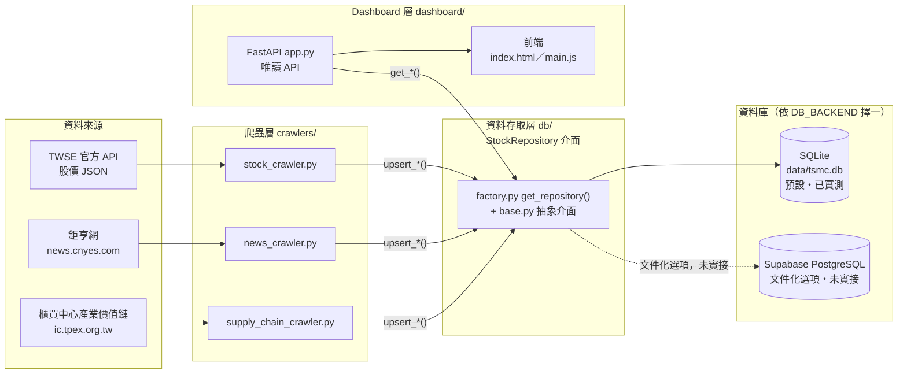
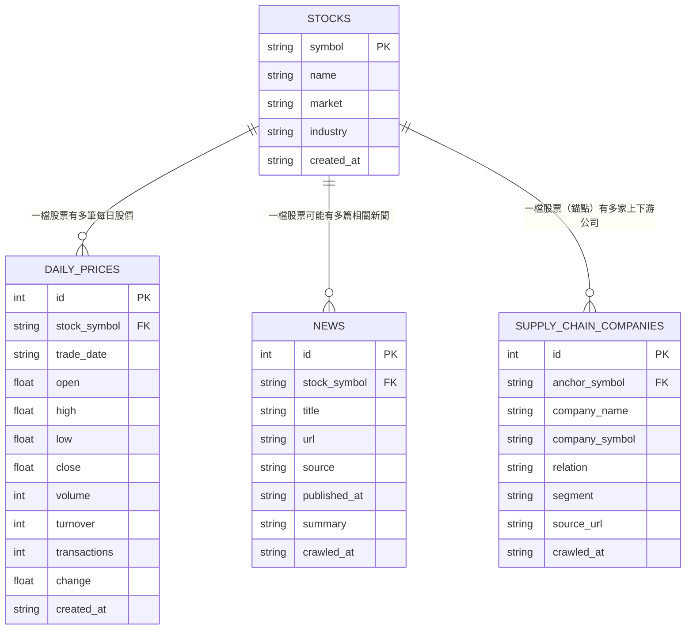
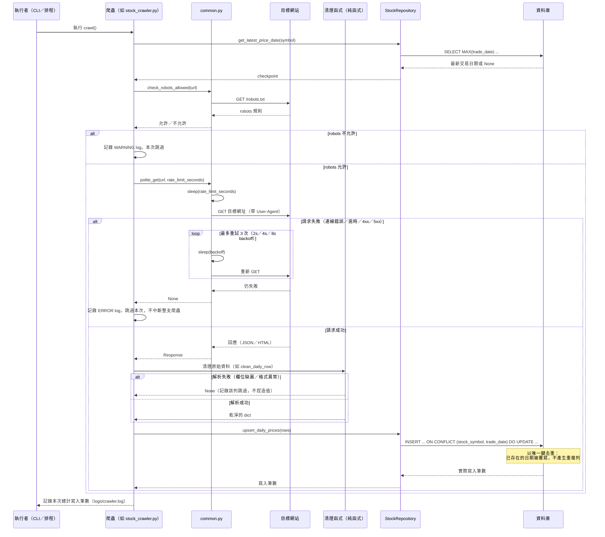
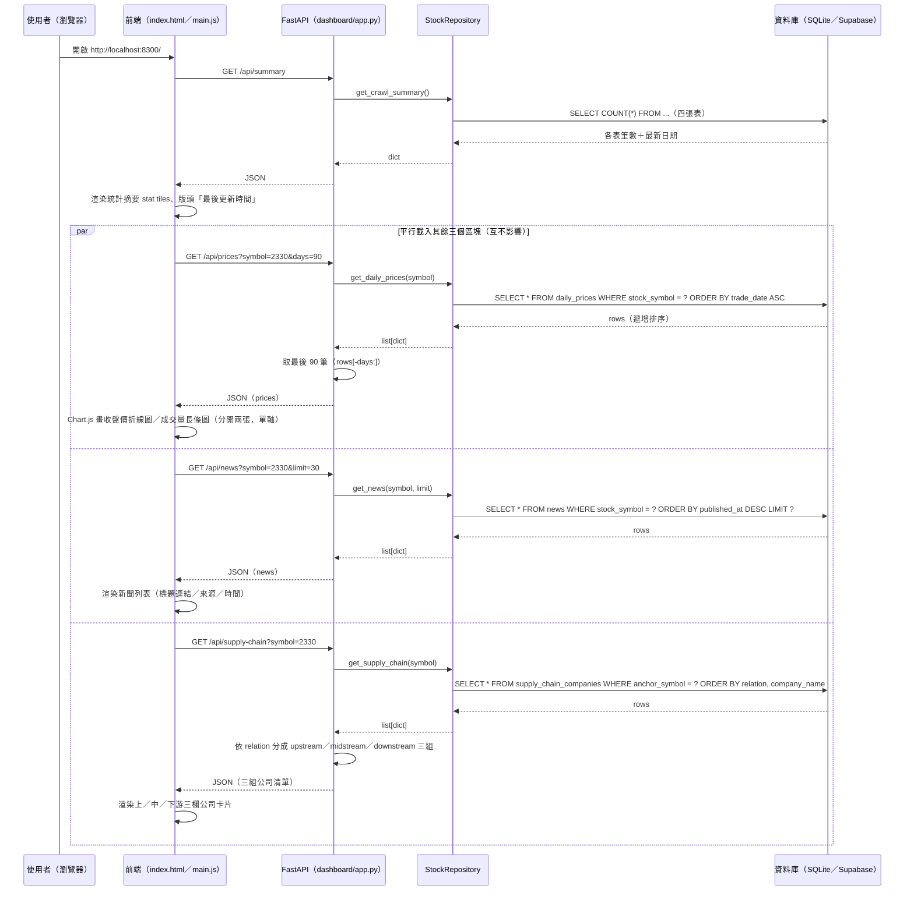

# 台積電股票分析教學專案 — 產品需求文件（PRD）

> 本文件是教學等級的技術規格文件，寫給「剛學會 Python 基礎、還沒做過完整爬蟲與資料庫專案」的學員閱讀。
> 每個重要的設計決策後面都會補一句「為什麼這樣設計」；初學者容易踩的坑會用「注意」標出來。
> 本文件的所有敘述都對照專案實際程式碼寫成，不是憑空想像的規格——如果你發現文件跟程式碼對不上，
> 請以程式碼為準，並回報給作者（見下方聯絡方式）。

---

## 0. 文件資訊與聯絡方式

| 項目 | 內容 |
|---|---|
| 專案名稱 | 台積電股票分析教學專案（tsmc-stock-analysis） |
| 文件性質 | 教學等級 PRD，對象為初學 Python、第一次做完整爬蟲＋資料庫專案的學員 |
| 作者 | 呂紹民（Darren Lu） |
| Email | kevin868686@gmail.com |
| LinkedIn | https://linkedin.com/in/shaominglu |
| Facebook | https://www.facebook.com/darrenlu86 |

本專案為呂紹民的學員教學範例。如果對本文件或專案有任何問題，或有專案導入、教學、諮詢需求，歡迎聯絡我。

**專案定位與誠實聲明**：本專案是**全本地端**教學專案。SQLite 是預設、且唯一實際跑通並驗證過的資料庫；
Supabase（雲端 PostgreSQL）只是「文件化選項」——程式碼（`db/supabase_repo.py`、`db/schema_supabase.sql`）
已經寫好、邏輯完整可讀，學員可以照著做，但本專案本身**沒有**實際連上任何雲端 Supabase 專案測試過。
這條界線在文件裡會反覆提醒，避免學員誤以為 Supabase 那條路已經被「跑過」了。

資料僅供教學與研究用途，不作商業散布。

---

## 1. 系統架構總覽

本專案採「兩段式、嚴格解耦」的架構：**爬蟲層**負責把外部資料抓進資料庫，**Dashboard 層**負責把資料庫的
資料讀出來呈現，兩層之間**只透過資料庫溝通**，彼此不直接呼叫對方的程式碼。

```
[資料來源] → 爬蟲層(crawlers/) → 清理(cleaning) → 資料存取層(db/) → SQLite / Supabase
                                                        ↑
                              Dashboard 層(dashboard/) — 唯讀，只從資料庫讀
```

**為什麼這樣設計**：如果爬蟲跟 Dashboard 綁死在同一個流程裡（例如 Dashboard 每次被打開就順便重新爬一次
網頁），會有兩個問題——第一，使用者打開網頁要等好幾秒甚至更久（爬蟲很慢，牽涉網路請求）；第二，爬蟲失敗
會直接讓 Dashboard 也一起壞掉。拆成兩層、中間隔一個資料庫之後，爬蟲可以獨立、重複、排程執行（例如晚上
排程跑一次），Dashboard 永遠只是很快地讀資料庫、秒開；就算爬蟲那天故障，Dashboard 依然能正常顯示「上次
爬到的資料」。這也是本專案在 `dashboard/app.py` 裡刻意只呼叫 repository 的 `get_*` 方法、完全不呼叫任何
`upsert_*` 方法的原因——程式碼結構本身就把「唯讀邊界」鎖死，不是靠口頭約定。

再往下拆一層，資料存取層（`db/`）本身也不直接跟「SQLite」或「Supabase」綁死，而是透過一個抽象介面
`StockRepository`（`db/base.py`）當中介。爬蟲層與 Dashboard 層的程式碼裡，永遠只會出現
`from db.factory import get_repository`，不會出現任何 `import sqlite3` 或 `from supabase import ...`。



**圖中重點（凸顯解耦）**：`Factory`（`db/factory.py`）同時被爬蟲層與 Dashboard 層呼叫，但走的是同一組
`get_repository()` 介面——爬蟲用它來寫，Dashboard 用它來讀，兩邊完全不知道對方的存在，也不會互相 import
對方的模組。整個架構裡只有「資料庫」這一個共同的接觸點。

**注意（初學者常見誤解）**：不要把「解耦」誤解成「爬蟲跟 Dashboard 完全沒關係」。它們仍然共用同一份
`db/base.py` 介面合約與同一個資料庫檔案——解耦的意思是「不直接呼叫對方的函式、不共用執行流程」，
不是「完全獨立、互不相干」。

---

## 2. 資料庫設計

本專案有四張表：`stocks`（股票基本資料）、`daily_prices`（每日股價）、`news`（新聞）、
`supply_chain_companies`（上下游供應鏈公司）。所有欄位定義都對照專案實際的
`db/schema_sqlite.sql`（SQLite 版本，本專案實際在用）逐欄寫成。

### 2.1 stocks（股票基本資料）

| 欄位 | 型別 | 可否為空 | 主鍵／外鍵 | 預設值 | 說明 |
|---|---|---|---|---|---|
| symbol | TEXT | 否 | PK | 無 | 股票代號，如 `2330` |
| name | TEXT | 否 | | 無 | 股票名稱，如「台積電」 |
| market | TEXT | 可 | | 無 | 市場別，如「上市」 |
| industry | TEXT | 可 | | 無 | 產業別，如「半導體」 |
| created_at | TEXT | 否 | | `datetime('now')` | 建立時間，ISO8601 字串 |

**為什麼這樣設計**：`symbol`（股票代號）本身就是天生唯一、不會重複的識別碼，直接拿來當主鍵，
不需要另外設一個自增的 `id` 欄位——這是資料庫設計裡「天然鍵（natural key）」的典型例子。
本專案目前只收錄台積電一檔股票，但這張表的設計本來就支援未來擴充多檔股票，不需要改 schema。

### 2.2 daily_prices（每日股價）

| 欄位 | 型別 | 可否為空 | 主鍵／外鍵 | 預設值 | 說明 |
|---|---|---|---|---|---|
| id | INTEGER | 否 | PK（AUTOINCREMENT） | 無 | 流水號 |
| stock_symbol | TEXT | 否 | FK → stocks(symbol) | 無 | 股票代號 |
| trade_date | TEXT | 否 | | 無 | 交易日，ISO8601（`YYYY-MM-DD`） |
| open | REAL | 可 | | 無 | 開盤價 |
| high | REAL | 可 | | 無 | 最高價 |
| low | REAL | 可 | | 無 | 最低價 |
| close | REAL | 可 | | 無 | 收盤價 |
| volume | INTEGER | 可 | | 無 | 成交股數 |
| turnover | INTEGER | 可 | | 無 | 成交金額 |
| transactions | INTEGER | 可 | | 無 | 成交筆數 |
| change | REAL | 可 | | 無 | 漲跌價差 |
| created_at | TEXT | 否 | | `datetime('now')` | 寫入時間 |

額外約束：`UNIQUE (stock_symbol, trade_date)`。

**為什麼這樣設計**：`(stock_symbol, trade_date)` 的組合天生就唯一——同一檔股票同一天只會有一筆收盤資料。
把這個組合設成 `UNIQUE`，資料庫本身就會幫忙擋掉重複列，爬蟲重複執行、甚至同一天重跑兩次，也不會塞進兩筆
一模一樣的資料——這是「冪等性（idempotency）」在資料庫層的具體實作，細節見 §5 爬蟲設計。

**注意（初學者常見誤解）**：`open`/`high`/`low`/`close`/`change` 這幾個欄位允許是 `NULL`，不是
「一定要有值」。程式碼裡的清理函式（`clean_daily_row`）設計成：只要日期、成交量、成交金額、開盤/最高/
最低/收盤價、成交筆數任何一個解析失敗，整列就直接丟棄不寫入（寧缺勿濫）；但「漲跌價差」（`change`）
是唯一的例外——它本身就可能合法地沒有值（例如當天沒有比較基準），`None` 對這個欄位是有效的清理結果。

### 2.3 news（新聞）

| 欄位 | 型別 | 可否為空 | 主鍵／外鍵 | 預設值 | 說明 |
|---|---|---|---|---|---|
| id | INTEGER | 否 | PK（AUTOINCREMENT） | 無 | 流水號 |
| stock_symbol | TEXT | 可 | FK → stocks(symbol) | 無 | 相關股票代號 |
| title | TEXT | 否 | | 無 | 新聞標題 |
| url | TEXT | 否 | UNIQUE | 無 | 新聞網址 |
| source | TEXT | 可 | | 無 | 來源媒體，如「鉅亨網」 |
| published_at | TEXT | 可 | | 無 | 發布時間，ISO8601 字串 |
| summary | TEXT | 可 | | 無 | 摘要（≤ 300 字） |
| crawled_at | TEXT | 否 | | `datetime('now')` | 爬取時間 |

**為什麼這樣設計**：`url` 設成 `UNIQUE`，因為「同一篇新聞」在真實世界裡就是用網址判斷是不是同一篇——
就算標題後來被媒體改了幾個字，只要網址一樣，就是同一篇文章，不該因為重複爬取而在表裡出現兩筆。

**注意（這是一個值得注意的 schema 細節）**：`stock_symbol` 在這張表**允許是 NULL**（schema 上沒有
`NOT NULL`），跟 `daily_prices.stock_symbol`（NOT NULL）不一樣。這是因為「新聞」這種資料型態本質上可能
跟特定股票無關（例如產業總論、總體經濟新聞），schema 設計上保留彈性；但本專案目前的爬蟲程式碼
（`news_crawler.py`）實際上每次都會把 `stock_symbol` 設成 `"2330"`，所以現階段資料庫裡不會出現
`stock_symbol` 是 NULL 的新聞列。這是「schema 允許的彈性」跟「目前應用程式的實際用法」兩件事——初學者
很容易把兩者搞混，誤以為 schema 沒寫 `NOT NULL` 就代表資料庫裡一定會出現 NULL。

索引：`idx_news_symbol_published` 建在 `(stock_symbol, published_at DESC)`。

**為什麼這樣設計**：Dashboard 查新聞的方式固定是「指定一檔股票、依發布時間新到舊排序」
（`get_news()` 對應的 SQL 是 `WHERE stock_symbol = ? ORDER BY published_at DESC`），
這個複合索引讓資料庫可以直接依索引順序取資料，不必額外做排序運算，資料量變大時查詢速度差異會很明顯。

### 2.4 supply_chain_companies（上下游供應鏈公司）

| 欄位 | 型別 | 可否為空 | 主鍵／外鍵 | 預設值 | 說明 |
|---|---|---|---|---|---|
| id | INTEGER | 否 | PK（AUTOINCREMENT） | 無 | 流水號 |
| anchor_symbol | TEXT | 否 | FK → stocks(symbol) | 無 | 錨點股票代號（本專案固定為 2330） |
| company_name | TEXT | 否 | | 無 | 公司名稱 |
| company_symbol | TEXT | 可 | | 無 | 公司股票代號（未上市可為 NULL） |
| relation | TEXT | 否 | | 無 | `upstream` / `midstream` / `downstream` |
| segment | TEXT | 否 | | `''`（空字串） | 細分環節，如「IC 設計」「化學品」；無資料時存空字串，不存 NULL |
| source_url | TEXT | 可 | | 無 | 資料來源網址 |
| crawled_at | TEXT | 否 | | `datetime('now')` | 爬取時間 |

額外約束：`UNIQUE (anchor_symbol, company_name, segment)`。

**為什麼這樣設計**：`company_symbol` 刻意允許 `NULL`，因為供應鏈上下游有不少公司是外國企業或未上市公司，
根本沒有台股代號（例如頁面上「知名外國企業」分類底下直接連到公司官網，不是台股個股頁面）。如果把這個
欄位設成 `NOT NULL`，等於強迫爬蟲對這種公司填一個假代號進去，直接違反「不捏造資料」的鐵律。

**注意（教學重點：UNIQUE 與 NULL 的陷阱）**：`segment` 欄位設計成 `NOT NULL DEFAULT ''`，不允許
`NULL`——因為 SQLite 與 PostgreSQL 的 `UNIQUE` 約束都把 `NULL` 視為「與任何值都不相等」（包含
`NULL` 自己）。如果 `segment` 允許 `NULL`，`UNIQUE (anchor_symbol, company_name, segment)` 遇到
兩筆 `(anchor_symbol, company_name, NULL)` 會被當成兩筆不同的列，完全不會觸發去重——重複執行爬蟲
就會讓這張表無限膨脹。改成 `NOT NULL DEFAULT ''`，把「沒有 segment 資訊」統一表示成空字串，
`UNIQUE` 才能正常比對、正常去重。寫入前（`db/sqlite_repo.py`、`db/supabase_repo.py` 的
`upsert_supply_chain`）會把 `None` 正規化成 `''`，呼叫端（爬蟲）不需要自己記得處理這件事。

**注意（真實踩到的 schema 限制，來自實測資料）**：去重鍵是 `(anchor_symbol, company_name, segment)`，
**不包含** `relation`。實測發現 TPEx 頁面上「生產製程及檢測設備」這個 `segment` 名稱同時出現在中游與
下游兩個大分類底下；如果同一家公司剛好兩邊都被列出（實測約 32 家），後寫入的那筆 upsert 會把
`relation` 覆蓋成後面爬到的值，前一個 `relation` 的紀錄會消失。這不是程式邏輯寫錯，而是 schema 設計
本身的取捨——如果要完整保留「同一家公司在兩種 relation 都有出現」的事實，去重鍵需要把 `relation` 也
納進去，但這會讓「同一家公司、同一 segment、卻在不同 relation 底下」被當成兩筆不同資料。本專案選擇
維持目前的去重鍵，忠實反映一個真實世界常見的現象——資料庫設計常常要在「表達力」跟「簡潔的去重規則」
之間做取捨，沒有絕對正確的答案，重點是知道自己選了哪一邊、代價是什麼。

### 2.5 表間關聯與索引總覽

| 索引／約束 | 建在 | 為什麼 |
|---|---|---|
| `daily_prices` PK | `stocks(symbol)` | 天然鍵，見 §2.1 |
| `UNIQUE(stock_symbol, trade_date)` | `daily_prices` | 同股同日只會有一筆股價，見 §2.2 |
| `idx_daily_prices_trade_date` | `daily_prices(trade_date)` | Dashboard／查詢常依日期區間篩選，加速範圍查詢 |
| `UNIQUE(url)` | `news` | 同一篇新聞用網址判斷唯一性，見 §2.3 |
| `idx_news_symbol_published` | `news(stock_symbol, published_at DESC)` | 對應 `get_news()` 的查詢與排序方式，見 §2.3 |
| `UNIQUE(anchor_symbol, company_name, segment)` | `supply_chain_companies` | 同一錨點股票、同一公司、同一環節只留一筆，見 §2.4 |

三張明細表（`daily_prices`／`news`／`supply_chain_companies`）都用外鍵指回 `stocks(symbol)`，
這是典型的「一對多」關聯：一檔股票可以有很多筆每日股價、很多篇新聞、很多家供應鏈公司；反過來，
每一筆股價／新聞／供應鏈公司紀錄只會屬於一檔股票。

**注意（SQLite 的外鍵是預設關閉的）**：SQLite 預設**不會**強制檢查 `FOREIGN KEY` 約束，就算違反外鍵、
寫入一個 `stocks` 表裡不存在的 `symbol`，SQLite 預設也不會報錯擋下來。`db/sqlite_repo.py` 的
`_connect()` 因此在每個新連線都手動執行 `PRAGMA foreign_keys = ON` 把這個檢查打開——這是初學者用
SQLite 時很容易忽略的一個預設值陷阱。

### 2.6 SQLite 與 Supabase（PostgreSQL）的型別／語法差異

本專案的兩份 schema 檔案（`db/schema_sqlite.sql`、`db/schema_supabase.sql`）資料模型完全相同，
但因為底層資料庫引擎不同，有幾個地方語法必須跟著調整：

| 差異點 | SQLite（本專案實際使用） | Supabase / PostgreSQL（文件化選項） | 為什麼 |
|---|---|---|---|
| 自增主鍵 | `INTEGER PRIMARY KEY AUTOINCREMENT` | `BIGINT GENERATED ALWAYS AS IDENTITY PRIMARY KEY` | 兩套資料庫實作自增數字的機制不同；PostgreSQL 較新的標準寫法是 `GENERATED ALWAYS AS IDENTITY`，取代舊式的 `SERIAL` |
| 日期／時間型別 | `TEXT`，存 ISO8601 字串（如 `"2026-07-01"`） | `DATE`（交易日）／`TIMESTAMPTZ`（含時區的時間戳，如 `published_at`、`created_at`） | SQLite 沒有原生日期型別，只能用文字模擬，靠「ISO8601 格式天生可以用字串排序」這個技巧取巧；PostgreSQL 有原生日期型別，可以直接做日期運算、時區轉換，不必自己解析字串 |
| 金額精度 | `REAL`（浮點數） | `NUMERIC(10, 2)`（定點數） | 浮點數在做金額加減時可能出現微小誤差（例如 `0.1 + 0.2 != 0.3`），教學專案用 `REAL` 是簡化取捨；正式金融系統的正確做法是用定點數 `NUMERIC`，PostgreSQL 版本示範這個正確做法 |
| 整數欄位大小 | `INTEGER` | `BIGINT`（`volume`／`turnover`） | 成交金額（`turnover`）數字可能很大，PostgreSQL 版本用更大範圍的 `BIGINT` 保守處理；SQLite 的 `INTEGER` 本身就是動態長度，不需要特別區分 |
| 目前時間預設值 | `DEFAULT (datetime('now'))` | `DEFAULT now()` | 兩套資料庫取得「目前時間」的內建函式名稱不同 |
| Upsert 語法 | `INSERT ... ON CONFLICT (...) DO UPDATE SET ...` | `INSERT ... ON CONFLICT (...) DO UPDATE SET ...`（語法幾乎相同） | 兩邊都支援標準 SQL 的 `ON CONFLICT` 語法，這正是本專案選 SQLite 做本地開發的原因之一——寫法可以幾乎原封不動遷移，學員不用學兩套完全不同的 upsert 心智模型 |

**為什麼這樣設計**：讓學員先在 SQLite 上把整個資料流程跑熟、跑通，之後如果要「升級」成正式的雲端
PostgreSQL 資料庫（Supabase），schema 轉換與程式邏輯轉換的落差都被壓到最小——這是本專案刻意選擇
「SQLite 為主、Supabase 為文件化選項」的核心理由，而不是因為 Supabase 比較難。

**注意（Supabase 版本的 upsert 有一個不一樣的地方）**：`db/supabase_repo.py` 的 `upsert_news()` 用
`ignore_duplicates=True`，衝突時是「整列跳過、不更新」；而 `db/sqlite_repo.py` 的 SQLite 版本用
`ON CONFLICT (url) DO NOTHING`，語意其實是一致的（兩者都是「已存在就不動它」），只是 supabase-py
套件包裝的參數名稱看起來不一樣，容易讓人誤以為邏輯不同。

---

## 3. ER 圖



**注意（如何讀懂這張圖的符號）**：`||--o{` 這個記號代表「一對多」關聯——左邊 `stocks` 的 `||` 代表
「剛好一筆」，右邊 `o{` 代表「零到多筆」。也就是說：一檔股票可以「完全沒有」對應的新聞或供應鏈資料
（`o` 代表可以是零），但一旦有，就可以有很多筆（`{` 代表多）。

---

## 4. 爬蟲設計說明

三支爬蟲共用 `crawlers/common.py` 提供的工具：

- `check_robots_allowed(url, user_agent)`：用標準庫 `urllib.robotparser` 檢查目標網址是否允許抓取，
  抓取前一定先呼叫這個函式，禁止就記 log 跳過。
- `USER_AGENT`（固定字串）：`tsmc-analysis-edu-crawler/1.0 (educational project; contact: kevin868686@gmail.com)`，
  在每個請求的 Header 裡誠實表明身分與聯絡方式。
- `polite_get(url, logger, rate_limit_seconds, **kwargs)`：內建「請求前先 sleep（節流）」＋
  「失敗用 2s/4s/8s exponential backoff 重試最多 3 次」的 GET 請求。
- `setup_logging(name)`：同時輸出到終端機（stdout）與 `logs/crawler.log` 的 logger，禁止用 `print()` 除錯。

**為什麼把這些抽成共用模組**：三支爬蟲抓的網站型態完全不同（官方 JSON API／React SPA／
server-rendered HTML），但「怎麼當一個有禮貌、有韌性的爬蟲」這件事是共通的——不重複寫三次一樣的
節流與重試邏輯（DRY 原則：Don't Repeat Yourself）。

### 4.1 股價爬蟲（stock_crawler.py）

| 項目 | 內容 |
|---|---|
| 目標來源 | TWSE（台灣證券交易所）官方 API：`https://www.twse.com.tw/exchangeReport/STOCK_DAY?response=json&date=YYYYMM01&stockNo=2330` |
| 格式 | JSON（官方 API，非 HTML） |
| 是否免費 | 是，TWSE 公開資訊，無需申請金鑰 |
| 更新頻率 | 每個交易日收盤後更新一次 |
| 要抓的欄位 | 日期、成交股數、成交金額、開盤價、最高價、最低價、收盤價、漲跌價差、成交筆數（實測固定的 9 個必要欄位順序） |

**Playwright vs requests 的取捨**：這支爬蟲選 `requests`，因為 TWSE 本身就提供公開、穩定的 JSON
端點，**有官方 API 就不爬網頁**——理由有三個：(1) 穩定：官方端點的資料格式不會像網頁排版一樣說改就改；
(2) 合法有禮貌：這是 TWSE 主動開放的資料介面，不是繞過限制硬爬；(3) 省資源：一次 API 呼叫換整月資料
（約 20 個交易日），比逐頁爬網頁划算，也不需要像新聞爬蟲那樣開一整個瀏覽器程序。

**抓取流程**：
1. Checkpoint：呼叫 `repo.get_latest_price_date(symbol)` 拿資料庫裡目前最新的交易日期。
2. 依 checkpoint 決定起始月份（`determine_start_month`）：完全沒資料時，從今天所在月份往前推
   `--months`（預設 3）個月開始 backfill；已有資料時，從「最新資料所在月份」的第一天重新抓整個月
   （即使 checkpoint 落在月中，也要重抓整月才不會漏掉月底的資料——重抓完全安全，因為 upsert 是冪等的）。
3. 逐月呼叫 API（`fetch_month`），一路抓到本月為止。
4. 逐列清理（見下方清理函式），組成 `upsert_daily_prices()` 需要的 dict。
5. 呼叫 `repo.upsert_daily_prices(rows)` 寫入。

**清理步驟（程式裡的實際函式名）**：

| 函式 | 做什麼 |
|---|---|
| `convert_roc_date` | 民國年 `"115/07/01"` → 西元 `"2026-07-01"` |
| `parse_number` | 千分位字串 `"37,544,470"` → `float`；`"--"`／空字串 → `None` |
| `parse_int` | 在 `parse_number` 基礎上再轉 `int`，給 volume／turnover／transactions 用 |
| `parse_change` | 漲跌價差：`"+95.00"` → `95.0`、`"-40.00"` → `-40.0`、`"X0.00"` → `0.0`（除權息等基準價調整日，實測 17 個月份、4 筆 X 開頭資料全部是 `"X0.00"`，如實反映成 0，不臆測其他數值）、`"--"` → `None` |
| `clean_daily_row` | 整合以上函式，把一列原始資料組成完整 dict；必要欄位任何一個解析失敗，整列直接丟棄 |

**寫入方式（冪等 upsert）**：`upsert_daily_prices()` 以 `(stock_symbol, trade_date)` 為唯一鍵，
SQL 用 `INSERT ... ON CONFLICT (stock_symbol, trade_date) DO UPDATE SET ...`。同一天同一檔股票的資料
重複匯入，後面的會覆蓋前面的值，不會產生重複列——這代表這支爬蟲可以放心重複執行（例如排程每天跑一次），
不用擔心資料庫越跑越腫。

**注意（初學者常見誤解）**：清理函式（`convert_roc_date`、`parse_number`、`parse_change`、
`clean_daily_row`）刻意寫成「純函式」——輸入字串、輸出乾淨的值，完全不做任何網路或資料庫 I/O。
這樣才能完全不連網路、不碰資料庫就對它們寫單元測試（`tests/test_stock_crawler.py`），也才能針對
「民國年」「千分位」「X 開頭」這些奇怪的輸入格式各自單獨驗證。把「抓資料」跟「清資料」拆開寫，是
本專案三支爬蟲共同的設計原則。

### 4.2 新聞爬蟲（news_crawler.py）

| 項目 | 內容 |
|---|---|
| 目標來源 | 鉅亨網「台積電」標籤頁：`https://news.cnyes.com/tag/台積電` |
| 格式 | HTML，但內容由 React SPA（Next.js App Router）在瀏覽器端渲染 |
| 是否免費 | 是，公開新聞網站，無需登入或付費 |
| 更新頻率 | 連續更新（新聞隨時發布，非固定排程） |
| 要抓的欄位 | 標題、連結、來源（固定「鉅亨網」）、發布時間、摘要（文章首段，≤ 300 字） |

**Playwright vs requests 的取捨**：這支爬蟲選 `Playwright`（會真的開一個無頭瀏覽器渲染頁面），
因為鉅亨網的新聞列表頁初始 HTML 只帶少量文章，其餘新聞要等瀏覽器把頁面「跑完」JavaScript 之後才會出現
——實測用 `curl` 直接抓只拿到 24 筆連結，用 Playwright 渲染完之後看到 33 筆不重複連結。這正是本專案
刻意挑這個來源當教學案例的原因：`requests` 對這種頁面會「看起來成功（HTTP 200）、內容卻不完整」，
是初學者很容易忽略的陷阱。

**誠實揭露的取捨教學點**：鉅亨網其實另外有一組公開的 JSON API（`api.cnyes.com`），如果只是要抓新聞
資料，實務上直接打那組 API 通常更穩定、更省資源、不用背瀏覽器的開銷。本專案為了教學目的**刻意不用**
那組 API，改走「開瀏覽器把頁面渲染出來」這條路，示範遇到 JS 渲染網站時的標準解法。如果是真正的正式
專案，看到目標網站有現成 API，通常應該優先選 API，而不是無腦上 Playwright——這一點在程式碼的模組
docstring 裡也有明講。

**抓取流程**：
1. `check_robots_allowed` 檢查 `robots.txt`（實測結果：`User-agent: * / Allow: /`，本入口未被禁止）。
2. 開啟 headless Chromium，用 `page.goto(..., wait_until="domcontentloaded")` 進列表頁，
   再用 `page.wait_for_selector()` 明確等待新聞連結元素出現（沒有用 `networkidle`，因為鉅亨網頁面
   背景有持續的追蹤／輪詢請求，實測 `networkidle` 會整個等到 30 秒逾時）。
3. `parse_list_items()` 從渲染完的 HTML 解析出候選新聞（標題、連結），預設上限 20 筆
   （CLI `--limit`）。
4. 逐篇進文章頁，同樣渲染後用 `parse_detail_page()` 抓 `<time datetime="...">` 屬性當發布時間、
   抓 `#article-container` 底下第一個 `<p>` 當摘要。
5. 清理（見下方）後，呼叫 `repo.upsert_news()` 寫入（url 去重）。

**清理步驟（程式裡的實際函式名）**：

| 函式 | 做什麼 |
|---|---|
| `clean_title` | 去除全形空白（`　`）與頭尾空白 |
| `clean_news_url` | 轉絕對網址；移除已知的行銷追蹤參數（如 `fbclid`、`gclid`、`utm_*`）與網址片段（`#...`） |
| `parse_relative_or_absolute_time` | 相對時間（「3 小時前」「剛剛」）／絕對時間／只有月日（「07-22」）統一轉成 UTC ISO8601 字串 |

**寫入方式（冪等 upsert）**：`upsert_news()` 以 `url` 為唯一鍵，`ON CONFLICT (url) DO NOTHING`。
重複執行這支爬蟲，已經存在的新聞網址不會重複寫入，回傳值是「本次實際新增」的筆數。

**注意（初學者常見誤解）**：抓不到必要欄位（例如解析不出發布時間）時，程式碼選擇**整筆跳過**，
不會用「現在時間」湊一個假的發布時間頂替——這是「不捏造資料」鐵律在爬蟲層的具體實踐，寧可少一筆
資料，也不要有一筆錯的資料混進資料庫。

### 4.3 供應鏈爬蟲（supply_chain_crawler.py）

| 項目 | 內容 |
|---|---|
| 目標來源 | 證券櫃檯買賣中心產業價值鏈資訊平台（半導體產業鏈）：`https://ic.tpex.org.tw/introduce.php?ic=D000` |
| 格式 | HTML，伺服器直接輸出完整內容（server-rendered，「檢視原始碼」就看得到資料） |
| 是否免費 | 是，公開官方平台 |
| 更新頻率 | 不定期（產業鏈參考資料，非每日更新的行情資料） |
| 要抓的欄位 | 公司名稱、公司股票代號（可為 None）、環節（segment）、上中下游分類（relation） |

**requests+BeautifulSoup vs Playwright 的取捨**：這支爬蟲選 `requests + BeautifulSoup`，因為這個頁面
是官方平台直出的 server-rendered HTML，不需要等 JavaScript 執行才有資料——能用簡單工具解決的事就不要
用複雜工具，多開一個瀏覽器程序是有成本的（啟動慢、吃記憶體）。

**抓取流程**：
1. `check_robots_allowed`（實測：這個網域沒有 `robots.txt`，視為無限制）。
2. `common.polite_get()` 走標準的節流＋重試流程抓頁面 HTML（約 280～300KB）。
3. `_build_relation_map()` 從「上游／中游／下游」三大區塊，建立 segment 代碼 → relation 的對照表。
4. `parse_supply_chain()` 逐 segment 解析公司清單（名稱、代號、來源網址），組成待寫入的 rows。
5. `repo.upsert_supply_chain(rows)` 寫入。

**清理步驟（程式裡的實際函式名）**：

| 函式 | 做什麼 |
|---|---|
| `_normalize_company_symbol` | 從公司連結網址取出 `stk_code` 參數，正規化成純數字字串；抓不到或非純數字一律回傳 `None`（未上市／外國企業沒有代號） |
| `_build_relation_map` | 建立 segment → relation（`upstream`/`midstream`/`downstream`）對照表；辨識不出的分類標題記 log 跳過，不亂猜 |
| `parse_supply_chain` | 整合上述解析，輸出符合 `upsert_supply_chain()` 欄位格式的 rows |

**寫入方式（冪等 upsert）**：以 `(anchor_symbol, company_name, segment)` 為唯一鍵，
`ON CONFLICT (...) DO UPDATE SET company_symbol = excluded.company_symbol, relation = excluded.relation, ...`。
這個 schema 限制（同一 segment 名稱出現在不同 relation 底下時，後寫入的 relation 會覆蓋前面的）
在 §2.4 已詳細說明。

**執行時的三段式 log（解析／去重／寫入）**：`run()` 執行完會印出一則統整 log，把「頁面解析出幾筆」
「去重後剩幾筆」「這次實際寫入(新增或更新)幾筆」三個數字分開列出，並額外從 `repo.get_supply_chain()`
讀回資料庫目前的實際總列數一起印出——這四個數字不會互相相等是正常的（解析筆數 ≥ 去重後筆數，因為
同一頁面同一 segment 下常有重複列出的公司名稱；去重後筆數也不一定等於資料庫總列數，因為 §2.4 提到的
「segment 相同、relation 不同」覆蓋現象會讓資料庫總列數略少於這次去重後筆數）。以下是某次實測的
輸出範例（實際數字會隨 TPEx 網站當下內容變動，不是固定值）：

```
供應鏈爬取完成：解析 610 筆／去重後 511 筆／資料庫寫入(新增或更新) 511 筆
（上游 150／中游 178／下游 183）；資料庫目前 anchor=2330 實際總列數：479
```

**為什麼要把這四個數字都印出來，而不是只印一個「完成」**：如果只印一句「供應鏈爬取完成」，學員看到
資料庫實際列數（479）跟這次寫入筆數（511）對不上，很容易誤以為程式有 bug、資料掉了 32 筆。把「解析」
「去重」「寫入」「資料庫目前總列數」四個階段的數字都攤開來，落差的原因（重複列出的公司名稱、
schema 去重鍵不含 relation）在 log 裡就完全透明，不需要另外查程式碼才能理解。

**注意（一個值得學員認識的環境陷阱）**：開發時實測發現，這個網站用的憑證鏈（老牌憑證機構 TWCA 簽發）
沒有帶新版規範建議的 Subject Key Identifier 擴充欄位——瀏覽器與 `curl` 都不會因此拒絕連線，但
Python 3.13 起 `ssl` 模組的預設驗證行為變得比業界標準更嚴格，會直接判定連線失敗
（`SSLCertVerificationError: Missing Subject Key Identifier`）。這不是網站不安全，是新版 Python
「比瀏覽器龜毛」的相容性問題。程式碼的因應方式：先照標準 `requests` 流程（含 robots 檢查、rate limit、
重試）抓取；如果重試多次仍失敗，才退而求其次呼叫系統內建的 `curl` 指令備援（`_fetch_via_curl`，
沒有加 `-k`/`--insecure`，不是關掉安全檢查，只是換一個沒踩到 Python 3.13 新規則的用戶端），
並把原因記進 log。

---

## 5. 循序圖

### 5.1 一次完整爬取到入庫

以下以股價爬蟲為代表流程（三支爬蟲共用 `crawlers/common.py` 的 robots 檢查／節流／重試機制，
差別只在「清理」與「解析」的細節，見 §4）。



**圖中重點**：checkpoint（一開始問資料庫「上次抓到哪裡」）、robots 檢查、rate limit（`sleep`）、
失敗重試（exponential backoff）、以及最後 upsert 的去重，是三支爬蟲共同遵守的完整鏈路——
差異只在「清理函式」換成各自的實作。

### 5.2 Dashboard 從資料庫讀取並呈現



**圖中重點**：整條路徑完全沒有出現任何 `upsert_*` 呼叫——`dashboard/app.py` 的四支端點只呼叫
`get_*` 系列方法，這是「唯讀邊界」在程式碼層級的具體展現，也對應 §1 系統架構圖裡 Dashboard 層與
爬蟲層完全分離的設計。四個區塊各自獨立 `try/catch`（`main.js`），其中一支 API 失敗不會讓整頁掛掉。

---

## 6. 資料來源介紹

本專案的三類資料，來源型態、更新頻率、該用 API 還是爬蟲，差異很大，整理如下：

| 類別 | 公開來源 | 格式 | 是否免費 | 更新頻率 | 該用 API 還是爬蟲 |
|---|---|---|---|---|---|
| 股價 | TWSE（台灣證券交易所）`exchangeReport/STOCK_DAY` | JSON（官方 API） | 免費，無需申請金鑰 | 每個交易日收盤後更新一次 | **用 API**——官方已提供結構化端點，沒有理由改爬網頁 HTML |
| 新聞 | 鉅亨網 `news.cnyes.com`（React SPA） | HTML（需 JS 渲染） | 免費，公開新聞網站 | 連續更新（新聞隨時發布） | 教學上**用爬蟲（Playwright）**，因為內容是前端渲染的；實務上若只求穩定省資源，該優先找有沒有現成 JSON API（本例中鉅亨確實有 `api.cnyes.com`，但本專案刻意不用，見 §4.2） |
| 上下游供應鏈 | 證券櫃檯買賣中心產業價值鏈平台 `ic.tpex.org.tw` | HTML（server-rendered） | 免費，公開官方平台 | 不定期（產業鏈參考資料，非每日行情） | **用爬蟲（requests+BeautifulSoup）**——沒有已知的公開 API，但因為是伺服器直出的 HTML，不需要動用瀏覽器渲染 |

**為什麼把這三種資料放在同一個專案裡當教材**：這三種來源剛好涵蓋了初學者會遇到的三種典型情境——
「有官方 API 就直接用」「網頁內容是 JavaScript 動態渲染，需要瀏覽器」「網頁是伺服器直出的 HTML，
用簡單工具就夠」。同一個專案裡同時示範這三種取捨，比只做一種類型的爬蟲更能讓學員建立完整的判斷力：
拿到一個新的資料來源時，第一步永遠是先看「有沒有現成 API」，再看「頁面內容是不是要等 JS 執行才出現」，
最後才決定要用 `requests` 還是 `Playwright`。

---

## 7. 爬蟲倫理與法律邊界

爬蟲技術本身是中性的，但「怎麼用」牽涉到網站方的意願、使用條款、甚至法律責任。本專案在這幾件事上
的具體做法：

**robots.txt**：每支爬蟲在發出任何請求前，都會先呼叫 `check_robots_allowed()` 檢查目標網址的
`robots.txt`。三個來源的實測結果：TWSE STOCK_DAY 端點、鉅亨網新聞標籤頁（`User-agent: * / Allow: /`，
本入口未被排除）皆允許抓取；TPEx 產業鏈平台則沒有 `robots.txt`（視為無限制）。**注意**：`robots.txt`
是網站方表達意願的機制，不是法律本身——它禁止的路徑，本專案的程式碼一律跳過，不強行抓取；但即使
`robots.txt` 沒有禁止，也不代表可以無限制、無節制地抓取，仍要搭配下面的節流與使用條款一併考量。

**使用條款（Terms of Service）**：TWSE 的股價資料屬於政府機關依法公開的開放資料；鉅亨網、TPEx 的
使用條款通常允許個人瀏覽與合理使用，但不一定允許「大量重製、商業散布」。本專案的爬蟲只擷取必要欄位
（標題、連結、時間、≤ 300 字的摘要），**不重製全文**，也不對外散布抓到的資料，這是刻意的節制。

**Rate limiting（節流）**：三支爬蟲分別設定不同的請求間隔——股價每次請求前 `sleep` 3 秒、新聞 2 秒、
供應鏈頁面間 2 秒，加上失敗時的 exponential backoff 重試（2s／4s／8s，最多 3 次）。**為什麼這樣設計**：
節流的目的是避免短時間內對目標伺服器發送大量請求、造成對方負擔（甚至被誤判成阻斷服務攻擊）；本專案
資料量小（一檔股票、幾十篇新聞、一次性抓取供應鏈頁面），節流成本很低，但這是任何規模的爬蟲都該養成
的習慣。

**User-Agent 誠實標示**：所有請求的 `User-Agent` 都固定是
`tsmc-analysis-edu-crawler/1.0 (educational project; contact: kevin868686@gmail.com)`，
沒有偽裝成一般瀏覽器。**為什麼這樣設計**：讓對方網站管理員在後台看到這個流量時，能一眼看出這是誰
的爬蟲、可以怎麼聯絡——這是爬蟲禮儀的基本功，而不是為了規避偵測。

**教學研究用途聲明**：本專案所有抓取的資料僅供教學與研究使用，不做商業散布、不對外提供資料下載服務、
不用來建立可公開查詢的競品資料庫。

**實務法律提醒（重要，非本專案免責聲明）**：以下是給學員的一般性提醒，不是法律意見，實際商業專案
務必諮詢律師：
- 台灣《著作權法》保護新聞內容等著作，即使網站沒有明確禁止爬取，「重製全文並公開散布」仍可能構成
  侵權；本專案只存標題與短摘要，就是為了避開這個風險。
- 「網站沒有 robots.txt 禁止」不等於「使用條款允許」，兩者是不同層次的規則——`robots.txt` 是技術層
  的存取控制，使用條款是契約層的約束，違反使用條款即使技術上抓得到資料，仍可能有違約或其他法律風險。
- 政府公開資料（如 TWSE）通常有明確的開放資料授權條款，使用前建議確認授權範圍（例如是否要求標示
  來源）。
- 高頻率、大量抓取造成對方伺服器負擔，即使個別請求合法，整體行為仍可能構成民事上的妨害（例如過度
  流量造成服務中斷），節流不是可有可無的裝飾，是實際的風險控制手段。

---

## 8. 開發指引

本專案建議依照「資料層 → 爬蟲層 → Dashboard 層」的順序開發，理由是：資料層定義了整個專案的「資料
長什麼樣子」與「怎麼存取」，爬蟲跟 Dashboard 都要依賴這一層的介面；如果反過來先寫爬蟲，後續資料庫
設計異動會牽動已經寫好的爬蟲程式碼，來回修改的成本更高。

### 階段一：資料層（config.py、db/）

**要完成的檔案**：`config.py`（讀 `.env`）、`db/base.py`（`StockRepository` 抽象介面）、
`db/schema_sqlite.sql`、`db/sqlite_repo.py`（SQLite 實作）、`scripts/init_db.py`（建表＋seed）。

**驗收標準**：
- `venv/bin/python scripts/init_db.py` 可以成功建表，並在 `stocks` 表種入台積電（2330）基本資料。
- 用 `sqlite3 data/tsmc.db` 手動查詢（或任何 SQLite 檢視工具）read-back 確認資料表結構與種子資料正確。
- `tests/test_repository.py` 全數通過（涵蓋四張表的 CRUD／upsert 去重／`get_crawl_summary()`）。

**為什麼這樣設計驗收標準**：先確認資料層獨立正確，之後爬蟲跟 Dashboard 出問題時，才能排除「是不是
資料層本身就有 bug」這個變數，除錯範圍會小很多。

### 階段二：爬蟲層（crawlers/）

**要完成的檔案**：`crawlers/common.py`（先做，三支爬蟲都依賴它）、`crawlers/stock_crawler.py`、
`crawlers/news_crawler.py`、`crawlers/supply_chain_crawler.py`。

**驗收標準**：
- 各爬蟲的清理／解析純函式先用固定 fixture（`tests/fixtures/` 底下的 JSON／HTML 檔案，不連網路）
  跑過 `tests/test_stock_crawler.py`／`tests/test_news_crawler.py`／`tests/test_supply_chain_crawler.py`
  全數通過。
- 每支爬蟲至少手動真實執行一次（`venv/bin/python -m crawlers.stock_crawler`、
  `venv/bin/python -m crawlers.news_crawler`、`venv/bin/python -m crawlers.supply_chain_crawler`），
  確認能真的連上目標網站、寫入資料庫，且 `logs/crawler.log` 有對應的執行紀錄。
- 冪等性驗證：同一支爬蟲手動連續執行兩次，第二次執行後資料庫筆數不應該重複增加（股價／供應鏈是
  「筆數不變或因新資料略增」，新聞是「新增筆數明顯下降，因為大部分 url 已存在」）。

**排程整合入口（`scripts/run_all_crawlers.py`）**：三支爬蟲各自照上面驗收標準跑通、確認沒問題之後，
可以改用這支腳本一次依序執行全部三支，取代「逐一手動執行」的方式：

```bash
venv/bin/python scripts/run_all_crawlers.py
venv/bin/python scripts/run_all_crawlers.py --months 3 --news-limit 20
```

其中一支爬蟲執行途中拋出例外，只會記一筆 `ERROR` log 並繼續跑下一支，不會讓整批排程中斷；三支都
跑完後會印出一份總結（哪支成功／失敗、寫入或新增筆數），回傳碼 `0` 代表三支全部成功、`1` 代表至少
一支失敗，方便排程系統的通知機制判斷。這是給 cron／Windows 工作排程器等排程系統呼叫的**單一入口**，
細節見 README.md〈定時自動執行爬蟲〉一節與 `scripts/run_all_crawlers.py` 的模組 docstring。

### 階段三：Dashboard 層（dashboard/）

**要完成的檔案**：`dashboard/app.py`（FastAPI 唯讀 API）、`dashboard/static/index.html`／
`style.css`／`main.js`。

**驗收標準**：
- `tests/test_api.py` 全數通過（用 FastAPI `TestClient` 搭配暫存測試資料庫，透過
  `app.dependency_overrides` 換掉 `get_repo`，不動到正式的 `data/tsmc.db`）。
- 執行 `venv/bin/uvicorn dashboard.app:app --port 8300`，用瀏覽器打開
  `http://localhost:8300/`，確認四個區塊（統計摘要、股價圖表、新聞列表、供應鏈三欄卡片）都能正確
  渲染，瀏覽器主控台（Console）沒有 JavaScript 錯誤。
- 直接用瀏覽器打 API 端點（如 `http://localhost:8300/api/summary`）觀察回傳的原始 JSON，確認格式與
  `db/base.py` 定義的介面一致。

**為什麼把「直接打 API 看 JSON」也列進驗收標準**：這是初學者建立「前後端分工」直覺很有效的練習——
先確認後端 API 回傳的資料格式正確，再確認前端有沒有正確把這份 JSON 畫成圖表／列表，出問題時能立刻
判斷是後端邏輯錯還是前端渲染錯，不用整個當成一個黑盒子除錯。

---

（文件結束）
