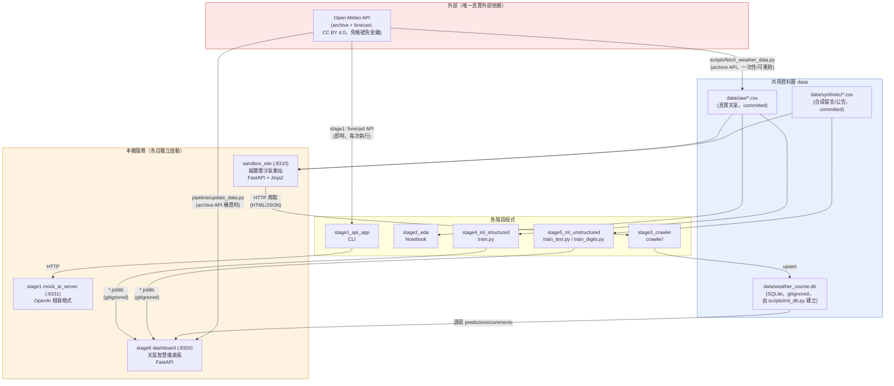
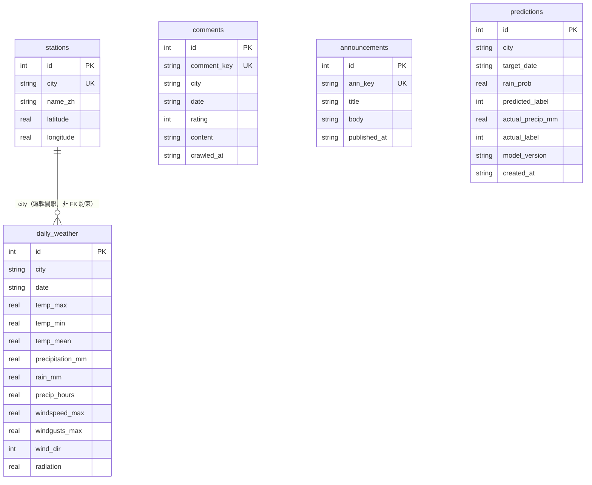
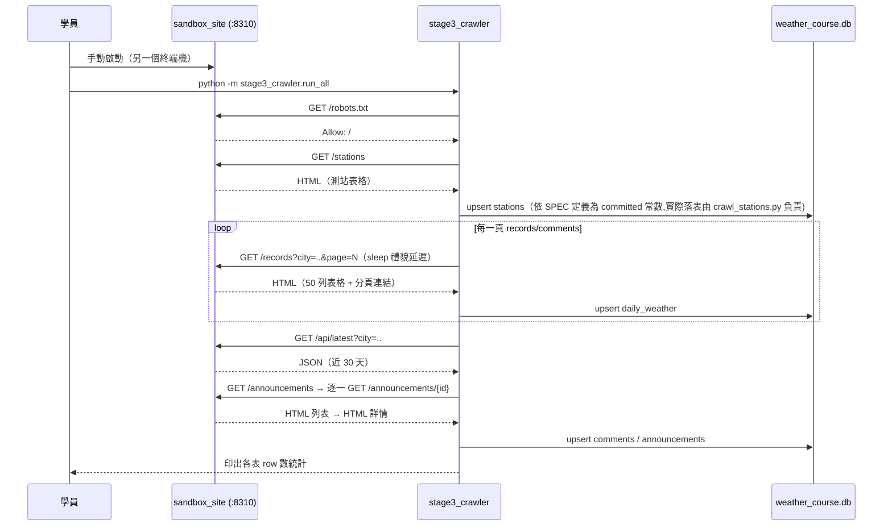
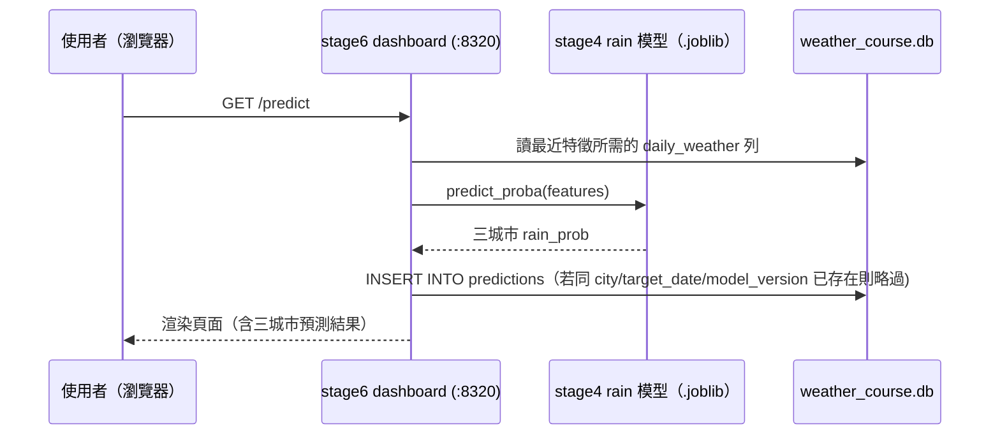

# 系統設計

這份文件講「整套系統怎麼串起來」：各服務的架構圖、資料契約、資料庫
schema、ER 圖、關鍵流程的循序圖。課程設計（六階段對應、評分、時數）在
`docs/CURRICULUM.md`；資料來源與授權細節在 `docs/DATA_SOURCES.md`。

## 整體架構

本課程沒有「一個系統」,而是六個獨立可執行的階段產出物,共用同一組資料層
（`data/`）與工具層（`common/`）。下圖畫出全部會啟動的服務、會寫入的檔案,
以及彼此的資料流向。

**為什麼這樣設計**：全部服務都是本機獨立進程,沒有共用的訊息佇列或
容器編排——這是刻意的教學取捨,學員要能用 `python -m uvicorn ...` 這種
最直觀的指令看懂每個服務怎麼啟動,不需要先學 docker-compose 才能碰資料
科學的核心方法論。資料層用檔案（CSV/SQLite）而非資料庫伺服器,同樣是
「先求看得懂,再求規模」的取捨。

**注意**：`data/weather_course.db` 是唯一跨階段共用的可變狀態。階段 3 寫入
`comments`/`daily_weather`/`announcements`,階段 6 額外寫入 `predictions`。
如果你刪掉這個檔案,階段 6 的 `pipeline/bootstrap.py` 設計上要能一鍵重建
（重新訓練模型、若資料庫不存在則呼叫 `scripts/init_db.py`),但不會自動
重新爬蟲——重新產生 `comments`/`announcements` 表仍需要手動跑一次
`stage3_crawler/run_all.py`（沙盒站需在 8310 運行）。

## 埠號總表

| 埠 | 服務 | 啟動指令 |
|---|---|---|
| 8310 | sandbox_site（教學沙盒網站） | `python -m uvicorn sandbox_site.app:app --port 8310` |
| 8331 | stage1 mock AI server | `python -m uvicorn stage1_api_app.mock_ai_server:app --port 8331` |
| 8320 | stage6 天氣智慧儀表板 | `python -m uvicorn stage6_system.app:app --port 8320` |

## 資料契約

### CSV：`data/raw/{city}.csv`（真實資料）

首欄 `date`（=Open-Meteo API 的 `time`），其餘欄名照 API 回應原樣：

| 欄名 | 型別 | 說明 |
|---|---|---|
| `date` | `YYYY-MM-DD` | 觀測日期 |
| `temperature_2m_max` / `_min` / `_mean` | float,攝氏 | 當日最高/最低/平均溫 |
| `precipitation_sum` | float,mm | 當日總降雨量（含雪，含微量降水） |
| `rain_sum` | float,mm | 當日總降雨量（僅雨,不含雪） |
| `precipitation_hours` | float,小時 | 當日有降雨的小時數 |
| `windspeed_10m_max` | float,km/h | 當日最大風速（10 公尺高度） |
| `windgusts_10m_max` | float,km/h | 當日最大陣風 |
| `winddirection_10m_dominant` | int,度 | 當日主導風向（0~360） |
| `shortwave_radiation_sum` | float,MJ/m² | 當日短波輻射總量 |

完整來源、授權、擷取時間戳見 `docs/DATA_SOURCES.md`。

### CSV：`data/synthetic/comments.csv`（合成資料）

`comment_id,city,date,rating,content`——`city`/`date` 必存在於對應
`data/raw/{city}.csv`；`rating` 為 1~5 整數；`content` 為程式生成中文短句。
**此語料為程式生成的合成資料（`generate_synthetic.py`，seed 20260723），
非真實網友留言。**

### CSV：`data/synthetic/announcements.csv`（合成資料）

`ann_id,title,body,published_at`——30 則公告，`ann_id` 為 `a01`~`a30`。同樣
為程式生成的合成資料,非真實公告。

## SQLite ER 圖

**為什麼 `city` 不是外鍵**：`daily_weather`/`comments`/`predictions` 的
`city` 欄位在邏輯上對應 `stations.city`,但 schema 沒有宣告 FK 約束——這是
教學上的刻意簡化（避免學員在 stage3 寫爬蟲時,還要先搞懂 SQLite 的 FK
enforcement 預設是關閉的、需要 `PRAGMA foreign_keys=ON` 這個額外知識點）。
完整 schema 定義見 `scripts/init_db.py` 的 `SCHEMA_SQL`（唯一真實來源,本圖
只是視覺化,若兩者不一致以程式碼為準）。

**冪等鍵設計**：`daily_weather` 用 `UNIQUE(city, date)`、`comments` 用
`comment_key`、`announcements` 用 `ann_key`、`predictions` 用
`UNIQUE(city, target_date, model_version)`——四張表都靠 `INSERT OR IGNORE`
或 `INSERT ... ON CONFLICT DO UPDATE` 達成「重跑爬蟲/預測不會製造重複列」,
這是 stage3 與 stage6 測試會實際驗證的性質,不是只寫在文件裡。

## 關鍵流程循序圖

### 流程一：stage3 爬蟲跑一輪

### 流程二：stage6 儀表板 `/predict` 一次請求

## 已知界線（承接 SPEC §9）

架構上刻意不含的東西,以及為什麼：容器編排、雲端部署、正式資料庫伺服器、
訊息佇列——全部略過,因為教學目標是方法論而非维运工程。完整清單與理由見
SPEC §9 與各階段 README 的「注意」小節。
