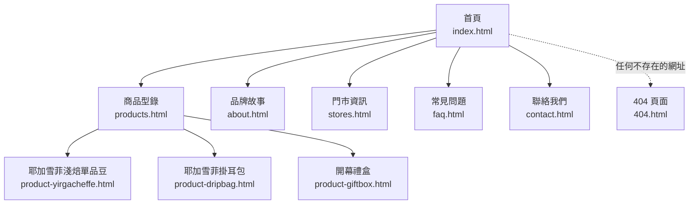

# 網站地圖與導覽結構

## 1. 頁面清單與 URL 命名

| URL | 頁面 | 屬於導覽列 | 屬於 sitemap.xml |
|---|---|---|---|
| `index.html` | 首頁 | 是 | 是 |
| `products.html` | 商品型錄 | 是 | 是 |
| `product-yirgacheffe.html` | 商品詳情：耶加雪菲淺焙單品豆 | 否（從型錄點入） | 是 |
| `product-dripbag.html` | 商品詳情：耶加雪菲掛耳包 | 否（從型錄點入） | 是 |
| `product-giftbox.html` | 商品詳情：開幕禮盒 | 否（從型錄點入） | 是 |
| `about.html` | 品牌故事 | 是 | 是 |
| `stores.html` | 門市資訊 | 是 | 是 |
| `faq.html` | 常見問題 | 是 | 是 |
| `contact.html` | 聯絡我們 | 是 | 是 |
| `404.html` | 找不到頁面 | 否 | 否（見第 4 節） |

URL 命名規則：全部小寫、用連字號分隔（`product-yirgacheffe.html`，不是 `productYirgacheffe.html` 或 `product_yirgacheffe.html`），
副檔名固定 `.html`——這是純靜態網站最直接的命名方式，沒有 route 這個抽象層，
網址就是磁碟上的實際檔名（stage3 開始用 client-side router 之後，這個對應關係才會被打破）。

## 2. 網站地圖（導覽結構）

**誠實聲明——這條虛線只在正式靜態主機上生效**：本地用 `python3 -m http.server` 預覽時，打一個不存在的網址不會走到 `404.html`，只會看到 Python 內建的英文錯誤頁；`http.server` 沒有「找不到檔案就轉導自訂 404 頁」這種機制。上圖「任何不存在的網址 → 404.html」是部署到 GitHub Pages、Cloudflare Pages 等正式靜態主機後才會生效的行為，這些平台原生支援把根目錄的 `404.html` 當成自訂錯誤頁。實測細節見 `docs/DEPLOY.md`。

導覽層級只有兩層：「主導覽列的六個入口」與「商品型錄底下的三個詳情頁」，
沒有做到第三層（例如「詳情頁底下再分頁籤」），這是刻意的——
12 筆商品目前只有 3 筆有詳情頁，資訊架構沒有必要為了還不存在的內容多留一層。

## 3. 導覽結構說明

- **主導覽列**（`partials/header.html`）：首頁、商品型錄、品牌故事、門市資訊、常見問題、聯絡我們，六個入口固定順序出現在每一頁。目前頁面用 `aria-current="page"` 標示（做法見 `docs/ARCHITECTURE.md` 第 2 節）。
- **頁尾導覽**（`partials/footer.html`）：重複一份「網站導覽」精簡連結（商品型錄／品牌故事／門市資訊／常見問題），加上聯絡方式——這是常見的「頁尾兜底」設計，使用者捲到頁面最下面時不用往上找導覽列。
- **麵包屑**：首頁不需要麵包屑；商品型錄與其他一般內頁是「首頁 > 目前頁」；三個商品詳情頁是「首頁 > 商品型錄 > 商品名稱」三層，對應它們在網站地圖裡真正的深度。

## 4. sitemap.xml 與 robots.txt 是給誰看的

這兩個檔案都不是給「人」看的——一般訪客不會主動打開它們——而是給搜尋引擎的爬蟲程式看的機器可讀清單。

- **`sitemap.xml`**：明確告訴爬蟲「這個網站有哪些頁面希望被收錄」，格式遵照
  [sitemaps.org protocol](https://www.sitemaps.org/protocol.html)：每個 `<url>` 一個 `<loc>`（完整網址）＋ `<lastmod>`（最後修改日期）。
  本站列出 9 個內容頁，**不包含 `404.html`**——sitemap 的用意是「引導爬蟲找到真正的內容」，
  錯誤頁不是內容，硬塞進去只會讓搜尋引擎收錄一個沒有意義的頁面。
- **`robots.txt`**：給爬蟲的存取規則，本站設定 `Allow: /` 開放全站，
  再用 `Disallow: /404.html` 明確擋掉錯誤頁（呼應上一點的理由），
  並用 `Sitemap:` 這一行告訴爬蟲去哪裡拿 sitemap.xml。

**誠實聲明——網域是佔位資料**：`sitemap.xml`、`robots.txt`、每頁的 `<link rel="canonical">` 與
`og:url` 用的都是 `https://www.brewgo-demo.example`。`.example` 是
[RFC 2606](https://www.rfc-editor.org/rfc/rfc2606) 保留給文件／範例使用的頂級網域，
刻意選它是為了避免誤用到真的有人在用的網域名稱。**這個網址目前打不開，也不該打得開**——
它只是教學上示範「sitemap 裡的網址長什麼樣子」。真的要部署上線時，
必須把這四個地方全部換成實際擁有的網域，做法見 `docs/DEPLOY.md`。
