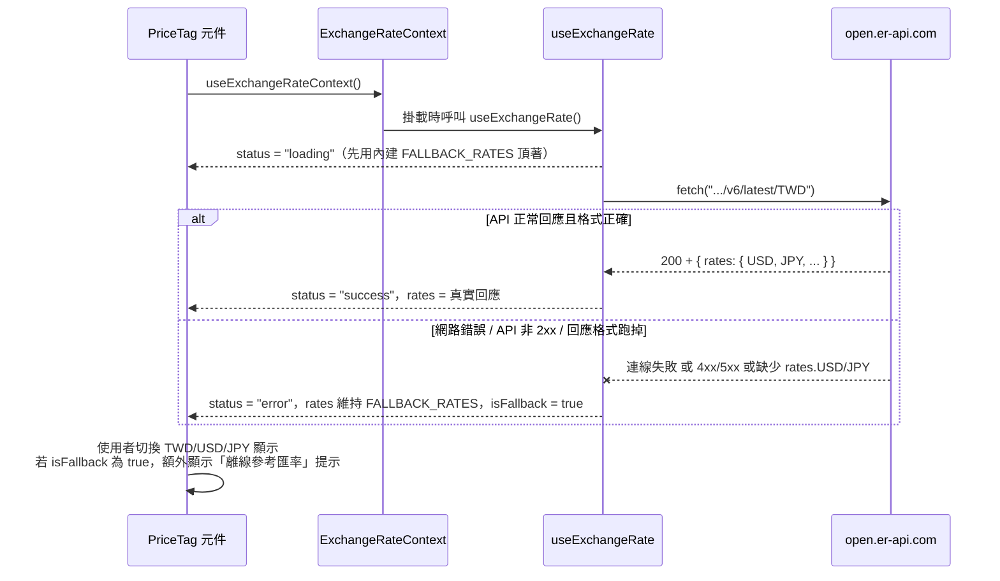

# API_INTEGRATION — 第三方 API 串接流程與錯誤處理

回上層：[stage3-spa README](../README.md)

## 1. 用的是哪支 API

- 服務：[exchangerate-api.com 的免費公開版本](https://www.exchangerate-api.com/docs/free)
- 端點：`https://open.er-api.com/v6/latest/TWD`
- 特性：**不需要註冊、不需要 API key**，直接 GET 就有回應；以 TWD 為基準幣別，回傳 TWD 兌換其他所有幣別的匯率。
- 本專案只用到回應裡的 `rates.USD` 與 `rates.JPY` 兩個欄位，讓商品價格旁能顯示「約多少美元／日圓」的參考價。

實際打一次的真實回應（2026-07-23 執行 `curl -s "https://open.er-api.com/v6/latest/TWD"` 記錄下來，只節錄關鍵欄位）：

```json
{
  "result": "success",
  "provider": "https://www.exchangerate-api.com",
  "time_last_update_utc": "Thu, 23 Jul 2026 00:02:31 +0000",
  "base_code": "TWD",
  "rates": {
    "TWD": 1,
    "USD": 0.030855,
    "JPY": 5.030669
  }
}
```

## 2. 為什麼第三方 API 一定要有 fallback

這支 API 完全在我們控制範圍之外：服務可能維護、可能流量限制被擋、使用者的網路可能斷線或公司防火牆擋掉這個網域。如果「匯率顯示不出來」這件小事會連帶讓整個商品頁面壞掉（例如拋出例外讓 React 整棵元件樹白屏），使用者會因為一個無關緊要的附加功能，連「看商品、加購物車、結帳」這些核心功能都用不了——這是本末倒置。

**設計原則：外部依賴失敗時，只有依賴它的那一小塊 UI 要降級，其他全部功能必須完全不受影響。** 商品列表、購物車、結帳、訂單查詢全部只讀本地 `products.json` 跟 `localStorage`，跟這支匯率 API 完全無關；就算 API 永遠打不通，網站的核心購物流程一樣能走完，只是價格旁邊看不到外幣參考價（或者只能看到「離線參考匯率」）。

## 3. 串接流程（loading → 成功／失敗 → fallback）



程式對應位置：

- 發請求：[`src/hooks/useExchangeRate.js:28`](../src/hooks/useExchangeRate.js#L28) `await fetch(EXCHANGE_RATE_API_URL)`
- 三態的狀態機：`status` 的值只會是 `'loading'` → `'success'`／`'error'` 其中一種，定義在 [`src/hooks/useExchangeRate.js:20`](../src/hooks/useExchangeRate.js#L20)
- 失敗與 fallback：[`src/hooks/useExchangeRate.js:41`](../src/hooks/useExchangeRate.js#L41) 的 `catch` 區塊，不管是什麼原因失敗都會落到同一個處理路徑
- 共享單一次 API 呼叫：[`src/context/ExchangeRateContext.jsx`](../src/context/ExchangeRateContext.jsx) 把 hook 提升到 App 最外層，避免每張商品卡各自呼叫

## 4. 錯誤處理策略表

| 情境 | 觸發條件 | 處理方式 | 使用者看到什麼 |
|---|---|---|---|
| 網路離線 / DNS 失敗 | `fetch` 直接 reject（`TypeError: Failed to fetch` 之類） | `catch` 捕捉，`console.warn` 留下除錯痕跡，`rates` 設回 `FALLBACK_RATES` | 切到 USD/JPY 時價格旁多一行「（離線參考匯率）」 |
| API 回傳非 2xx（例如 429 太多請求、5xx 伺服器錯誤） | `response.ok` 為 `false` | 主動 `throw`，統一走同一個 `catch` 路徑 | 同上 |
| API 回應格式跑掉（例如拿掉了 `rates` 欄位，或欄位型別不是 number） | `typeof usd !== 'number'` 或 `typeof jpy !== 'number'` | 主動 `throw`，統一走同一個 `catch` 路徑 | 同上 |
| API 正常 | 上面三種都沒發生 | 直接採用回應的 `rates.USD`/`rates.JPY` | 價格旁顯示即時換算後的參考價，不顯示離線提示 |
| 商品列表／購物車／結帳等核心功能 | 不管上面哪種情況 | 完全不受影響，因為這些頁面不依賴這支 API | 正常操作 |

## 5. 測試怎麼驗證這件事

`src/hooks/useExchangeRate.test.js` 用 `vi.stubGlobal('fetch', ...)` 模擬四種情境（全部不打真網路）：

- 成功：`fetch` resolve 一個 `{ ok: true, json: async () => ({ rates: { USD, JPY } }) }`，驗證 `status` 變成 `'success'`、`isFallback` 為 `false`。
- 網路失敗：`fetch` 直接 reject，驗證 `status` 變成 `'error'`、`rates` 等於 `FALLBACK_RATES`。
- 非 2xx：`fetch` resolve `{ ok: false, status: 500 }`，驗證同樣落到 `'error'`。
- 格式跑掉：`fetch` resolve 一個沒有 `rates` 欄位的物件，驗證同樣落到 `'error'`。

`src/components/PriceTag.test.jsx` 則是從「使用者實際會看到什麼」的角度再驗證一次：API 失敗時切到 USD 會顯示「離線參考匯率」字樣；API 成功時切到 JPY 會顯示正確換算後的金額、且不顯示離線提示。

**斷網情境的完整驗證方式**：因為測試環境本來就不允許連真網路，我們沒有辦法在自動化測試裡「真的斷網」；上面這些 mock 測試涵蓋的是「fetch 會 reject／回傳失敗狀態／回傳格式不對」這幾種情況，這些正是斷網、API 掛掉在程式碼層面實際看到的樣子，所以這樣的 mock 測試等同於驗證了斷網情境下的行為。如果想要更貼近真實情況地手動驗證，可以在瀏覽器開發者工具的 Network 面板切換成 "Offline" 之後重新整理商品頁，觀察畫面是否如預期顯示離線提示（這一步屬於手動驗證，本文件沒有自動化測試涵蓋，誠實列在這裡）。
