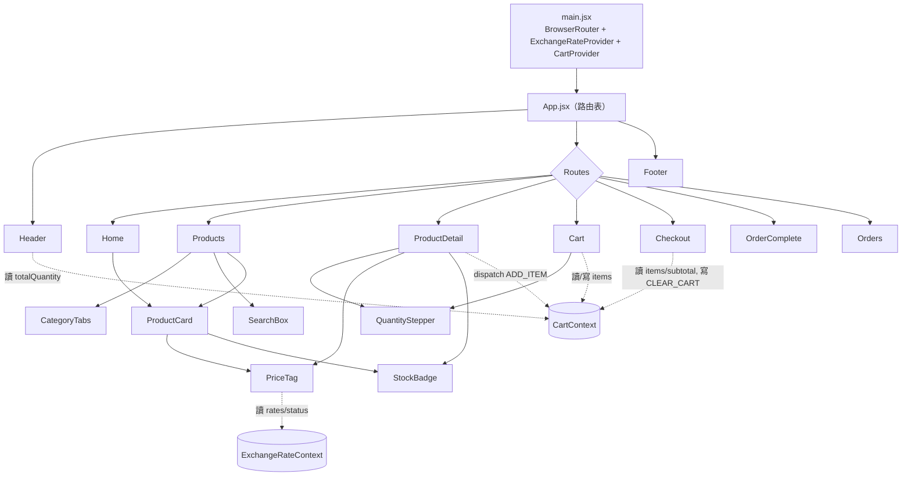
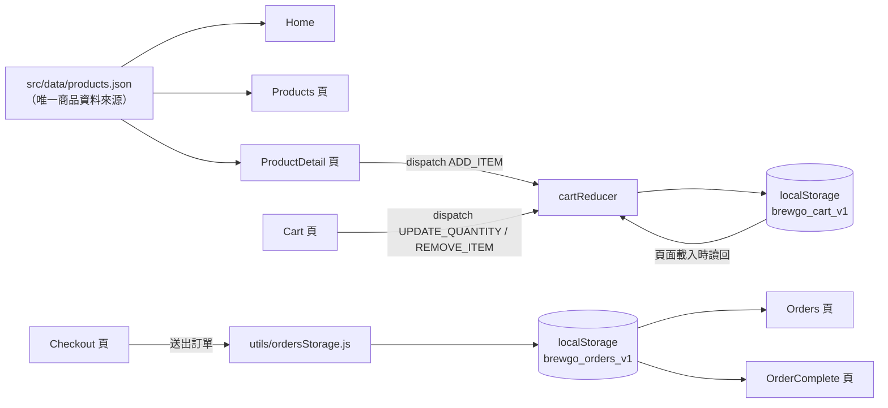

# ARCHITECTURE — 前端框架選型與分層說明

回上層：[stage3-spa README](../README.md)

## 1. 為什麼需要框架（從 stage2 的痛點開場）

Stage2（多頁式靜態網站）用純 HTML/CSS/JS 做出了一個可以逛的多頁商店，但只要加上「購物車」就會立刻遇到三個撐不住的地方：

1. **跨頁共享狀態很痛苦。** 使用者在 `products.html` 加入一件商品，切到 `cart.html` 要能看到同一筆資料。純 HTML 多頁沒有「頁面之間共享的 JS 變數」這回事——每次換頁都是瀏覽器重新載入一個全新的 document，之前那頁 JS 裡的變數全部歸零。唯一的共享手段是 `localStorage`/`sessionStorage` 這種瀏覽器儲存機制，但如果每一頁都要自己寫「讀 localStorage → 手動更新 DOM → 監聽變化 → 再手動更新別的地方的 DOM」這套邏輯，程式碼會在每個頁面重複一次，而且很容易漏改某個地方（例如 header 的購物車數字忘記同步）。
2. **UI 要「即時」反應資料變化，手動 DOM 操作規模爆炸。** 商品列表要同時套用分類篩選＋關鍵字搜尋、庫存徽章要跟著庫存數字變，購物車要改數量就重算小計與總計——純 JS 版本要嘛整段重新產生 HTML 字串塞回去（笨但至少資料一致），要嘛手動抓每個 DOM 節點分別更新（快但很容易讓「畫面顯示的」跟「實際資料」兜不起來）。專案越大，這種手動同步的心智負擔越重。
3. **重複的 UI 元件沒有複用機制。** 商品卡（圖片＋名稱＋價格＋庫存徽章）在首頁、商品列表頁都要出現，純 HTML 只能複製貼上整段標籤，改一次樣式要記得改好幾個地方。

**框架解決的正是這三件事**：用一個「元件」封裝一段可複用的 UI＋邏輯；用「狀態」代表資料，畫面永遠是狀態的函式（狀態變了，畫面自動重新算一次該長什麼樣子，不用自己手動命令 DOM 怎麼改）；用「跨元件共享狀態」的機制（本專案用 React Context）讓 Header 的購物車數字、Cart 頁的品項列表讀的是同一份資料。

## 2. Vite 是什麼、為什麼選它

Vite 是一套「前端建置工具」，本專案用到它兩個核心能力：

- **開發模式（`npm run dev`）**：啟動一個開發伺服器，瀏覽器改哪個檔案就只重新編譯那個檔案（ESM-based，不用像傳統 bundler 一樣每次都整包重新打包），存檔到畫面更新幾乎是即時的。
- **打包模式（`npm run build`）**：把 `src/` 底下所有 `.jsx`/`.js`/`.css` 檔案，連同它們互相 `import` 的關係，打包成瀏覽器可以直接執行的靜態檔案（放進 `dist/`），因為瀏覽器原生不認得 JSX 語法、也不會自動解析「一個檔案 import 另一個檔案」這種模組寫法沒有打包過的話效能很差。

為什麼不是「不用建置工具，直接在瀏覽器裡跑 React」：React + JSX 需要先經過編譯（Babel/esbuild 之類的工具把 JSX 轉成 `React.createElement(...)`），瀏覽器沒辦法原生執行 JSX；就算改用不需要 JSX 的寫法，沒有打包工具也很難管理十幾個檔案之間的 `import`/`export` 關係與正式環境的效能優化（例如把用不到的程式碼移除、壓縮檔案大小）。Vite 是目前 React 官方文件推薦的建置工具之一，設定檔（`vite.config.js`）也很單純，適合教學。

## 3. 資料夾分層與職責

```
src/
├── main.jsx          入口：掛載 React、包上 BrowserRouter 與兩個全域 Provider
├── App.jsx            路由表：網址對應到哪個 page 元件
├── data/               靜態資料（本階段唯一的資料來源，沒有後端）
├── context/            全站共享狀態（購物車、匯率）
├── hooks/               可複用的邏輯（目前只有 useExchangeRate）
├── components/         可複用、不含頁面級路由邏輯的 UI 元件
├── pages/               對應一個路由的頁面元件，負責組裝 components 並串接 context
└── utils/               純函式（格式化、產生亂數編號），不 import React
```

| 資料夾 | 職責 | 為什麼要分出來 |
|---|---|---|
| `data/` | 12 筆商品型錄（唯一資料來源） | 之後 stage4 換成打後端 API 時，只要把「讀這個檔案」換成「fetch 這支 API」，components/pages 幾乎不用改——資料來源集中在一處，才有辦法之後整批替換 |
| `context/` | `CartContext`（購物車）、`ExchangeRateContext`（外幣匯率）、`cartReducer`（純函式 reducer） | 兩份「全站共享」的狀態各自獨立，互不干擾；reducer 拆成獨立檔案是為了能直接用純函式單元測試（不必掛載任何 React 元件），見 `cartReducer.test.js` |
| `hooks/` | `useExchangeRate`：呼叫第三方 API、處理 loading/成功/失敗三態 | 「呼叫 API＋處理三態」這段邏輯本身值得獨立測試（見 `useExchangeRate.test.js`），也可能未來被其他元件重複使用 |
| `components/` | Header、ProductCard、StockBadge、PriceTag、QuantityStepper、CategoryTabs、SearchBox、Footer | 純粹負責「這個東西長什麼樣子＋接受什麼 props」，不知道自己被哪個頁面用、也儘量不自己決定商業邏輯（例如 `QuantityStepper` 只認得 `min`/`max`/`onChange`，不知道 `max` 背後其實是庫存數） |
| `pages/` | Home、Products、ProductDetail、Cart、Checkout、OrderComplete、Orders、NotFound | 每個 page 對應 `App.jsx` 的一個路由，負責「這個網址該顯示什麼」：讀 URL 參數、串 context、組裝 components |
| `utils/` | `formatCurrency`、`generateOrderId`、`categories`、`ordersStorage` | 跟 React 完全無關的純函式／localStorage 存取邏輯，方便獨立測試、也方便之後被其他階段直接複製沿用 |

## 4. 狀態管理決策：為什麼 Context + useReducer 就夠

購物車需要滿足三個條件：

1. 好幾個不相關的元件都要讀它（Header 的徽章數字、Cart 頁的品項列表、ProductDetail 的「加入購物車」按鈕）。
2. 好幾種不同的變化方式（加入、改數量、移除、清空），而且每種變化都有防呆規則（不能超過庫存、不能低於 1）。
3. 需要持久化（重新整理網頁購物車不能不見）。

React 內建的 `useState` 只能解決「一個元件自己的狀態」，沒辦法讓 Header 和 Cart 頁共享同一份資料（除非把 state 硬提到最上層再一路用 props 往下傳好幾層，也就是所謂的 "prop drilling"，本專案的元件樹深度只有 2-3 層看起來還好，但 Header 跟頁面內容是兄弟關係，中間沒有共同的直接父子鏈可以順路傳，硬做會非常彆扭）。

`createContext` 解決「共享」的問題（任何在 `<CartProvider>` 底下的元件都能用 `useCart()` 讀到同一份資料），`useReducer` 解決「集中管理狀態變化邏輯」的問題（`ADD_ITEM`/`UPDATE_QUANTITY`/`REMOVE_ITEM`/`CLEAR_CART` 四種 action 各自的防呆規則全部寫在 `cartReducer.js` 一個地方，見 [`src/context/cartReducer.js:16`](../src/context/cartReducer.js#L16) 的 `ADD_ITEM` 分支；元件呼叫端只需要 `dispatch({ type: 'ADD_ITEM', payload: {...} })`，不需要知道防呆規則怎麼算）。持久化則是額外用一個 `useEffect` 監看 `state.items` 變化就寫回 `localStorage`（見 [`src/context/CartContext.jsx:36`](../src/context/CartContext.jsx#L36)）。

**什麼時候才需要 Redux/Zustand 這類狀態庫**：當專案有下面任一種情況時，Context + useReducer 就會開始不夠用——

- 狀態更新頻率很高、訂閱同一個 Context 的元件很多，導致每次更新都觸發大量不相關元件重新渲染（Context 的限制之一：value 變了，所有訂閱者都會重新渲染，無法像狀態庫一樣做到「只有真正用到那個欄位的元件才重新渲染」的細粒度訂閱）。
- 需要跨頁籤同步（多個瀏覽器分頁共享同一份狀態即時同步）、需要 middleware（例如記錄每次 action 方便除錯、或做 undo/redo）、需要把非同步流程（例如「送出訂單」牽涉多個步驟且需要重試機制）集中管理。
- 全站有好幾份彼此無關、但都很複雜的狀態需要治理，手動維護好幾個 Context Provider 巢狀結構開始難以維護。

本專案只有一份會頻繁變動的共享狀態（購物車），複雜度完全在 Context + useReducer 的守備範圍內，這是刻意的簡化，也是 master spec 白名單刻意排除狀態庫的原因——先把 React 內建工具用紮實，再考慮要不要多學一套 API。

## 5. 元件樹與資料流





## 6. 路由設計（`react-router-dom`）

路由表集中定義在 [`src/App.jsx:19-26`](../src/App.jsx#L19)：

| 路徑 | 頁面 | 說明 |
|---|---|---|
| `/` | Home | 首頁：hero、分類快速入口、精選商品 |
| `/products` | Products | 全部商品：分類 tab（用 `?category=` query string 記錄，可分享／加書籤）＋關鍵字搜尋 |
| `/products/:id` | ProductDetail | 商品詳情，`:id` 對應 `products.json` 的 `id` |
| `/cart` | Cart | 購物車 |
| `/checkout` | Checkout | 結帳表單 |
| `/order-complete/:orderId` | OrderComplete | 訂單完成／訂單詳情共用同一頁 |
| `/orders` | Orders | 本機訂單列表 |
| `*` | NotFound | 404 |

分類篩選用 URL query string 而不是元件內部 state，是刻意的設計決策：這樣「分類快速入口」的連結可以直接分享、加書籤、重新整理網頁後篩選條件還在，這是純內部 state 做不到的（詳見 [`src/pages/Products.jsx:12`](../src/pages/Products.jsx#L12) 的註解）。

## 7. 誠實聲明

- 本階段完全沒有後端，商品資料是打包進前端的靜態 JSON，購物車與訂單都存在使用者自己瀏覽器的 `localStorage`——換一台裝置或清除瀏覽器資料，資料就會不見。這個限制留給 stage4（含後端的互動式動態網頁）解決，見 [README「與上一階段的差異」](../README.md)。
- `ExchangeRateProvider` 把 `useExchangeRate` 提升到 App 最外層只呼叫一次，是為了避免 12 張商品卡各自呼叫造成 12 次重複的 API 請求；這個設計決策詳見 [`src/context/ExchangeRateContext.jsx`](../src/context/ExchangeRateContext.jsx) 檔案開頭的註解。
