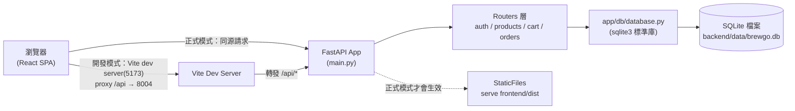

# 前後端專案架構說明

回上層：[stage4 README](../README.md)

## 1. 整體資料流

stage3 是「一個瀏覽器 process 內部的資料流」：所有商品、購物車、訂單都活在使用者
自己的瀏覽器記憶體與 `localStorage` 裡。stage4 多了一個真正的後端 process 與一顆
SQLite 資料庫，資料流變成「瀏覽器 → 後端 API → 資料庫」三層：



兩種模式（開發分離 / 正式合體）的差異與教學意義，見 [`DEPLOY.md`](DEPLOY.md)。

## 2. 後端分層

跟上一份參考教材（`meowshop-tutorial`）同一套分層概念，但**刻意省略了
Repository Pattern 那一層抽象**——這是本階段的教學重點，不是偷懶，理由寫在
`backend/app/db/database.py` 檔案開頭的長註解，這裡摘要：

meowshop 用 `app/repositories/base.py`（抽象介面）+ `sqlite_repo.py` /
`supabase_repo.py`（兩種實作）+ `factory.py`（依環境變數切換），目的是「同一套
介面，可以換底層資料庫」。本課程 master spec 規定六個階段全部只用 SQLite，
永遠不會真的切換到別的資料庫——這種情況下硬加一層「可以替換但永遠不會替換」
的抽象，只會讓初學者多一層要理解的間接層，卻拿不到對應的好處。所以 stage4
把資料存取「拉平」成一個模組（`app/db/database.py`）、一組函式，直接把 SQL
寫在函式裡，教學重點是「這句 SQL 在做什麼、為什麼要這樣寫」，不是「抽象層怎麼設計」。

分層與職責：

| 層 | 檔案 | 職責 |
|---|---|---|
| 入口 | `app/main.py` | 建立 app、掛 CORS、註冊路由、（正式模式）serve 前端 build |
| 路由 | `app/routers/*.py` | 解析 request → 呼叫 db 函式 → 組成 response，不寫 SQL |
| Schema | `app/schemas.py` | Pydantic request/response 形狀定義與欄位驗證 |
| 依賴注入 | `app/deps.py` | `get_db`（每個 request 一條連線）、`get_current_user`（解析 JWT） |
| 安全 | `app/security.py` | bcrypt 密碼雜湊、JWT 簽發/解析 |
| 設定 | `app/config.py` | 集中讀環境變數 |
| 資料存取 | `app/db/database.py` | 連線管理 + 各資料表的查詢/寫入函式（純 SQL） |

## 3. 前端分層（沿用 stage3，新增 `api/` 層）

stage4 前端是以 `stage3-spa/` 為基礎改造，元件（`components/`）與頁面
（`pages/`）的資料夾結構完全沿用，改動集中在「資料從哪裡來」：

```
frontend/src/
├── api/
│   ├── client.js       ← 新增：集中 fetch 封裝（見下方第 5 節）
│   └── client.test.js  ← 新增
├── context/
│   ├── AuthContext.jsx  ← 新增：全站共享的登入狀態
│   ├── CartContext.jsx  ← 改造：從 useReducer + localStorage 改成呼叫 API
│   └── ExchangeRateContext.jsx ← 沿用 stage3，沒有改動
├── pages/
│   ├── Login.jsx         ← 新增：登入／註冊
│   ├── Home.jsx / Products.jsx / ProductDetail.jsx  ← 改造：fetch 取代本地 JSON
│   ├── Cart.jsx / Checkout.jsx / Orders.jsx / OrderComplete.jsx ← 改造：串接 API
│   └── NotFound.jsx      ← 沿用 stage3，沒有改動
└── components/           ← 全部沿用 stage3（只有 ProductCard 因為欄位名稱
                             image → image_url 小改，其餘完全沒動）
```

## 4. 狀態管理決策：為什麼購物車從 `useReducer` 改成直接存後端回應

stage3 的 `cartReducer.js` 是一支純函式，負責「購物車狀態怎麼變化」的所有邏輯
（加入要不要累加、上限怎麼算）。stage4 把這些邏輯**搬到後端**（
`backend/app/routers/cart.py` 與 `database.py`）——資料庫才是「購物車現在長怎樣」
的唯一真相來源（source of truth），前端不應該自己算一份、又跟後端不一致。

所以 `CartContext.jsx` 不再需要 reducer，改成「每次操作都呼叫 API，把後端回傳的
最新購物車內容整包存進 `useState`」（見 `frontend/src/context/CartContext.jsx`）。
這是刻意不做樂觀更新（optimistic update）的簡化：每次點擊都要等一次網路來回才會
看到畫面變化，體驗上比 stage3 稍慢，但程式碼簡單很多、也不會有「前端猜測的結果
跟後端實際結果不一致」的邊界情況要處理。真實產品的購物車通常會做樂觀更新
（先假設會成功、立刻改畫面，失敗才復原），這是進階題，留給有興趣的學員（見
README「延伸挑戰」）。

## 5. `api/client.js`：為什麼要有這一層

`frontend/src/api/client.js` 是 stage4 全新的檔案。如果沒有這一層，每個頁面要
呼叫 API 都得自己：組 `/api` 前綴、判斷有沒有登入要不要帶 `Authorization` header、
判斷 `response.ok`、解析後端 `{"detail": "..."}` 格式的錯誤訊息——這四件事只要有
一個頁面漏做（最常見是漏帶 token），就會出現「明明登入了卻一直被當成沒登入」
這種很難除錯的 bug。集中寫成 `apiFetch()` 一個函式，全站只有一個入口，這四件事
只需要寫對一次。

`client.js` 另外用兩個模組層級變數（`authToken`、`unauthorizedHandler`）維護
「目前的登入 token」與「收到 401 要做什麼」，`AuthContext.jsx` 負責在登入狀態
變化時同步這兩個變數。這是 stage4 前端唯一用到「模組層級可變狀態」（而不是
React state）的地方，理由與取捨見 `client.js` 檔案內的完整註解。

## 6. CORS 設定

`app/main.py` 掛了 `CORSMiddleware`，但 `allow_credentials=False`——跟
meowshop 的取捨完全相同：本專案的登入態是 JWT 存在瀏覽器的 `localStorage`，
由前端 JS 手動組進 `Authorization` header，不是瀏覽器自動夾帶的 cookie，本來就
不需要 `allow_credentials=True`；把它跟 `CORS_ORIGINS=*`（開發預設值）一起打開
會有安全疑慮（瀏覽器規範也禁止兩者同時開啟，實際行為會退化成把任何來源都
原樣允許）。開發模式因為前端走 Vite proxy（同源），CORS 設定根本不會被觸發；
只有「前後端分開部署到不同網域」時才需要把 `CORS_ORIGINS` 改成前端的實際網址，
細節見 [`DEPLOY.md`](DEPLOY.md)。

## 7. 訂單狀態與扣庫存時機（跟 meowshop 的關鍵差異）

meowshop 有「建單」跟「付款」兩個獨立步驟，扣庫存的時機選在付款成功那一刻。
stage4 完全沒有付款/金流的概念（那是 stage5 才會加入），下單本身就是唯一的
「確定要買」動作，所以只能在建單當下扣庫存。這個取捨的完整說明、以及它帶來的
超賣風險，寫在 [`DATABASE.md`](DATABASE.md) 的「訂單狀態與扣庫存時機」一節。
