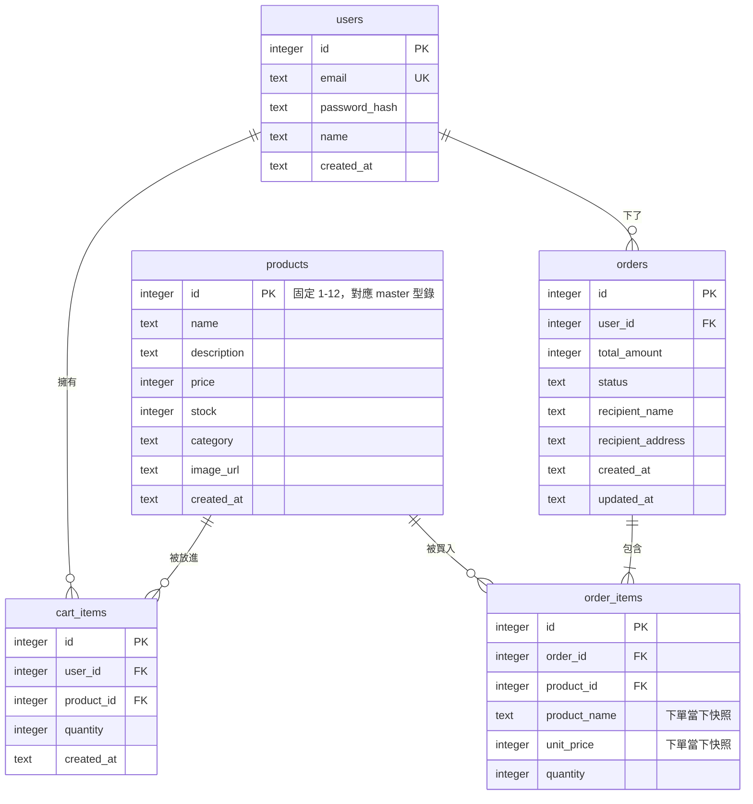

# 資料庫 Schema

回上層：[stage4 README](../README.md)

資料庫是 SQLite（標準庫 `sqlite3`），檔案位置 `backend/data/brewgo.db`（不進版控，
`.gitignore` 已排除，每個學員本機各自建立自己的檔案）。完整建表 SQL 見
[`backend/app/db/schema.sql`](../backend/app/db/schema.sql)。

## 1. ER Diagram

## 2. 逐表「為什麼這樣設計」

### users

- `email` 有 `UNIQUE` 約束——註冊時違反這個約束會讓 `sqlite3` 丟出
  `IntegrityError`，`app/db/database.py` 的 `create_user()` 把它轉換成專屬的
  `DuplicateEmailError`，讓路由層可以精準攔截、回傳 409（見
  `app/routers/auth.py`），不用自己先查一次「email 是否存在」再插入——
  這種「先查再寫」的寫法在並發情境下有 race condition（兩個請求同時查到
  「還沒有這個 email」，然後都各自插入成功，UNIQUE 約束反而是最後一道防線）。
- `password_hash` 一律是 bcrypt 雜湊值，資料庫任何一列都不會出現明文密碼；
  就算資料庫檔案外洩，攻擊者也無法直接還原密碼（bcrypt 是設計成故意很慢的
  單向雜湊演算法，即使碰運氣硬爆破成本也很高）。

### products

- `id` 刻意**不**用 `AUTOINCREMENT`，而是由 `seed_products.json` 明確指定
  1-12——這是為了跟 master spec 規定的商品型錄（六個階段共用同一份型錄）逐筆
  對齊，方便學員在不同階段之間比較同一件商品（例如 id=6「深焙醇厚掛耳包」在
  stage3 跟 stage4 都是同一個 id，庫存故意設 3 示範低庫存徽章；id=11「冷萃咖啡瓶」
  庫存 0 示範補貨中）。
- 沒有 `is_active`（下架）欄位——這是跟 meowshop 的差異，也是刻意簡化：
  meowshop 的教學範圍包含（隱含的）商品管理概念，stage4 沒有任何管理後台，
  12 筆商品在整個階段的生命週期裡都是「上架」狀態，加這個欄位只會多一個
  永遠是同一個值的欄位。stage5（前台＋後台）如果要做商品管理，才是加回這個
  欄位的時機。

### cart_items

- `UNIQUE (user_id, product_id)`：同一個使用者、同一件商品在購物車裡只會有
  一列，這個約束是「加入購物車要用累加而不是重複新增一列」這個規則的資料庫層
  保證，讓 `upsert_cart_item()` 可以直接用 SQLite 的 `INSERT ... ON CONFLICT
  DO UPDATE`（UPSERT）語法一句 SQL 搞定，不用自己先 SELECT 判斷「這個組合
  存不存在」。
- `quantity` 有 `CHECK (quantity > 0)`：數量 0 或負數在購物車裡沒有意義（要嘛
  移除，要嘛保留正數），資料庫層直接擋掉不合法的資料，不完全依賴應用層驗證
  （雖然 `schemas.py` 的 `Field(ge=1)` 已經先擋過一次，資料庫的 CHECK 是最後
  一道防線，防止繞過 API 直接寫資料庫的情境）。

### orders / order_items

- `order_items` 的 `product_name` / `unit_price` 是**下單當下的快照**，故意
  跟 `products` 表分開存，不是每次都去 JOIN `products` 拿即時資料——這是因為
  商品之後可能改名、改價，但已經成立的歷史訂單金額不應該跟著變動（想像一下
  「你收到帳單顯示金額，跟下單時看到的完全不一樣」，這對使用者是很糟糕的體驗）。
  這也是為什麼 `order_items` 沒有直接把 `products.name` / `products.price`
  當唯一資料來源——那兩個欄位只代表「商品現在長怎樣」，不代表「這筆訂單當時
  買的是什麼價錢」。
- **訂單狀態與扣庫存時機（跟 meowshop 的關鍵差異，這裡是完整說明）**：
  `orders.status` 目前只有一種值 `pending`（`CHECK` 約束目前只允許這一個值），
  因為 stage4 完全沒有付款/金流概念。meowshop 有「建單」與「付款」兩個獨立的
  時間點，可以選擇在付款成功那一刻才扣庫存（好處：建單但沒付款不會卡住庫存）。
  stage4 只有「建單」這一個動作，沒有第二個時間點可以選，所以扣庫存只能發生
  在建單當下（見 `app/routers/orders.py` 的 `create_order_route()`）。

  **這個設計的已知限制（誠實聲明）**：因為沒有「預留庫存、付款/取消才真的扣
  或釋放」這種進階機制，一旦有兩個人「幾乎同時」對同一件庫存很少的商品下單，
  先送達的請求會成功扣庫存，後送達的請求會在建單當下收到 409（庫存不足）——
  這其實是正確、預期中的行為（後端用條件式 `UPDATE ... WHERE stock >= ?`
  保證不會超賣，見 `app/db/database.py` 的 `decrease_stock()`），只是使用者
  體驗上可能會覺得「我明明看到有庫存，怎麼下單就說不夠」。stage5 引入付款流程
  後，可以重新設計成「建單先鎖 30 分鐘、超時自動釋放」這類更完整的機制，
  這是留給有興趣的學員的延伸方向（見 README「延伸挑戰」）。

## 3. 為什麼刪掉了 Repository Pattern（跟 meowshop 的架構差異）

見 [`ARCHITECTURE.md`](ARCHITECTURE.md) 第 2 節的完整說明；這裡只重申結論：
本課程六個階段永遠只用 SQLite，不需要「可以換資料庫」這種抽象層帶來的彈性，
`backend/app/db/database.py` 直接把 SQL 寫進一組函式裡，教學重點是 SQL 本身。
