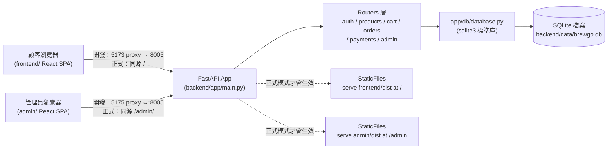

# 前台／後台／後端專案架構說明

回上層：[stage5 README](../README.md)

## 1. 整體資料流：三個獨立的 app，一個後端

stage4 是「一個前端＋一個後端」；stage5 變成「兩個獨立的前端（前台／後台）＋
一個後端」，三者都各自可以獨立開發、獨立部署，只是共用同一套 API：



三個 app 的 package.json、build 產物、部署方式完全獨立：可以只部署後端＋前台
（客人能買東西，沒有後台可管理），也可以三者一起部署，或甚至只在本機跑後台
（`admin/` 沒有 build 過時，後端根本不會掛載 `/admin` 路由）。

## 2. 後端分層（沿用 stage4，新增兩個路由模組）

分層概念與「為什麼不用 Repository Pattern」跟 stage4 完全一致（見
`backend/app/db/database.py` 開頭的長註解），這裡只列出跟 stage4 不同的部分：

| 層 | 檔案 | stage5 新增/變更 |
|---|---|---|
| 路由 | `app/routers/payments.py` | **新增**：模擬付款 `POST /api/payments/mock` |
| 路由 | `app/routers/admin.py` | **新增**：全部 `/api/admin/*` 端點，統一掛 `require_admin` |
| 狀態機 | `app/order_state.py` | **新增**：訂單狀態機的合法轉移規則，供 orders/payments/admin 三個路由共用同一份規則 |
| 依賴注入 | `app/deps.py` | 新增 `require_admin`（疊在 `get_current_user` 之上，角色不是 admin 回 403） |
| 資料存取 | `app/db/database.py` | 新增商品 CRUD、訂單狀態更新、payments 存取、`admin_summary()` 聚合查詢 |

## 3. 前端分層

### 前台 `frontend/`（stage4 基礎上擴充）

跟 stage4 相比，前台新增了兩個頁面、一支路由：

```
frontend/src/pages/
├── Checkout.jsx  ← 改造：現在只負責「填地址 → 建單」，建單成功後導去 /pay/:orderId
├── Pay.jsx       ← 新增：結帳兩步流程的第二步，對已建立的訂單呼叫付款 API
├── Orders.jsx    ← 改造：顯示訂單狀態徽章、pending/failed 訂單多「去付款」連結、
│                    pending 訂單多「取消訂單」按鈕
└── OrderComplete.jsx ← 改造：如實顯示目前狀態（不再寫死「一律 pending」）
```

其餘元件（`ProductCard`、`PriceTag`、`StockBadge`……）、`AuthContext`、
`CartContext`、`ExchangeRateContext` 完全沒有改動——資料層的擴充（付款、狀態機）
不影響「怎麼呈現商品」「怎麼管登入態」這些既有邏輯。

### 後台 `admin/`（stage5 全新獨立專案）

跟 `frontend/` 是**完全獨立的 Vite React app**：自己的 `package.json`、自己的
`vite.config.js`（`base: '/admin/'`）、自己 build 出獨立的 `dist/`。之所以不是
「在 `frontend/` 底下多加幾個 `/admin/*` 路由」，是因為兩者的目標使用者、
資料敏感度、視覺風格完全不同——前台任何人都能看，後台顯示全站營收與會員清單，
把兩者的程式碼與 build 產物分開，「不小心把後台功能打包進顧客看得到的 bundle
裡」這種疏失在架構上就不可能發生。

```
admin/src/
├── api/client.js                 ← 獨立複製一份 fetch 封裝（理由見檔案內註解）
├── context/AdminAuthContext.jsx  ← 登入時檢查 role === 'admin'，非管理員拒絕登入
├── components/Sidebar.jsx        ← 深色側欄導覽（BrewGo tokens 的深色變體）
└── pages/
    ├── Login.jsx      ← 沒有註冊分頁，管理員帳號只能靠 seed 建立
    ├── Dashboard.jsx  ← 數字卡＋低庫存表＋最近訂單表（純 HTML，不引圖表庫）
    ├── Products.jsx   ← 商品列表／新增／編輯／上下架
    ├── Orders.jsx     ← 訂單列表（狀態篩選）＋狀態流轉按鈕
    └── Members.jsx    ← 會員清單（唯讀）
```

## 4. 為什麼後台要獨立 build、掛在 `/admin` 路徑下

`backend/app/main.py` 用兩組獨立的 SPA fallback（前台一組、後台一組），後台那組
必須在前台的 catch-all 路由（`GET /{full_path:path}`，會吃掉任何路徑，包含
`/admin/...`）**之前**註冊，否則所有 `/admin/*` 的請求都會被前台的 fallback
搶先攔截，永遠輪不到後台的 SPA。完整程式碼與註解見 `backend/app/main.py`。

`admin/vite.config.js` 設定 `base: '/admin/'`，讓 build 出來的資源網址（JS/CSS）
自動變成 `/admin/assets/xxx.js`，跟後端的掛載路徑一致；如果沒設這個 `base`，
build 產物裡的資源網址會是從網站根目錄找的 `/assets/xxx.js`，會被前台的
`/assets` 掛載搶走，載入到錯的檔案。

## 5. CORS 設定

跟 stage4 完全一致（`allow_credentials=False`，理由見 `backend/app/main.py`
的註解）——不管是前台還是後台，登入態都是 JWT 存在瀏覽器 `localStorage`，
由前端 JS 手動組進 `Authorization` header，不需要 cookie-based 的
`allow_credentials=True`。兩個前端各自用不同的 `localStorage` key
（前台 `brewgo_token_v1`、後台 `brewgo_admin_token_v1`）存自己的 token——
正式部署時前台跟後台是同一個網站（同源、只是路徑不同），瀏覽器的
`localStorage` 是「整個網站共用」而不是分路徑的，用同一把 key 會讓登入其中
一邊把另一邊的登入狀態蓋掉。

## 6. 訂單狀態機與付款流程（跟 stage4 的關鍵差異）

完整狀態圖、權限矩陣、付款循序圖見 [`SYSTEM_DESIGN.md`](SYSTEM_DESIGN.md)；
扣庫存時機的取捨說明見 [`DATABASE.md`](DATABASE.md)「訂單狀態與扣庫存時機」
一節——這是本階段從 stage4 沿用下來、但**演進了實作方式**的核心教學點。
