# 資料庫 Schema

回上層：[stage5 README](../README.md)

資料庫是 SQLite（標準庫 `sqlite3`），檔案位置 `backend/data/brewgo.db`（不進
版控，`.gitignore` 已排除）。完整建表 SQL 見
[`backend/app/db/schema.sql`](../backend/app/db/schema.sql)。

## 1. ER Diagram

```mermaid
erDiagram
    users ||--o{ cart_items : "擁有"
    users ||--o{ orders : "下了"
    products ||--o{ cart_items : "被放進"
    products ||--o{ order_items : "被買入"
    orders ||--|{ order_items : "包含"
    orders ||--o{ payments : "有付款嘗試"

    users {
        integer id PK
        text email UK
        text password_hash
        text name
        text role "customer / admin，新增"
        text created_at
    }
    products {
        integer id PK "固定 1-12，對應 master 型錄"
        text name
        text description
        integer price
        integer stock
        text category
        text image_url
        integer is_active "0/1，新增：軟刪除下架"
        text created_at
    }
    cart_items {
        integer id PK
        integer user_id FK
        integer product_id FK
        integer quantity
        text created_at
    }
    orders {
        integer id PK
        integer user_id FK
        integer total_amount
        text status "pending/paid/failed/shipped/completed/cancelled，擴充"
        text recipient_name
        text recipient_address
        text created_at
        text updated_at
    }
    order_items {
        integer id PK
        integer order_id FK
        integer product_id FK
        text product_name "下單當下快照"
        integer unit_price "下單當下快照"
        integer quantity
    }
    payments {
        integer id PK "新增資料表"
        integer order_id FK
        integer amount
        text card_last4
        text status "success / failed"
        text created_at
    }
```

## 2. 跟 stage4 的變更說明（逐項）

### users 新增 `role`

`role TEXT NOT NULL DEFAULT 'customer' CHECK (role IN ('customer', 'admin'))`。
公開的 `POST /api/auth/register` 永遠不接受呼叫端指定 role，`create_user()`
永遠用預設值 `'customer'`——管理員帳號只能透過 `scripts/init_db.py` 的種子
資料建立，這是刻意的安全邊界：不可能有人靠著自己填註冊表單就變成管理員。

### products 新增 `is_active`

`is_active INTEGER NOT NULL DEFAULT 1`。stage4 沒有這個欄位（見 stage4
`docs/DATABASE.md` 的說明：「stage4 沒有任何管理後台，12 筆商品在整個階段的
生命週期裡都是上架狀態」）；stage5 有了後台商品管理，需要「下架」這個概念。

**為什麼下架是軟刪除（`is_active=0`）而不是真的 `DELETE`**：`order_items`
的 `product_name` / `unit_price` 是下單當下的快照（沿用 stage4 的設計），
理論上就算商品被刪除，歷史訂單的品項明細也還在——但如果真的 `DELETE FROM
products`，`order_items.product_id` 這個外鍵就會指向一筆不存在的資料，
往後任何「從訂單品項回頭查商品現況」的功能（例如「這個商品現在還買得到嗎」）
都會出錯。用 `is_active=0` 保留這筆資料，商品本身「還在」，只是前台看不到、
不能再被買，這是電商系統常見的作法（真實產品甚至會再細分「下架」跟「刪除」
兩種狀態，本教材只做到「下架」這一層，教學上足夠說明軟刪除的價值）。

### orders.status 從一種值擴充成完整狀態機

stage4 的 `CHECK (status IN ('pending'))` 只允許一種值，因為完全沒有付款
概念。stage5 擴充成 `CHECK (status IN ('pending', 'paid', 'failed', 'shipped',
'completed', 'cancelled'))`，完整狀態圖見 [`SYSTEM_DESIGN.md`](SYSTEM_DESIGN.md)。

### 新增 payments 資料表

每一次付款嘗試（不管成功或失敗）都留一筆紀錄——`card_last4` 只存卡號末 4 碼
（不存完整卡號，比照真實 PCI-DSS 規範的精神，即使本站的付款只是模擬也養成
這個習慣）。一筆訂單可能對應多筆 payments（先失敗、重試才成功），這是刻意
設計成一對多，不是「訂單上直接存一個付款結果欄位」——後者會讓「這筆訂單
其實失敗過一次」這個資訊直接消失，稽核軌跡不完整。

## 3. 訂單狀態與扣庫存時機（跟 stage4 的關鍵演進，完整說明）

**stage4 的做法**：沒有付款概念，下單本身就是唯一的「確定要買」動作，所以
`create_order_route()` 在建單當下就直接扣庫存（見 stage4
`docs/DATABASE.md`）。

**stage5 為什麼要改**：本階段加入了真正的付款流程，「使用者送出訂單」跟
「這筆訂單真的成立（錢付了）」變成兩個不同的時間點。如果繼續沿用 stage4
「建單就扣庫存」的做法，會出現這個問題：使用者填完收件資訊、點了「下一步：
付款」，但接下來因為各種原因（切分頁、關瀏覽器、猶豫不決）遲遲不付款——這筆
「下單但沒付」的訂單卻已經佔用了庫存，其他真的想買、也準備好要付款的顧客
反而買不到。有了付款這個中間狀態之後，「建單」應該只代表「登記這筆意向、
鎖住當下的商品名稱與價格」，真正動用庫存資源要等到「確定會有錢進來」的那一刻
（付款成功）才發生。

**具體改法**：
- `backend/app/routers/orders.py` 的 `create_order_route()` 不再呼叫
  `decrease_stock()`，只寫入 `orders`（status 固定 `'pending'`）與
  `order_items`（商品名稱、價格快照）。
- `backend/app/routers/payments.py` 的 `mock_payment_route()` 在卡號驗證通過
  （非失敗卡號）之後，才對訂單裡的每個品項呼叫 `decrease_stock()`——原子性
  保證（多品項要嘛全部扣成功、要嘛完全不變）的做法跟 stage4 一致，只是時機點
  從「建單」搬到「付款成功」。

**這個演進解決了什麼、還有什麼沒解決（誠實聲明）**：解決了「下單不付款白白
佔用庫存」的問題；但也帶來新的已知限制——`create_order_route()` 現在完全不
檢查庫存，代表使用者可以建立一筆「商品其實已經沒有庫存」的 pending 訂單
（`backend/tests/test_orders.py` 的
`test_create_order_can_exceed_stock_because_it_does_not_reserve_it` 就是刻意
驗證這個行為），一直要到付款那一刻才會發現庫存不夠、回 409。真實電商通常會
再加上「訂單保留庫存 N 分鐘，超時自動釋放」這種更完整的機制（stage4 README
「延伸挑戰」第 3 題就已經預告了這個方向），本教材因為要控制範圍與複雜度，
刻意沒有實作，留給有興趣的學員（見本階段 README「延伸挑戰」）。

## 4. 為什麼仍然沒有 Repository Pattern

跟 stage4 的理由完全一致：本課程六個階段永遠只用 SQLite，不需要「可以換
資料庫」這種抽象層帶來的彈性，`backend/app/db/database.py` 直接把 SQL 寫進
一組函式裡，教學重點是 SQL 本身，見 [`ARCHITECTURE.md`](ARCHITECTURE.md)。
