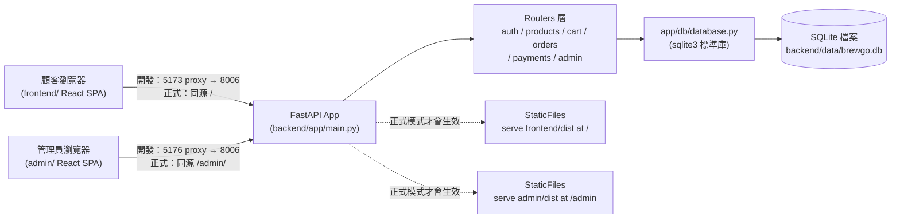

# 前台／後台／後端專案架構說明

回上層：[stage6 README](../README.md)

## 1. 整體資料流：三個獨立的 app，一個後端

stage4 是「一個前端＋一個後端」；stage5 變成「兩個獨立的前端（前台／後台）＋
一個後端」，三者都各自可以獨立開發、獨立部署，只是共用同一套 API：



三個 app 的 package.json、build 產物、部署方式完全獨立：可以只部署後端＋前台
（客人能買東西，沒有後台可管理），也可以三者一起部署，或甚至只在本機跑後台
（`admin/` 沒有 build 過時，後端根本不會掛載 `/admin` 路由）。

## 2. 後端分層（沿用 stage4，新增兩個路由模組）

分層概念與「為什麼不用 Repository Pattern」跟 stage4 完全一致（見
`backend/app/db/database.py` 開頭的長註解），這裡只列出跟 stage4 不同的部分：

| 層 | 檔案 | stage5 新增/變更 |
|---|---|---|
| 路由 | `app/routers/payments.py` | **新增**：模擬付款 `POST /api/payments/mock` |
| 路由 | `app/routers/admin.py` | **新增**：全部 `/api/admin/*` 端點，統一掛 `require_admin` |
| 狀態機 | `app/order_state.py` | **新增**：訂單狀態機的合法轉移規則，供 orders/payments/admin 三個路由共用同一份規則 |
| 依賴注入 | `app/deps.py` | 新增 `require_admin`（疊在 `get_current_user` 之上，角色不是 admin 回 403） |
| 資料存取 | `app/db/database.py` | 新增商品 CRUD、訂單狀態更新、payments 存取、`admin_summary()` 聚合查詢 |

## 3. 前端分層

### 前台 `frontend/`（stage4 基礎上擴充）

跟 stage4 相比，前台新增了兩個頁面、一支路由：

```
frontend/src/pages/
├── Checkout.jsx  ← 改造：現在只負責「填地址 → 建單」，建單成功後導去 /pay/:orderId
├── Pay.jsx       ← 新增：結帳兩步流程的第二步，對已建立的訂單呼叫付款 API
├── Orders.jsx    ← 改造：顯示訂單狀態徽章、pending/failed 訂單多「去付款」連結、
│                    pending 訂單多「取消訂單」按鈕
└── OrderComplete.jsx ← 改造：如實顯示目前狀態（不再寫死「一律 pending」）
```

其餘元件（`ProductCard`、`PriceTag`、`StockBadge`……）、`AuthContext`、
`CartContext`、`ExchangeRateContext` 完全沒有改動——資料層的擴充（付款、狀態機）
不影響「怎麼呈現商品」「怎麼管登入態」這些既有邏輯。

### 後台 `admin/`（stage5 全新獨立專案）

跟 `frontend/` 是**完全獨立的 Vite React app**：自己的 `package.json`、自己的
`vite.config.js`（`base: '/admin/'`）、自己 build 出獨立的 `dist/`。之所以不是
「在 `frontend/` 底下多加幾個 `/admin/*` 路由」，是因為兩者的目標使用者、
資料敏感度、視覺風格完全不同——前台任何人都能看，後台顯示全站營收與會員清單，
把兩者的程式碼與 build 產物分開，「不小心把後台功能打包進顧客看得到的 bundle
裡」這種疏失在架構上就不可能發生。

```
admin/src/
├── api/client.js                 ← 獨立複製一份 fetch 封裝（理由見檔案內註解）
├── context/AdminAuthContext.jsx  ← 登入時檢查 role === 'admin'，非管理員拒絕登入
├── components/Sidebar.jsx        ← 深色側欄導覽（BrewGo tokens 的深色變體）
└── pages/
    ├── Login.jsx      ← 沒有註冊分頁，管理員帳號只能靠 seed 建立
    ├── Dashboard.jsx  ← 數字卡＋低庫存表＋最近訂單表（純 HTML，不引圖表庫）
    ├── Products.jsx   ← 商品列表／新增／編輯／上下架
    ├── Orders.jsx     ← 訂單列表（狀態篩選）＋狀態流轉按鈕
    └── Members.jsx    ← 會員清單（唯讀）
```

## 4. 為什麼後台要獨立 build、掛在 `/admin` 路徑下

`backend/app/main.py` 用兩組獨立的 SPA fallback（前台一組、後台一組），後台那組
必須在前台的 catch-all 路由（`GET /{full_path:path}`，會吃掉任何路徑，包含
`/admin/...`）**之前**註冊，否則所有 `/admin/*` 的請求都會被前台的 fallback
搶先攔截，永遠輪不到後台的 SPA。完整程式碼與註解見 `backend/app/main.py`。

`admin/vite.config.js` 設定 `base: '/admin/'`，讓 build 出來的資源網址（JS/CSS）
自動變成 `/admin/assets/xxx.js`，跟後端的掛載路徑一致；如果沒設這個 `base`，
build 產物裡的資源網址會是從網站根目錄找的 `/assets/xxx.js`，會被前台的
`/assets` 掛載搶走，載入到錯的檔案。

## 5. CORS 設定

跟 stage4 完全一致（`allow_credentials=False`，理由見 `backend/app/main.py`
的註解）——不管是前台還是後台，登入態都是 JWT 存在瀏覽器 `localStorage`，
由前端 JS 手動組進 `Authorization` header，不需要 cookie-based 的
`allow_credentials=True`。兩個前端各自用不同的 `localStorage` key
（前台 `brewgo_token_v1`、後台 `brewgo_admin_token_v1`）存自己的 token——
正式部署時前台跟後台是同一個網站（同源、只是路徑不同），瀏覽器的
`localStorage` 是「整個網站共用」而不是分路徑的，用同一把 key 會讓登入其中
一邊把另一邊的登入狀態蓋掉。

## 6. 訂單狀態機與付款流程（跟 stage4 的關鍵差異）

完整狀態圖、權限矩陣、付款循序圖見 [`SYSTEM_DESIGN.md`](SYSTEM_DESIGN.md)；
扣庫存時機的取捨說明見 [`DATABASE.md`](DATABASE.md)「訂單狀態與扣庫存時機」
一節——這是本階段從 stage4 沿用下來、但**演進了實作方式**的核心教學點。

---

# stage6：即時通訊／效能調校／壓力測試

以上第 1-6 節是 stage5 就定下的架構，stage6 完全沿用。以下是 stage6 新增的
部分（產出要求 1：技術選型表＋關鍵程式片段）。

## 7. 技術選型表

| 需求 | 選了什麼 | 為什麼 | 考慮過的替代方案 |
|---|---|---|---|
| 訂單即時推播 | FastAPI 原生 WebSocket ＋自寫 `ConnectionManager` | 不需要額外套件（Starlette 內建）；先看懂 WebSocket 本身，才知道 Socket.IO 幫你做了什麼，見 [`REALTIME.md`](REALTIME.md) | Socket.IO（`python-socketio`）：多了房間/自動重連/降級，教學上更難看清底層；Server-Sent Events：只能單向、且本課同時要示範兩者的差異，不能兩個功能都用同一種技術 |
| 客服串流回覆 | Server-Sent Events（`StreamingResponse` + `text/event-stream`） | 單向推播、就是普通 HTTP，瀏覽器 `EventSource` 內建重連，比 WebSocket 輕量 | WebSocket：協定升級的開銷對「單次問答」這種場景不划算；輪詢（polling）：使用者會看到明顯的分段跳字而不是逐字效果，體驗差很多 |
| 商品列表快取 | 自寫 in-memory `TTLCache`（30 秒） | 教學規模不需要外部快取服務，能看到 cache invalidation 的核心概念就夠 | Redis：需要額外服務、額外部署複雜度，正式產品多 worker 情境下才有必要，見下方「uvicorn workers」一節 |
| 回應壓縮 | FastAPI/Starlette 內建 `GZipMiddleware` | 一行 middleware 解決，不需要額外套件 | 手動在每個端點加壓縮邏輯：重複程式碼；Brotli：Starlette 沒有內建，需要額外套件，壓縮率略勝 gzip 但教學規模差異不大 |
| 壓力測試工具 | locust（實測 Python 3.13.11 裝得起來）＋ 自寫 asyncio+httpx fallback | locust 有網頁介面、逐端點統計、業界常用；fallback 腳本確保裝不起來也能跑 | k6（Go 寫的，需要另外裝執行檔，不是 pip 套件）、Apache Bench（太陽春，測不出多端點混合場景） |
| CI | GitHub Actions | 免費額度對教學規模夠用，YAML 語法直觀 | GitLab CI / CircleCI：本課程用 GitHub 當版本控管平台，選同生態系的 CI 最省事 |

## 8. 關鍵程式片段

### WebSocket ConnectionManager（`app/ws_manager.py`）

```python
class ConnectionManager:
    def __init__(self) -> None:
        self._admin_connections: set[WebSocket] = set()
        self._user_connections: dict[int, set[WebSocket]] = {}

    async def broadcast_admin(self, message: dict) -> None:
        payload = json.dumps(message, ensure_ascii=False)
        dead: list[WebSocket] = []
        for connection in self._admin_connections:
            try:
                await connection.send_text(payload)
            except Exception:
                dead.append(connection)
        for connection in dead:
            self._admin_connections.discard(connection)
```

重點：用 `set`／`dict` 這種基本資料結構土法煉鋼管理連線清單，送訊息失敗就
當作連線已死、從清單移除——這正是 Socket.IO「房間」功能在底層做的事，
自己寫過一次才看得懂那些便利 API 省下了多少工。完整程式碼見
`backend/app/ws_manager.py`。

### SSE Streaming generator（`app/routers/support.py`）

```python
async def _stream_reply(question: str) -> AsyncGenerator[str, None]:
    reply = _match_reply(question)
    chunks = _split_into_chunks(reply)
    for chunk in chunks:
        yield f"data: {json.dumps({'chunk': chunk}, ensure_ascii=False)}\n\n"
        await asyncio.sleep(0.12)
    yield f"data: {json.dumps({'done': True}, ensure_ascii=False)}\n\n"
```

`yield` 讓這個函式變成一個 async generator，`StreamingResponse` 會在每次
`yield` 時就把資料送給瀏覽器，不用等整個函式執行完——這是串流的核心機制。
真的接 LLM streaming 時，`await asyncio.sleep(0.12)` 會被「等待模型吐出下一個
token」的真實延遲取代，其餘程式碼幾乎不用改。

### TTL 快取（`app/cache.py`）

```python
class TTLCache:
    def get(self, key: tuple):
        entry = self._store.get(key)
        if entry is None:
            return None
        value, expires_at = entry
        if self._clock() >= expires_at:
            del self._store[key]
            return None
        return value
```

`clock` 參數預設 `time.monotonic`，測試時可以注入假的 clock 函式，不用真的
等 30 秒就能驗證過期行為，見 `backend/tests/test_cache.py`。

## 9. GZip 與靜態資產快取（實測查證）

`app/main.py` 加了 `app.add_middleware(GZipMiddleware, minimum_size=500)`——
超過 500 bytes 的回應會被壓縮。實測（2026-07-23，`curl -i -H "Accept-Encoding:
gzip" http://localhost:8006/api/products`）：

```
HTTP/1.1 200 OK
content-length: 862
content-type: application/json
vary: Accept-Encoding
content-encoding: gzip
```

`content-encoding: gzip` 確認真的有被壓縮；`vary: Accept-Encoding` 是
GZipMiddleware 自動加上的，告訴任何中間快取（瀏覽器、CDN）「這個回應的內容
會依請求的 `Accept-Encoding` header 而不同，不能不分青紅皂白地共用快取」。

**FastAPI `StaticFiles` 預設行為（查證後如實記錄）**：實測靜態資產（前端
build 出來的 JS 檔）回應標頭：

```
content-type: text/javascript; charset=utf-8
accept-ranges: bytes
last-modified: Thu, 23 Jul 2026 17:42:21 GMT
etag: "6ffc2eed34474bd408838fbebe6078f4"
vary: Accept-Encoding
```

`StaticFiles`**預設會**回傳 `ETag` 與 `Last-Modified`，並且支援條件式請求
（瀏覽器帶 `If-None-Match` 上來、內容沒變的話回 `304 Not Modified`，不用
重傳整個檔案）；但**不會**主動加上 `Cache-Control`（沒有 `max-age`），代表
瀏覽器每次還是要發一次請求跟伺服器確認「內容有沒有變」（雖然沒變時只收到
很小的 304 回應，不是重新下載整個檔案，但仍然有一次網路往返）。如果要做到
「瀏覽器完全不用問伺服器，直接用本地快取」（強快取），需要自己加
`Cache-Control: max-age=...` 的 middleware——本課程沒有實作這一步，這是
誠實的「查證過但沒進一步優化」聲明，正式產品通常會替 build 產物加上檔名
hash（Vite 預設就有，見 `assets/index-XXXXXXXX.js`）＋長效 `Cache-Control`
（因為檔名變了，快取失效自然發生，不用擔心快取到舊版本）。

## 10. uvicorn workers（教學方向，未實作）

本課程從頭到尾都用 `uvicorn app.main:app --port XXXX`（單一 worker process）
啟動，沒有加 `--workers N`。**為什麼不能直接加這個參數就完事**：本階段新增
的兩個功能都是「process 內記憶體狀態」——

- `app/cache.py` 的 `products_cache`：只存在單一 Python process 的記憶體裡。
  如果開了多個 worker（`uvicorn ... --workers 4`），作業系統會啟動 4 個完全
  獨立的 process，各自有各自的一份 `products_cache`。後台改了商品、觸發
  `invalidate_all()`，只會清空「處理這個請求的那個 worker」的快取，另外 3 個
  worker 的快取渾然不知，會繼續回傳舊資料，直到各自的 30 秒 TTL 過期——
  出現「明明後台顯示改好了，前台重整幾次卻時好時壞」的詭異不一致。
- `app/ws_manager.py` 的 `ConnectionManager`：同理，WebSocket 連線清單也是
  存在單一 process 的記憶體裡。使用者的瀏覽器連上了 worker A，另一個使用者
  下單的請求被 worker B 處理，worker B 呼叫 `broadcast_admin()` 只會送給
  「連在 worker B 上」的連線，連在 worker A 上的管理員完全收不到通知。

**正式產品怎麼解決**：這兩個問題的本質都是「多個 process 需要共享同一份
狀態」，業界標準做法是把這份狀態搬到一個獨立於任何 worker 之外的地方——
最常見是 Redis：快取直接存 Redis（多個 worker 讀寫同一份）；WebSocket 訊息
透過 Redis Pub/Sub 廣播，讓每個 worker 都能收到「有新事件」的通知、再各自
推播給連在自己身上的連線。這是典型的「用外部 message broker 解決多 process
協調」的架構模式，本課程因為要控制範圍（引入 Redis 需要額外的服務、額外的
部署複雜度）刻意不實作，**這裡明確標示為進階方向，留給有興趣的學員**（見
README「延伸挑戰」）。
