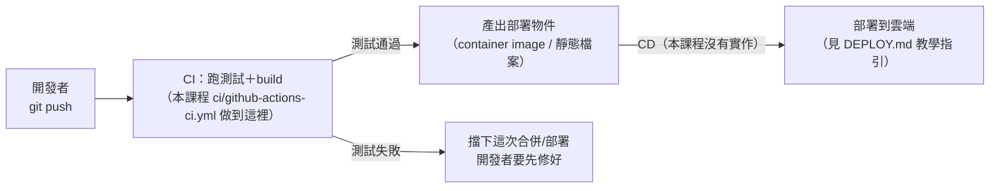

# CI/CD 概念與雲端架構願景

回上層：[stage6 README](../README.md)

stage1-5 的部署都是「學員自己手動跑指令」；本階段開始介紹 CI/CD 的概念，
以及本課程的單機架構跟正式產品的雲端架構之間的差距。

## 1. 什麼是 CI/CD

- **CI（Continuous Integration，持續整合）**：每次有人推程式碼上去，自動
  跑一輪測試＋build，確認「這次改動沒有把東西弄壞」。核心價值是**盡早發現
  問題**——如果沒有 CI，可能要等到下次有人手動跑測試（可能是好幾天後、甚至
  要等到出問題）才發現某支功能早就壞了，那時候已經很難回想「到底是哪一次
  改動弄壞的」。
- **CD（Continuous Deployment/Delivery，持續部署/交付）**：CI 通過之後，
  自動把新版本部署到某個環境（測試站、正式站）。本課程**沒有實作**真的自動
  部署（master spec 規定不呼叫雲端服務），`ci/github-actions-ci.yml` 只做到
  CI 那一半（測試＋build），部署仍然是文件教學（見 [`DEPLOY.md`](DEPLOY.md)）。



## 2. `ci/github-actions-ci.yml` 逐段講解

完整檔案見 [`../ci/github-actions-ci.yml`](../ci/github-actions-ci.yml)。

**觸發條件**（`on:`）：`push` 到 `main` 分支、或對 `main` 開 PR，而且限定
`paths: ["stage6-advanced/**"]`——這個 repo 同時放六個階段的教材，如果沒有
路徑過濾，改 stage1 的一行文字也會觸發 stage6 的完整測試套件，浪費 CI 執行
時間，也讓「這次 CI 失敗」跟「我剛剛的改動」的因果關係變得不清楚。

**`backend-tests` job**：`actions/setup-python@v5` 裝好 Python 3.13，
`pip install -r requirements.txt` 裝套件（`cache: "pip"` 讓下次執行不用重新
下載，明顯縮短 CI 時間），跑 `python scripts/init_db.py`（雖然 pytest 本身
用暫存資料庫、不依賴這個檔案，但這一步順便驗證「資料庫初始化腳本本身沒壞」，
是額外的一層保障），最後 `pytest -q`——**只要有任何一個測試失敗，這個 job
就會失敗，整個 workflow 標記成紅色**，這是 CI 最基本也最核心的價值：擋下
「測試沒過還是被合併進主分支」這件事。

**`frontend-build` job**：用 `strategy.matrix` 讓同一組步驟分別套用到
`frontend/` 跟 `admin/` 兩個資料夾（不用複製貼上兩份幾乎一樣的 job）。
`npm ci`（不是 `npm install`）——差異：`npm ci` 嚴格依照 `package-lock.json`
鎖定的版本安裝，安裝前會先清空 `node_modules`，任何版本對不上都直接報錯
中止；`npm install` 則會嘗試「合理地」更新 lockfile 去符合 `package.json`
的版本範圍，可能悄悄裝到跟你本機不同的版本。CI 環境要的是「保證跟開發者
本機一模一樣的版本」，所以永遠用 `npm ci`，這也是本課程規定
「必須 commit `package-lock.json`」的原因——沒有這個檔案，`npm ci` 根本無法
執行。

## 3. 部署管線：build → test → deploy

正式產品的典型流程：

1. **build**：把原始碼變成可執行/可部署的產物（前端 build 成靜態檔案、
   後端打包成 container image）。
2. **test**：跑自動化測試，任何一個失敗就整個流程中止，不會有「明知道測試
   沒過還是被部署到正式環境」這種事。
3. **deploy**：把通過測試的產物部署到目標環境，通常會先到 staging（測試站）
   驗證一次，再到 production（正式站）。

本課程的 CI 做到「build（前端）＋test（前後端）」，`deploy` 那一步刻意留白
（文件教學、不實作），理由是 master spec 規定不呼叫任何需要帳號/金鑰的雲端
服務——真的接上 `deploy` 需要一個實際存在的雲端目標（Cloud Run、Render 等），
那已經超出「教材可以在完全離線環境下跑起來」的範圍。

## 4. 雲端架構：教學願景 vs 本課程單機架構

```mermaid
flowchart TB
    subgraph 教學願景（正式產品規模，本課程沒有做到這裡）
        LB["Load Balancer"] --> App1["app instance 1"]
        LB --> App2["app instance 2"]
        LB --> AppN["app instance N"]
        App1 --> Redis[("Redis<br/>共享快取 + WebSocket Pub/Sub")]
        App2 --> Redis
        AppN --> Redis
        App1 --> DB[("正式資料庫<br/>PostgreSQL / MySQL")]
        App2 --> DB
        AppN --> DB
    end
    subgraph 本課程實際架構（stage6 為止）
        Single["單一 uvicorn process<br/>（單一 worker）"] --> SQLite[("SQLite 檔案")]
        Single --> MemCache["in-memory TTLCache<br/>（只在這個 process 裡）"]
        Single --> WSManager["ConnectionManager<br/>（只在這個 process 裡）"]
    end
```

**差距在哪裡、為什麼刻意不做**：

- **多 instance（水平擴展）**：正式產品流量大時會開多台機器/多個 process
  一起扛，本課程單機教學規模用不到，多開了反而讓 `app/cache.py` 跟
  `app/ws_manager.py` 的記憶體狀態在多個 process 間不同步（完整說明見
  [`ARCHITECTURE.md`](ARCHITECTURE.md)「uvicorn workers」一節）。
- **Redis**：解決上面「多 process 狀態不同步」問題的標準做法（共享快取、
  WebSocket 訊息用 Pub/Sub 廣播給所有 worker）。本課程沒有引入，因為需要
  額外部署一個服務，超出「全本地端、零額外基礎設施」的教學範圍。
- **正式資料庫（PostgreSQL 等）**：master spec 規定本課程六個階段統一用
  SQLite（單一檔案、零設定），不切換成需要獨立服務的資料庫。SQLite 對單一
  process 沒問題，但天生不適合多 process 高並發寫入（本課程壓力測試意外
  發現的併發 bug，見 [`PERFORMANCE_REPORT.md`](PERFORMANCE_REPORT.md)，
  某種程度上也印證了這個限制）。

**明確標示**：以上「教學願景」欄位的架構本課程完全沒有實作、沒有測試過，
純粹是文件層級的方向指引，讓學員知道「如果流量真的大到本課程架構撐不住，
業界通常往哪個方向解決」。

## 5. 學員交付檢查表（CI/CD 部分）

- [ ] `ci/github-actions-ci.yml` 已理解每個 job 在做什麼（不是照抄就好）
- [ ] （選做）把這份 workflow 複製到你自己 fork 的 repo 的 `.github/workflows/`
      底下，實際 push 一次，觀察 GitHub Actions 分頁跑起來的畫面
- [ ] （選做）故意寫壞一個測試，push 上去，確認 CI 真的會標記失敗、擋下來
- [ ] 理解「本課程 CI 做到 build+test，deploy 留白」的原因，能向別人解釋
      這個取捨
