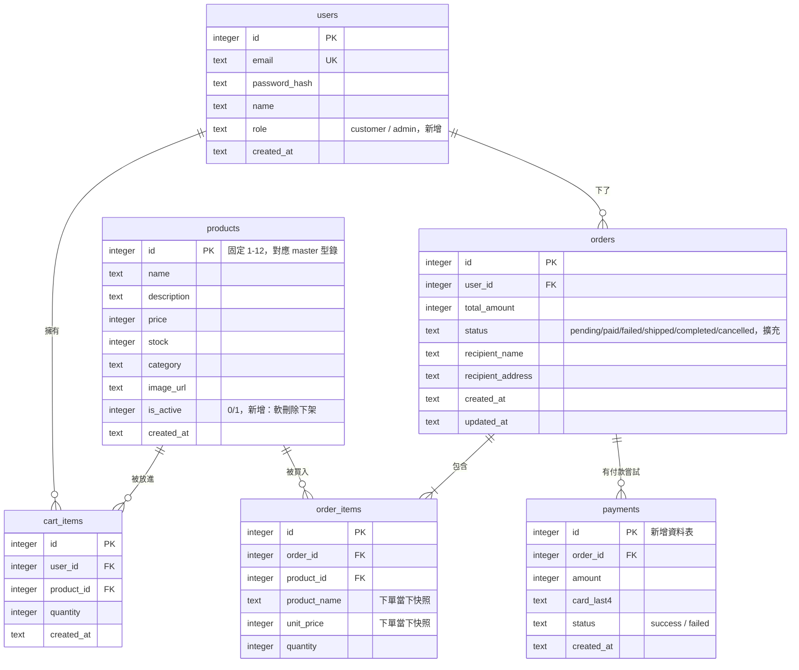

# 資料庫 Schema

回上層：[stage6 README](../README.md)

資料庫是 SQLite（標準庫 `sqlite3`），檔案位置 `backend/data/brewgo.db`（不進
版控，`.gitignore` 已排除）。完整建表 SQL 見
[`backend/app/db/schema.sql`](../backend/app/db/schema.sql)。

## 1. ER Diagram



## 2. 跟 stage4 的變更說明（逐項）

### users 新增 `role`

`role TEXT NOT NULL DEFAULT 'customer' CHECK (role IN ('customer', 'admin'))`。
公開的 `POST /api/auth/register` 永遠不接受呼叫端指定 role，`create_user()`
永遠用預設值 `'customer'`——管理員帳號只能透過 `scripts/init_db.py` 的種子
資料建立，這是刻意的安全邊界：不可能有人靠著自己填註冊表單就變成管理員。

### products 新增 `is_active`

`is_active INTEGER NOT NULL DEFAULT 1`。stage4 沒有這個欄位（見 stage4
`docs/DATABASE.md` 的說明：「stage4 沒有任何管理後台，12 筆商品在整個階段的
生命週期裡都是上架狀態」）；stage5 有了後台商品管理，需要「下架」這個概念。

**為什麼下架是軟刪除（`is_active=0`）而不是真的 `DELETE`**：`order_items`
的 `product_name` / `unit_price` 是下單當下的快照（沿用 stage4 的設計），
理論上就算商品被刪除，歷史訂單的品項明細也還在——但如果真的 `DELETE FROM
products`，`order_items.product_id` 這個外鍵就會指向一筆不存在的資料，
往後任何「從訂單品項回頭查商品現況」的功能（例如「這個商品現在還買得到嗎」）
都會出錯。用 `is_active=0` 保留這筆資料，商品本身「還在」，只是前台看不到、
不能再被買，這是電商系統常見的作法（真實產品甚至會再細分「下架」跟「刪除」
兩種狀態，本教材只做到「下架」這一層，教學上足夠說明軟刪除的價值）。

### orders.status 從一種值擴充成完整狀態機

stage4 的 `CHECK (status IN ('pending'))` 只允許一種值，因為完全沒有付款
概念。stage5 擴充成 `CHECK (status IN ('pending', 'paid', 'failed', 'shipped',
'completed', 'cancelled'))`，完整狀態圖見 [`SYSTEM_DESIGN.md`](SYSTEM_DESIGN.md)。

### 新增 payments 資料表

每一次付款嘗試（不管成功或失敗）都留一筆紀錄——`card_last4` 只存卡號末 4 碼
（不存完整卡號，比照真實 PCI-DSS 規範的精神，即使本站的付款只是模擬也養成
這個習慣）。一筆訂單可能對應多筆 payments（先失敗、重試才成功），這是刻意
設計成一對多，不是「訂單上直接存一個付款結果欄位」——後者會讓「這筆訂單
其實失敗過一次」這個資訊直接消失，稽核軌跡不完整。

## 3. 訂單狀態與扣庫存時機（跟 stage4 的關鍵演進，完整說明）

**stage4 的做法**：沒有付款概念，下單本身就是唯一的「確定要買」動作，所以
`create_order_route()` 在建單當下就直接扣庫存（見 stage4
`docs/DATABASE.md`）。

**stage5 為什麼要改**：本階段加入了真正的付款流程，「使用者送出訂單」跟
「這筆訂單真的成立（錢付了）」變成兩個不同的時間點。如果繼續沿用 stage4
「建單就扣庫存」的做法，會出現這個問題：使用者填完收件資訊、點了「下一步：
付款」，但接下來因為各種原因（切分頁、關瀏覽器、猶豫不決）遲遲不付款——這筆
「下單但沒付」的訂單卻已經佔用了庫存，其他真的想買、也準備好要付款的顧客
反而買不到。有了付款這個中間狀態之後，「建單」應該只代表「登記這筆意向、
鎖住當下的商品名稱與價格」，真正動用庫存資源要等到「確定會有錢進來」的那一刻
（付款成功）才發生。

**具體改法**：
- `backend/app/routers/orders.py` 的 `create_order_route()` 不再呼叫
  `decrease_stock()`，只寫入 `orders`（status 固定 `'pending'`）與
  `order_items`（商品名稱、價格快照）。
- `backend/app/routers/payments.py` 的 `mock_payment_route()` 在卡號驗證通過
  （非失敗卡號）之後，才對訂單裡的每個品項呼叫 `decrease_stock()`——原子性
  保證（多品項要嘛全部扣成功、要嘛完全不變）的做法跟 stage4 一致，只是時機點
  從「建單」搬到「付款成功」。

**這個演進解決了什麼、還有什麼沒解決（誠實聲明）**：解決了「下單不付款白白
佔用庫存」的問題；但也帶來新的已知限制——`create_order_route()` 現在完全不
檢查庫存，代表使用者可以建立一筆「商品其實已經沒有庫存」的 pending 訂單
（`backend/tests/test_orders.py` 的
`test_create_order_can_exceed_stock_because_it_does_not_reserve_it` 就是刻意
驗證這個行為），一直要到付款那一刻才會發現庫存不夠、回 409。真實電商通常會
再加上「訂單保留庫存 N 分鐘，超時自動釋放」這種更完整的機制（stage4 README
「延伸挑戰」第 3 題就已經預告了這個方向），本教材因為要控制範圍與複雜度，
刻意沒有實作，留給有興趣的學員（見本階段 README「延伸挑戰」）。

## 4. 為什麼仍然沒有 Repository Pattern

跟 stage4 的理由完全一致：本課程六個階段永遠只用 SQLite，不需要「可以換
資料庫」這種抽象層帶來的彈性，`backend/app/db/database.py` 直接把 SQL 寫進
一組函式裡，教學重點是 SQL 本身，見 [`ARCHITECTURE.md`](ARCHITECTURE.md)。

## 5. stage6：索引（EXPLAIN QUERY PLAN 實跑對照）

stage6 spec 原本要求「為 `orders.user_id`、`order_items.order_id`、
`payments.order_id`、`products(category, is_active)` 建索引」。實際去讀
stage5 的 `schema.sql` 才發現前三個其實**已經存在**（`idx_orders_user_id`、
`idx_order_items_order_id`、`idx_payments_order_id`，stage5 一開始設計 schema
時就順手建了）——這裡誠實記錄這個落差，不假裝這三個索引是本階段的功勞。
真正缺的只有 `products(category, is_active)`，這是全站最常被打的查詢
（`GET /api/products?category=xxx`）完全沒有索引可用的情況，本階段補上。

以下是 `backend/scripts/explain_query_plans.py` 的**實際執行輸出**（2026-07-23，
`python scripts/explain_query_plans.py`，跑在剛 `init_db.py` 過的乾淨資料庫）：

```
======================================================================
第一部分：products(category, is_active) 複合索引——加索引前 vs 後
======================================================================

-- 加索引「前」：SELECT * FROM products WHERE category = ? AND is_active = 1
   SQL: SELECT * FROM products WHERE category = ? AND is_active = 1
   SCAN products

-- 加索引「後」：SELECT * FROM products WHERE category = ? AND is_active = 1
   SQL: SELECT * FROM products WHERE category = ? AND is_active = 1
   SEARCH products USING INDEX idx_products_category_active (category=? AND is_active=?)

======================================================================
第二部分：stage5 已經建過的三個索引——確認實際上真的有被用到
======================================================================

-- orders.user_id：SELECT * FROM orders WHERE user_id = ?
   SQL: SELECT * FROM orders WHERE user_id = ?
   SEARCH orders USING INDEX idx_orders_user_id (user_id=?)

-- order_items.order_id：SELECT * FROM order_items WHERE order_id = ?
   SQL: SELECT * FROM order_items WHERE order_id = ?
   SEARCH order_items USING INDEX idx_order_items_order_id (order_id=?)

-- payments.order_id：SELECT * FROM payments WHERE order_id = ?
   SQL: SELECT * FROM payments WHERE order_id = ?
   SEARCH payments USING INDEX idx_payments_order_id (order_id=?)
```

**怎麼讀這份輸出**：`SCAN products` 代表 SQLite 要把整張表從頭到尾掃一遍才能
篩出符合條件的列（表越大越慢，跟列數成正比）；`SEARCH ... USING INDEX`
代表 SQLite 直接用索引的 B-tree 結構跳到符合條件的位置，不用檢查不相關的列。
本課程型錄只有 12 筆商品，`SCAN` 跟 `SEARCH` 的實際耗時差異小到量不出來，但
`EXPLAIN QUERY PLAN` 顯示的**查詢策略**（有沒有用到索引）不會因為資料量小
而改變，資料量放大到幾萬、幾十萬筆時，`SCAN` 會變成真正的效能瓶頸，這正是
索引存在的意義——這份文件的重點是讓你看懂「怎麼確認索引真的被用到」這個
方法本身，而不是在 12 筆資料上做出有意義的秒數差異。

複合索引 `(category, is_active)` 的欄位順序：SQLite 的複合索引是「照順序」
建的 B-tree，`WHERE category = ? AND is_active = ?` 這種查詢，索引欄位順序
跟 WHERE 子句的等值條件順序一致時效果最好；如果只查 `WHERE category = ?`
（不篩 is_active），這個索引仍然用得上（複合索引的「前綴」可以單獨使用），
但如果只查 `WHERE is_active = ?`（不篩 category），這個索引就派不上用場——
因為 B-tree 是先照 category 排序、同 category 內才照 is_active 排序，跳過
第一個欄位就沒辦法用二分搜尋的方式定位。

## 6. stage6：N+1 查詢修復（後台訂單列表）

`app/db/database.py` 的 `list_all_orders()`——被 `GET /api/admin/orders` 呼叫，
後台訂單管理頁面用的那支查詢。

**stage5 的寫法**（保留在 `list_all_orders_naive_n_plus_one()` 純供對照，
沒有任何路由呼叫它）：先 `SELECT * FROM orders` 拿到全部訂單，再對每一筆
訂單各自呼叫 `_attach_items()`（等於各自跑一次
`SELECT * FROM order_items WHERE order_id = ?`）。N 筆訂單 = 1 + N 次查詢，
這是經典的 N+1 查詢問題。

**stage6 的寫法**：改成一次 `LEFT JOIN` 把 orders 跟 order_items 一次查完
（不管幾筆訂單、幾個品項，永遠 1 次查詢），查詢結果在 Python 這一側依
`order_id` 分組重建成巢狀結構。完整程式碼與逐行說明見
`backend/app/db/database.py` 的 `list_all_orders()` 註解。

以下是 `backend/scripts/n_plus_one_demo.py` 的**實際執行輸出**（2026-07-23，
種子資料庫有 7 筆示範訂單）：

```
資料庫目前有 7 筆訂單。

stage5 舊寫法 list_all_orders_naive_n_plus_one()：實際發出 8 次 SQL 查詢
  （預期：1 次查訂單本體 + 7 次逐單查品項 = 8 次）
stage6 新寫法 list_all_orders()：實際發出 1 次 SQL 查詢
  （預期：1 次，不管訂單筆數是多少）

查詢次數從 8 次降到 1 次（訂單筆數越多，舊寫法的查詢次數會跟著線性增加，新寫法永遠是 1 次）。
```

計數方式：`sqlite3.Connection.set_trace_callback()`（SQLite 官方就是為了這種
用途設計的介面，每執行一句 SQL 都會呼叫一次註冊的 callback），不是憑印象猜的
數字。`backend/tests/test_n_plus_one_demo.py` 把這個對照做成自動化測試，
斷言「N 筆訂單一定對應 1+N 次查詢」（舊寫法）與「永遠 1 次查詢」（新寫法），
CI 每次跑測試都會重新驗證這個結論，不是寫死在文件裡就再也沒人管的宣稱。

## 7. stage6：商品列表 TTL 快取

`app/cache.py` 的 `TTLCache`——`GET /api/products` 的回應被快取 30 秒，
key 是 `(category, search)` 這個查詢條件組合。完整設計理由（為什麼是 TTL
不是永久快取、為什麼快取失效選擇整包清空而不是精準清除、多 worker 場景下
這個快取為什麼會失效）見 `backend/app/cache.py` 開頭的長註解，以及本文件
[`ARCHITECTURE.md`](ARCHITECTURE.md)「uvicorn workers」一節。

## 8. stage6：意外發現的 SQLite 跨執行緒錯誤（`check_same_thread`）

這不是原本規劃要修的項目，是在幫 `POST /api/orders`、`POST /api/payments/mock`、
`PATCH /api/admin/orders/{id}/status` 這三支路由加上「建單/付款/狀態變更後
透過 WebSocket 廣播事件」的功能、把它們從 `def` 改成 `async def` 之後，
自己的 `pytest -q` 測試就先炸出來的真實錯誤（不是壓測才發現，是開發過程中
第一時間就撞到）：

```
sqlite3.ProgrammingError: SQLite objects created in a thread can only be used in that same thread
```

**根因**：`app/deps.py` 的 `get_db` 是一個「非 async 的 generator 依賴」，
FastAPI 對這種依賴一律透過 threadpool 執行；但當它服務的路由函式本身是
`async def` 時，路由函式會直接在事件迴圈的執行緒上執行，於是「連線在
threadpool 的某條執行緒建立、卻在事件迴圈執行緒被使用」，SQLite 預設會擋下
這種跨執行緒存取。修法：`app/db/database.py` 的 `get_connection()` 加上
`sqlite3.connect(..., check_same_thread=False)`，完整理由見該函式的註解。

**這個修法的意外副作用——壓力測試才揭露的 stage5 潛在 bug**：docs/PERFORMANCE_REPORT.md
記錄了一個更嚴重的發現——這個「跨執行緒」問題其實**在 stage5 純同步（`def`）
路由上也會發生**，只是在單一請求循序執行的情境下（例如 pytest 的
`TestClient`、或流量很低的手動測試）幾乎不會被觸發，只有在 50 併發同時打
的真實壓力測試下才大量重現（stage5 baseline 實測 20.63% 的請求收到 500）。
`check_same_thread=False` 這個修法因此不只是「讓 WebSocket 廣播能力正常運作」
的必要條件，更修掉了一個連 stage5 自己的沒被發現、只有壓力測試能揭露的
真實併發 bug——完整證據（伺服器端 traceback、壓測前後對照數字）見
[`PERFORMANCE_REPORT.md`](PERFORMANCE_REPORT.md)。
