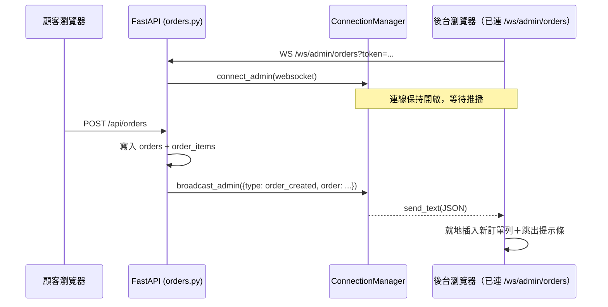
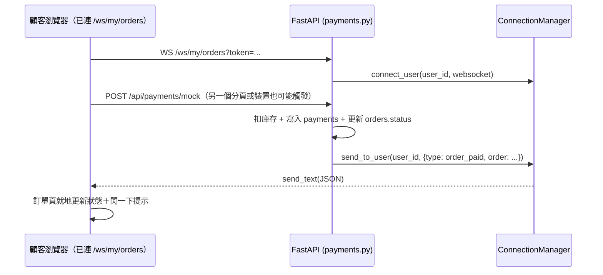

# 即時通訊設計（WebSocket ＋ SSE）

回上層：[stage6 README](../README.md)

本階段新增，stage5 完全沒有即時通訊功能——後台要看新訂單，只能自己按重新
整理。本文件涵蓋：WebSocket 端點設計、訊息格式、重連策略、SSE 客服串流、
以及「WebSocket vs Socket.IO」「WebSocket vs SSE」兩組教學比較。

## 1. 兩支 WebSocket 端點

| 端點 | 誰能連 | 收到什麼 |
|---|---|---|
| `WS /ws/admin/orders` | JWT 驗證、`role=admin` | 全站的訂單事件（任何人建單、任何一筆訂單狀態變化） |
| `WS /ws/my/orders` | JWT 驗證（任何登入使用者） | 只有「自己」的訂單事件（伺服器端用 `user_id` 分頻道隔離） |

認證方式：JWT 放在 query string（`?token=xxx`），不是 `Authorization` header——
因為瀏覽器原生 `WebSocket` 建構子沒辦法附加自訂 header，這是瀏覽器 API 的
先天限制。完整取捨（包含這個做法的安全隱憂：token 會出現在伺服器存取日誌）
見 `backend/app/routers/ws.py` 開頭的說明。

## 2. 訊息格式

所有訊息都是單一 JSON 物件字串：

```json
{"type": "order_created" | "order_paid" | "order_payment_failed" | "order_status_changed", "order": { ...訂單完整內容，含 user_id... }}
```

- `order_created`：`POST /api/orders` 建單成功後，廣播給所有連線的後台管理員。
- `order_paid` / `order_payment_failed`：`POST /api/payments/mock` 之後，
  廣播給後台管理員＋該訂單所屬的顧客本人。
- `order_status_changed`：`PATCH /api/admin/orders/{id}/status` 之後，
  廣播給後台管理員＋該訂單所屬的顧客本人。

## 3. 實測範例（真的用 Python `websockets` 套件連線收到的訊息，不是手寫的）

後台收到「建單」事件（2026-07-23 實測）：

```json
{"type": "order_created", "order": {"id": 8, "status": "pending", "total_amount": 520, "recipient_name": "WS 實測", "recipient_address": "台北市信義區某路 1 號", "created_at": "2026-07-23 17:43:09", "updated_at": "2026-07-23 17:43:09", "items": [{"product_id": 1, "product_name": "耶加雪菲 淺焙單品豆 250g", "unit_price": 520, "quantity": 1}], "user_id": 2}}
```

顧客本人在 `/ws/my/orders` 收到「後台把我的訂單標記出貨」事件（2026-07-23 實測）：

```json
{"type": "order_status_changed", "order": {"id": 8, "status": "shipped", "total_amount": 460, "recipient_name": "文件範例", "recipient_address": "台北市大安區某路 5 號", "created_at": "2026-07-23 17:51:28", "updated_at": "2026-07-23 17:51:28", "items": [{"product_id": 2, "product_name": "哥倫比亞 薇拉 中焙豆 250g", "unit_price": 460, "quantity": 1}], "user_id": 2}}
```

## 4. 循序圖：新訂單即時推播到後台



## 5. 循序圖：付款狀態變化即時推播到顧客本人



## 6. 重連策略：exponential backoff

前端（`frontend/src/hooks/useOrdersSocket.js`、
`admin/src/hooks/useAdminOrdersSocket.js`，兩支邏輯一致）斷線後不會立刻重連，
而是：第一次等 1 秒、失敗再等 2 秒、4 秒、8 秒……上限 16 秒，連上後重設回
1 秒。**為什麼不能無腦立刻重連**：如果伺服器剛好在重啟，或網路暫時不通，
「斷線→立刻重連→又失敗→立刻再重連」會在極短時間內狂發連線請求，瀏覽器與
伺服器都會被無謂的重試淹沒；exponential backoff 讓「暫時性抖動」很快恢復，
「伺服器真的掛了一段時間」也不會讓瀏覽器瘋狂重試。

**認證失敗不重連**：伺服器用自訂 close code 區分「該不該重連」——

| close code | 意義 | 前端行為 |
|---|---|---|
| `4401` | 未登入 / token 無效 | 不重連，顯示「請重新登入」 |
| `4403` | 登入了但不是 admin（只有 `/ws/admin/orders` 會回這個） | 不重連，顯示「權限不足」 |
| 其他（正常斷線、網路問題） | — | 照 backoff 排程重連 |

token 失效不會因為多重試幾次就變好，一直重試只是浪費資源。

## 7. WebSocket vs Socket.IO

課程刻意選用 FastAPI 原生 WebSocket，自己寫 `ConnectionManager` 管連線清單、
自己在前端寫斷線重連，而不是直接套 Socket.IO（`python-socketio` +
`socket.io-client`）。Socket.IO 是在原生 WebSocket 協定之上多加了幾層封裝：

| 能力 | 原生 WebSocket（本課程） | Socket.IO |
|---|---|---|
| 房間（room，只廣播給特定訂閱者） | 自己用 `set`/`dict` 土法煉鋼（見 `app/ws_manager.py`） | 內建 API |
| 自動重連 | 前端自己手刻 exponential backoff | 內建 |
| 網路環境降級（WebSocket 被擋時退回 HTTP long-polling） | 沒有，本課程不含這個機制 | 內建 |
| 訊息 ACK（送出後等待對方確認收到） | 沒有，全部單向推播 | 內建 |
| 需要額外套件 | 不用（Starlette 內建） | `python-socketio` + 前端 `socket.io-client` |

**學這個階段的目的**：先看懂「一個 WebSocket 連線在伺服器端到底是什麼」，
之後如果專案規模變大真的需要 Socket.IO 那些便利功能，才知道自己引入的套件
實際上幫你做了什麼、省下了多少你剛剛自己動手寫過的程式碼。

## 8. WebSocket vs SSE（Server-Sent Events）

| | WebSocket | SSE |
|---|---|---|
| 資料流向 | 雙向（伺服器 ↔ 瀏覽器都能主動送） | 單向（只有伺服器 → 瀏覽器） |
| 協定 | 獨立協定，需要 handshake upgrade | 就是一個普通的 HTTP GET，`Content-Type: text/event-stream` |
| 瀏覽器 API | `WebSocket`，需要自己處理重連 | `EventSource`，瀏覽器原生自動重連 |
| 穿透代理/防火牆 | 部分環境會擋（企業防火牆常擋非 80/443 的協定升級） | 就是 HTTP，幾乎不會被擋 |
| 本專案用途 | 訂單事件推播（需要保持連線、雙向概念的「連線」） | 客服逐字回覆（單次請求、單次回覆流，回完就結束） |

**判斷準則**：需要「伺服器主動、持續推播多筆不同事件給一個保持開啟的連線」
選 WebSocket；只是「把原本一次回傳的內容改成分批慢慢吐出來」選 SSE，
不需要處理連線生命週期，更簡單、更輕量。

## 9. SSE 客服串流：訊息格式

`GET /api/support/stream?question=...` 回傳 `text/event-stream`，每個事件：

```
data: {"chunk": "訂單付款成功後，"}

data: {"chunk": "我們通常會在 1 到 2 個工作天內出貨，"}

...

data: {"done": true}

```

前端（`frontend/src/pages/Support.jsx`）用 `EventSource` 接收，逐塊把
`chunk` 接起來做成打字機效果，收到 `{"done": true}` 就知道整段回覆結束。

**誠實聲明**：這不是真的 AI 客服，是後端規則式 FAQ 比對（完整規則清單見
`backend/app/routers/support.py`）；真實產品這裡通常接 LLM streaming，
**介面（SSE 逐字送出文字）長得完全一樣**，換掉的只有「怎麼決定要送出什麼
文字」這一小段。
