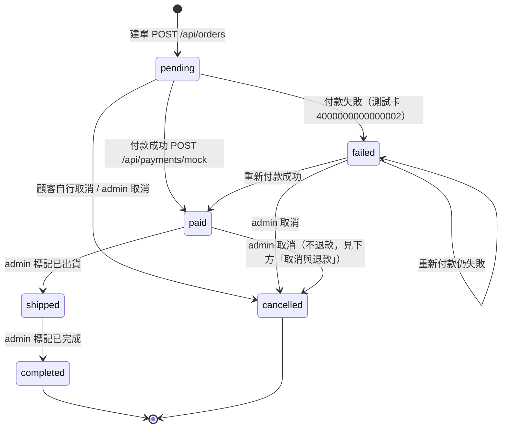
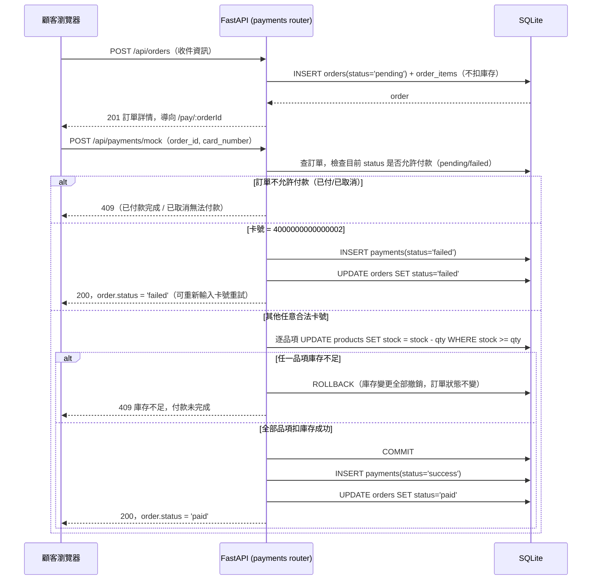

# 系統設計：權限矩陣、訂單狀態機、付款流程

回上層：[stage6 README](../README.md)

> stage6 沿用 stage5 的權限矩陣／訂單狀態機／付款流程，內容沒有變更；
> stage6 新增的即時通訊（誰能連哪條 WebSocket 頻道）另見
> [`REALTIME.md`](REALTIME.md)，效能調校見 [`ARCHITECTURE.md`](ARCHITECTURE.md)
> 與 [`DATABASE.md`](DATABASE.md)。

## 1. 權限矩陣

| 端點 | 訪客（無 token） | customer | admin |
|---|---|---|---|
| `GET /api/products`、`GET /api/products/{id}` | 200 | 200 | 200 |
| `GET /api/health` | 200 | 200 | 200 |
| `POST /api/auth/register`、`POST /api/auth/login` | 200 | 200 | 200 |
| `GET /api/auth/me` | 401 | 200（自己的資料） | 200（自己的資料） |
| `/api/cart/*` 全部端點 | 401 | 200 | 200（跟 customer 待遇一致，管理員也有自己的購物車） |
| `POST /api/orders`、`GET /api/orders`、`GET /api/orders/{id}` | 401 | 200（僅自己的訂單） | 200（僅自己的訂單） |
| `POST /api/orders/{id}/cancel` | 401 | 200（僅自己、且訂單是 pending） / 409（其他狀態） | 同 customer |
| `POST /api/payments/mock` | 401 | 200（僅自己的訂單） | 同 customer |
| `/api/admin/*` 全部端點 | 401 | **403**（`{"detail":"需要管理員權限"}`，實測輸出見下方） | 200 |

**401 vs 403 的語意區別（教學點）**：401 代表「你根本沒有證明自己是誰」（沒帶
token、token 過期或格式錯誤）；403 代表「你證明了自己是誰，但你沒有權限做這件
事」（customer 的 token 完全有效，`GET /api/auth/me` 打得通，但打
`/api/admin/*` 就是 403）。這個區別在 `backend/app/deps.py` 的
`require_admin()` 裡明確做出來，不是含糊地兩者都回 401。

實測（customer token 打 `/api/admin/summary`）：

```json
{"detail":"需要管理員權限"}
```

HTTP 狀態碼 403（實測，`backend/tests/test_admin.py::test_admin_summary_as_customer_returns_403`）。

## 2. 訂單狀態機



合法轉移規則的唯一真相來源是 `backend/app/order_state.py`，三個路由
（`orders.py` / `payments.py` / `admin.py`）都呼叫同一份規則，不會各自維護一份
容易漏改的邏輯。非法轉移（例如 pending 直接跳去 completed）一律回
`409 {"detail":"不允許從「pending」轉換成「completed」"}`（實測輸出，見
`backend/tests/test_admin.py::test_admin_illegal_transition_pending_to_completed_returns_409`）。

**取消與退款（教學簡化，誠實聲明）**：`paid` 狀態的訂單可以被 admin 取消，但
本階段**不處理退款**——沒有金流串接就沒有真的收到錢，自然也沒有「退錢」這個
動作；如果要接上真實金流（見 README「金流警示」），取消已付款訂單就必須同時
呼叫金流服務的退款 API，這是留給有興趣學員的延伸方向。

## 3. 付款流程 sequenceDiagram



**為什麼扣庫存的檢查放在「付款成功」而不是「建單」這一步**：見
[`DATABASE.md`](DATABASE.md)「訂單狀態與扣庫存時機」一節的完整說明。
